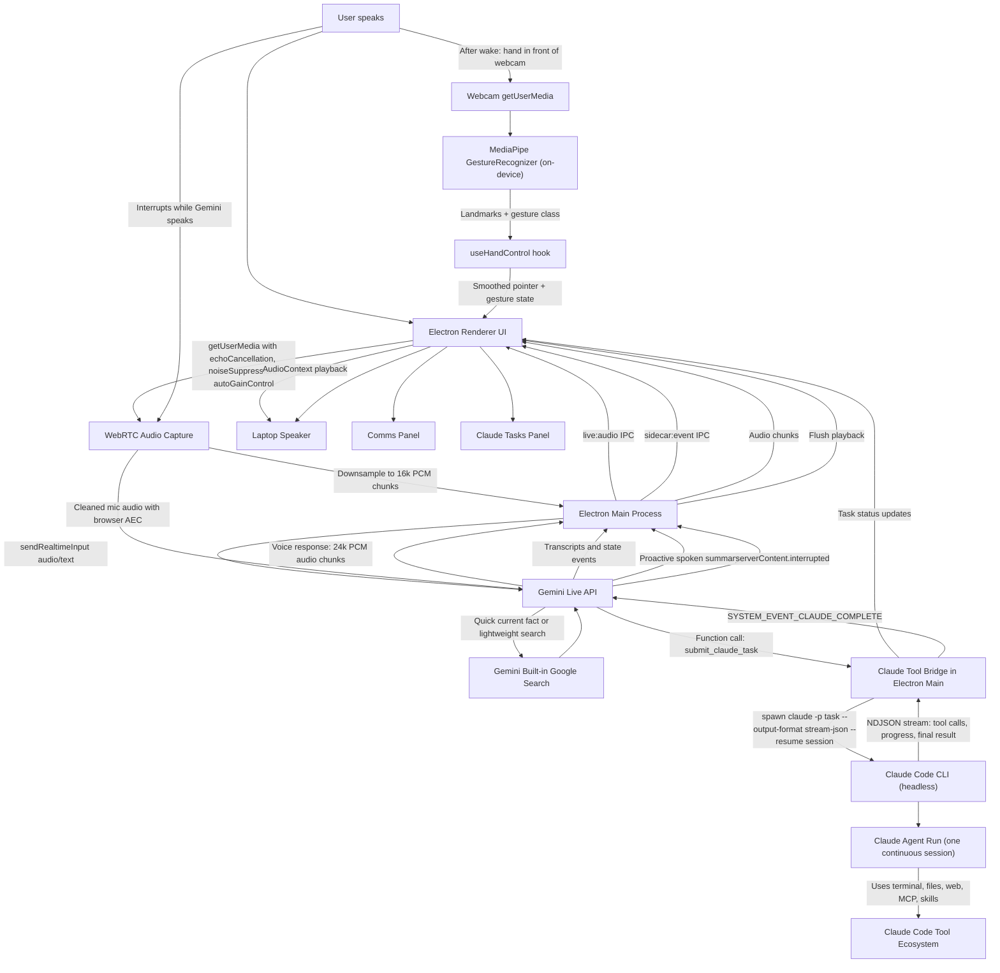
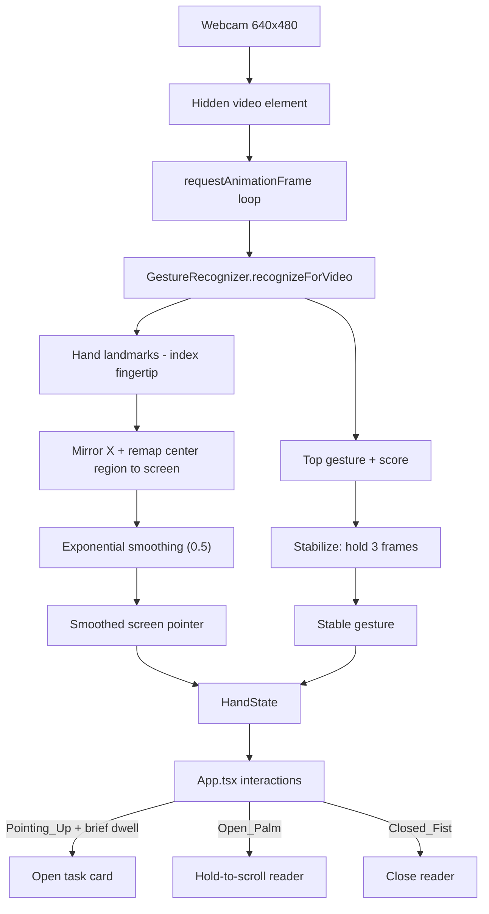

# Iris

> **Experimental personal build.** This repository is the personal experimental version of Iris by **MRQ Học Ứng Dụng AI**. It is being used to actively test ideas, workflows, and product directions, and was published to GitHub in response to audience requests. The project still contains many bugs that MRQ has not had time to fix yet, so please treat it as an actively evolving experiment rather than a polished product. It is shared under the **MIT License** to help the community study it, modify it, and continue developing it further. This version has been tested by MRQ on a **Mac mini M4 with 16 GB RAM running macOS 26**. It is also a fork of the original [`ASHR12/iris`](https://github.com/ASHR12/iris) project — many thanks to **Ashutosh Shrivastava** for the original work.

A desktop voice companion built on **Gemini Live** for natural realtime conversation, with an optional **Claude Code** build pipeline for real work.

**Out of the box, Iris just talks to you** — add a Gemini API key and start speaking; no other setup required. If you also have the [Claude Code](https://code.claude.com/docs/en/headless) CLI installed, Iris automatically unlocks a second layer: a **PO → DEV** build pipeline that lets you delegate real work (coding, research, files, terminal, automation) by voice. The two roles run on deliberately different mechanisms: **PO** is a **stateful** module — a persistent Agent SDK session that stays open across turns and can pause mid-turn to ask you something — while **DEV** is a **stateless** module — a one-shot headless `claude -p` run per issue. The pipeline uses [mattpocock/skills](https://github.com/mattpocock/skills), especially **Grill Me** on the PO side, and [Fission-AI/openspec](https://github.com/Fission-AI/openspec) for **SDD (spec-driven development)**. PO grills and shapes the request into a proper spec first; once the spec is complete, DEV implements it using **`opsx:apply`**. See "Claude pipeline (PO → DEV)" below for how it's detected and enabled.

## Quickstart (chat only)

```bash
npm ci
cp .env.example .env
# edit .env and set GEMINI_API_KEY (free key: https://aistudio.google.com/apikey)
npm start
```

That's it — Iris wakes up and talks to you. The Claude pipeline is a separate,
optional layer described under "Claude pipeline (PO → DEV)" below; skip it
entirely if you only want a voice companion.

## What This App Does

- Captures your microphone through Electron/Chromium with WebRTC audio cleanup.
- Streams cleaned audio to Gemini Live as 16 kHz PCM.
- Plays Gemini Live audio responses through the app using browser `AudioContext`.
- Lets Gemini use built-in Google Search for quick current facts.
- When the Claude Code CLI is installed, lets Gemini hand serious work to Claude, which spawns a headless Claude Code run (`claude -p`) — optional, auto-detected, off by default.
- Shows conversation in the Comms panel and Claude jobs in the Claude Tasks panel.
- Proactively announces Claude results when a background task finishes.
- Supports interruption/barge-in: when you speak over Gemini, playback is flushed.
- Uses a dark-only "Orbital Deck" UI with an animated voice orb, keyboard shortcuts, Comms, Camera/Gesture, and Work Stream columns.
- Adds **camera hand-gesture control** (MediaPipe) after wake so you can drive the UI in the air: point to move a cursor, dwell to open a task, open-palm to scroll, and make a fist to dismiss.
- Uses a simple polished reader open/close animation for expanded Claude results.

## Current Architecture



## How The Flow Works

1. **You speak to the app.**

   Electron captures your microphone using Chromium's WebRTC audio path:

   ```ts
   echoCancellation: true
   noiseSuppression: true
   autoGainControl: true
   ```

   This gives the app laptop-speaker echo cancellation similar to browser/mobile voice apps.

2. **The renderer streams audio to Electron main.**

   The renderer downsamples microphone audio to 16 kHz PCM chunks and sends them over Electron IPC.

3. **Electron main streams to Gemini Live.**

   Electron main owns the Gemini Live session using `@google/genai` and sends audio via `sendRealtimeInput`.

4. **Gemini decides the route.**

   Gemini has two tool paths:

   - **Google Search** for quick current facts and simple web lookups.
   - **Claude tools** for real work: deals, research, coding, files, terminal work, email checks, browser tasks, automation, and anything that should continue in the background.

5. **Claude runs work in the background — one continuous session, one task at a time.**

   When Gemini calls `submit_claude_task`, Electron main spawns a headless Claude Code run:

   ```text
   claude -p "<task>" --output-format stream-json --verbose --permission-mode bypassPermissions
   ```

   The spawn returns a `run_id` immediately, so Gemini can keep talking while Claude works. Sessions are **user-controlled**: the Work Stream panel has a session picker and a **New** button, and the active session can also be reset by voice ("Iris, new session"). Every task resumes the active session (`--resume`), so Claude remembers earlier tasks and follow-ups build on previous work — Gemini cannot pick or invent session ids. Tasks run strictly **one at a time**: if Claude is busy, the new task is queued and starts automatically when the current one finishes. Sessions persist across app restarts (`~/.iris/claude-sessions.json`).

6. **The app streams Claude progress live.**

   Electron parses the NDJSON stream as Claude works: every tool call (`[Bash] npm test …`) and intermediate note appears in the task card in realtime, so you can see what Claude is doing. When the process exits, the card shows the final result.

7. **Claude completion is fed back to Gemini.**

   When a run completes, Electron sends Gemini an internal message:

   ```text
   SYSTEM_EVENT_CLAUDE_COMPLETE
   ```

   Gemini then proactively tells you Claude has returned, summarizes the result, and asks whether you want to go through the details before continuing.

8. **You can interrupt Gemini.**

   If you speak while Gemini is talking, Gemini sends an interruption event. The app flushes queued playback so Gemini stops talking over you.

## Main Components

### Electron Main

File: `electron/main.mjs`

Responsibilities:

- Loads `.env`.
- Creates the Gemini Live session.
- Defines Gemini tools.
- Bridges Gemini tool calls to headless Claude Code runs (`claude -p`).
- Sends/receives Gemini audio.
- Tracks Claude runs and keeps per-session continuity via `--resume`.
- Announces Claude completion back into Gemini.

### Electron Preload

File: `electron/preload.cjs`

Responsibilities:

- Exposes safe IPC APIs to the renderer.
- Sends microphone PCM chunks to Electron main.
- Receives Gemini audio chunks and interruption events.
- Receives app state events.

### React Renderer

Files:

- `src/App.tsx`
- `src/App.css`
- `src/deck.css`
- `src/ReactorCore.tsx`
- `src/BootSequence.tsx`
- `src/useHandControl.ts` (MediaPipe hand/gesture hook)

Responsibilities:

- Renders the UI.
- Captures microphone with WebRTC audio cleanup.
- Downsamples mic audio to 16 kHz PCM.
- Plays Gemini audio through `AudioContext`.
- Shows Comms and Claude Tasks.
- Renders the dark-only Orbital Deck layout.
- Provides keyboard shortcuts.
- Runs camera hand-gesture control after wake and simple reader open/close animation.

## Hand & Gesture Control (MediaPipe)

The app can be driven in the air with your webcam. The camera does **not** start
on app boot; it is enabled automatically after wake, once Gemini Live and mic
capture are initialized. Hand tracking and gesture
classification run **fully on-device** using Google's
[MediaPipe Tasks Vision](https://ai.google.dev/edge/mediapipe/solutions/vision/gesture_recognizer)
`GestureRecognizer`. No camera frames ever leave your machine — only the derived
pointer position and gesture label are used by the UI.

File: `src/useHandControl.ts` (consumed by `src/App.tsx`).

### What we use

- **Package:** `@mediapipe/tasks-vision` (the WebAssembly "Tasks Vision" runtime).
- **Task:** `GestureRecognizer` — a pre-trained model that returns both hand
  landmarks and a classified gesture in one pass.
- **Model asset:** `gesture_recognizer.task` (Google's canned-gesture classifier).
- **WASM runtime:** loaded via `FilesetResolver.forVisionTasks(...)` from the
  MediaPipe CDN.

### How we configure it

```ts
const fileset = await FilesetResolver.forVisionTasks(WASM_URL);
recognizer = await GestureRecognizer.createFromOptions(fileset, {
  baseOptions: { modelAssetPath: MODEL_URL, delegate: "GPU" },
  runningMode: "VIDEO",
  numHands: 1,
  minHandDetectionConfidence: 0.6,
  minHandPresenceConfidence: 0.6,
  minTrackingConfidence: 0.6,
  cannedGesturesClassifierOptions: { scoreThreshold: 0.55 },
});
```

- **GPU delegate** for low-latency inference, **VIDEO** running mode for a live
  webcam stream.
- **One hand** is tracked to keep the interaction unambiguous.
- Confidence floors (`0.6`) and a canned-gesture score threshold (`0.55`) reject
  weak/uncertain frames.

### The processing pipeline

1. After wake, `navigator.mediaDevices.getUserMedia` opens the front camera at
   640×480 into a hidden `<video>` element.
2. A `requestAnimationFrame` loop calls
   `recognizer.recognizeForVideo(video, performance.now())` each frame.
3. From the result we read the first hand's **landmarks** and the **top gesture**.
4. **Pointer:** we take the index-fingertip landmark (`hand[8]`), mirror X
   (`1 - x`) for a natural selfie view, then remap a comfortable center region of
   the frame to the full screen (so you don't have to reach the physical edges):

   ```ts
   const INPUT_RANGE = { xMin: 0.18, xMax: 0.82, yMin: 0.12, yMax: 0.82 };
   ```

   The mapped point is then **exponentially smoothed** (factor `0.5`) to remove jitter.
5. **Gesture stabilization:** a raw gesture must persist for **3 frames** before it
   becomes the "stable" gesture, which prevents flicker between classes.

### Gesture → action mapping

| Gesture (MediaPipe class) | Action in the app |
| --- | --- |
| `Pointing_Up` | Move the on-screen cursor; **dwell ~850 ms** over a task card to open it |
| `Open_Palm` | **Hold-to-scroll** the open reader (joystick: hold high = scroll up, low = scroll down, middle = neutral; speed scales with distance) |
| `Closed_Fist` | Close the expanded reader |
| `None` / other | Idle — pointer hidden |

### Gesture control flow



### Reader animation

Expanded Claude task results open with a simple scale/fade pop and close with a
short fade/scale animation. The intentionally simple animation keeps the UI
clean and avoids expensive DOM rasterization.

## Gemini Tools

Gemini Live is configured with `{ googleSearch: {} }` (if billing is enabled) plus a `functionDeclarations` set that includes interface-control tools (`get_ui_context`, `control_ui`, `go_to_sleep`) always, and the Claude pipeline tools (`check_claude_status`, `submit_claude_task`, `get_claude_task_status`, `stop_claude_task`, `start_new_claude_session`, `get_workspace_info`, `answer_po_question`, `set_agent_model`) **only when the Claude pipeline is available** (see "Claude pipeline (PO → DEV)" below) — so in chat-only mode Gemini is never given a tool it can't use, and never offers to delegate.

Routing behavior:

- Quick answer or current fact: **Gemini Search**.
- Multi-step work or background task: **Claude**.
- Claude completion: **Gemini proactively announces result**.
- PO pauses mid-task with a question (`SYSTEM_EVENT_PO_QUESTION`): **Gemini reads it aloud immediately and answers via `answer_po_question`** once the user responds — distinct from the end-of-run "Decisions needed" relay, which still applies to DEV and to PO's lower-stakes calls.

## Claude pipeline (PO → DEV) — optional, advanced

This entire section is optional. Skip it if you only want to talk to Iris. It
covers the second layer: delegating real work to [Claude Code](https://code.claude.com/docs/en/headless)
through a Product Owner → Developer pipeline.

**Full setup steps and a voice-first walkthrough of using it live in the
[Pipeline Guide](docs/PIPELINE_GUIDE.md) ([Tiếng Việt](docs/PIPELINE_GUIDE.vi.md))** —
this section just summarizes how it turns on.

Iris probes for the `claude` binary at startup and before every Gemini
(re)connection — **the binary's presence is the only switch**. No config flag,
no toggle: install the Claude CLI and Iris detects it automatically. When
detected, the pipeline's Gemini tools are declared, the Work Stream / PipelineBar
/ session-switcher UI appears, and PO/DEV become selectable. When not detected,
Iris stays in chat-only mode.

```bash
claude --version
```

If that works, **DEV works immediately**. **PO** additionally needs a
subscription token (`claude setup-token` → `CLAUDE_CODE_OAUTH_TOKEN` in
`.env`), since it's a stateful Agent SDK session that doesn't inherit your
interactive `claude` login. Beyond that, the pipeline needs the `openspec`
CLI and a set of global Claude Code skills + the `iris-po`/`iris-dev` agent
personas — Settings → **"Claude pipeline"** checks all of these and offers a
one-click **"Install missing"** action that provisions whatever's absent
(never overwriting anything you've already installed yourself). See the
guide for the full walkthrough, troubleshooting, and using the agents
directly from Claude Code.

## App Environment

Iris reads environment values from:

1. `.env` in this repo (development and `npm start`).
2. `~/.iris/.env` (packaged app on macOS/Linux).
3. `%USERPROFILE%\\.iris\\.env` (packaged app on Windows).
4. `.env` bundled next to app resources (optional packaging flow).

Copy the example file:

```bash
cp .env.example .env
```

On Windows PowerShell:

```powershell
Copy-Item .env.example .env
```

Minimum required (chat only — this alone is enough to talk to Iris):

```bash
GEMINI_API_KEY=your_google_ai_studio_key
```

Recommended example (adds the optional Claude pipeline settings):

```bash
GEMINI_API_KEY=your_google_ai_studio_key
IRIS_USER_NAME=there
GEMINI_LIVE_MODEL=models/gemini-3.1-flash-live-preview
GEMINI_LIVE_VOICE=Zephyr
# IRIS_CLAUDE_CWD=/Users/you/.iris/workspace
# IRIS_CLAUDE_PERMISSION_MODE=bypassPermissions
# IRIS_CLAUDE_BIN=/Users/you/.local/bin/claude
# CLAUDE_CODE_OAUTH_TOKEN=your_setup_token_value
# IRIS_PO_QUESTION_TIMEOUT_MS=300000
# IRIS_PO_LIVE_SESSION=1
```

The `IRIS_CLAUDE_*` values are optional. Set `IRIS_CLAUDE_BIN` only if the
packaged GUI app cannot find the `claude` binary on PATH. `CLAUDE_CODE_OAUTH_TOKEN`
is required for the **PO** module specifically (generate it with `claude setup-token`) —
DEV keeps working without it via your interactive `claude` login.

## Exact Google Models, SDKs & Assets (pinned reference)

Use this table as the single source of truth for **which Google pieces we use**,
so future changes don't reintroduce wrong/deprecated names or version drift.

| Purpose | Exact identifier we use | Where it's set | Source |
| --- | --- | --- | --- |
| Gemini Live model | `models/gemini-3.1-flash-live-preview` | `electron/main.mjs` (`GEMINI_LIVE_MODEL` env override) | Google AI Studio / Gemini API |
| Gemini voice | `Zephyr` | `electron/main.mjs` (`GEMINI_LIVE_VOICE` env override) | Gemini Live prebuilt voices |
| Gemini SDK | `@google/genai` `^2.10.0` | `package.json` | npm |
| Gemini built-in search tool | `{ googleSearch: {} }` | `electron/main.mjs` `tools` | Gemini Live tools |
| Gesture/hand ML runtime | `@mediapipe/tasks-vision` `^0.10.35` | `package.json` | npm |
| MediaPipe WASM fileset | `https://cdn.jsdelivr.net/npm/@mediapipe/tasks-vision@0.10.35/wasm` | `src/useHandControl.ts` (`WASM_URL`) | jsDelivr CDN |
| MediaPipe model asset | `https://storage.googleapis.com/mediapipe-tasks/gesture_recognizer/gesture_recognizer.task` | `src/useHandControl.ts` (`MODEL_URL`) | Google Cloud Storage |
| Wake-word ONNX runtime | `onnxruntime-web` `^1.27.0` | `package.json` | npm |
| Wake-word ONNX WASM fileset | `https://cdn.jsdelivr.net/npm/onnxruntime-web@1.27.0/dist/` | `src/hooks/useWakeWord.ts` (`ort.env.wasm.wasmPaths`) | jsDelivr CDN |
| Wake-word model assets | `melspectrogram.onnx`, `embedding_model.onnx`, `hey_iris.onnx` | `public/wakeword/` (bundled, no runtime fetch) | vendored from the "Hey Iris" openWakeWord training run |
| WebGL 3D engine | `three` `^0.181.2` | `package.json` | npm |
| React renderer for Three.js | `@react-three/fiber` `^9.4.0` | `package.json` | npm |
| Three.js helpers | `@react-three/drei` `^10.7.7` | `package.json` | npm |
| Bloom/post-processing | `@react-three/postprocessing` `^3.0.4` | `package.json` | npm |

### Known footguns / lessons (avoid repeating these)

- **Use the exact Live model name `gemini-3.1-flash-live-preview`.** Live models
  are a distinct family from regular `gemini-*` chat models; a normal chat model
  name will fail to open a Live session. Keep the `models/` prefix.
- **Keep the MediaPipe WASM URL version equal to the installed npm version.**
  Both are pinned to `0.10.35` today. A mismatch between the JS API
  (`@mediapipe/tasks-vision`) and the WASM fileset can cause subtle runtime/ABI
  breakage, so update the `@x.y.z` in `WASM_URL` whenever you bump the package
  (or self-host the WASM from the installed package instead of a CDN).
- **Keep the onnxruntime-web WASM URL version equal to the installed npm version**, same reasoning as MediaPipe above — both are pinned to `1.27.0` today.
- **MediaPipe WASM + model are fetched from Google/jsDelivr at first load**, so
  gesture control needs network access on first run. Vendor both locally if you
  need fully offline startup.
- **Gemini Live audio formats are fixed:** send **16 kHz** PCM, receive **24 kHz**
  PCM. Don't assume a single sample rate for both directions.
- **Gemini 3.1 Live function calls are synchronous** — never block a tool call on
  long Claude work; return a `run_id` immediately and track completion separately.
- **Send realtime input with `sendRealtimeInput`** (not the deprecated
  `media_chunks` path) for audio/text streaming.

## Setup From Source

### Prerequisites

- Node.js 20+ (LTS recommended).
- npm.
- A Gemini API key for the Live model (`GEMINI_API_KEY`).
- macOS, Windows, or Linux with microphone permission available.
- *Optional, for the Claude pipeline:* Claude Code installed and authenticated (`claude --version` works) — see "Claude pipeline (PO → DEV)" above.

### 1. Install dependencies

```bash
npm ci
```

Use `npm ci` for a clean, reproducible install from `package-lock.json`. See "Quickstart (chat only)" above for the shortest path to a running app.

### 2. Configure Gemini and Iris

Create `.env` from `.env.example` and set at least `GEMINI_API_KEY`.

### 3. (Optional) Verify Claude Code for the pipeline

Skip this if you only want chat. To use the PO/DEV pipeline, make sure the Claude Code CLI is installed and logged in:

```bash
claude --version
claude -p "Reply with exactly: PONG" --output-format json
```

The second command should print a JSON object with `"result":"PONG"` and a `session_id`. Iris detects the CLI automatically on next launch/reconnect — no separate enable step.

### 4. Run in development mode

```bash
npm run dev
```

This starts Vite and Electron with hot reload. In dev mode the macOS Dock may
show the generic Electron app name, but the packaged app is named Iris.

### 5. Run a production build without packaging

```bash
npm start
```

This builds `dist/` and launches Electron from the built files.

If you already built once:

```bash
npm run start:prod
```

### 6. Build/check only

```bash
npm run build
```

## Packaging

### macOS

```bash
npm run package:mac
open release/mac-arm64/Iris.app
```

The app is unsigned by default. If macOS blocks it, right-click the app and choose
**Open** once.

### Windows

From Windows:

```powershell
npm ci
Copy-Item .env.example .env
# edit .env and set GEMINI_API_KEY (and IRIS_CLAUDE_BIN if needed)
npm start
```

To create an unpacked Windows app directory:

```powershell
npm run package:win
```

To create a distributable Windows build:

```powershell
npm run dist:win
```

For the packaged Windows app, copy `.env.example` to:

```text
%USERPROFILE%\\.iris\\.env
```

Then set `GEMINI_API_KEY` (and `IRIS_CLAUDE_BIN` if the packaged app cannot find `claude`) there.

## Controls

- **W**: Wake
- **S**: Sleep
- Top-right signal icon: live connection indicator
- Top-right hand icon: manually enables/disables camera gesture tracking

Camera/gesture behavior:

- App boot: camera is off.
- Wake (`W`): Gemini Live starts, mic capture starts, then camera/gesture control starts automatically.
- Sleep (`S`): Gemini, mic, and camera/gesture control stop.

### Hand gestures (when camera control is enabled)

- **Point (index up)**: move the cursor; hold over a task card briefly to open it
- **Open palm**: hold-to-scroll inside Comms, Work Stream, and the open reader (high = up, low = down)
- **Closed fist**: close the reader

> The first launch will prompt for camera permission. Frames are processed
> on-device by MediaPipe and never uploaded.

## Glass HUD Mode

Iris can float over your whole desktop as a transparent, click-through
overlay — the orb, tasks column, comms, and camera dock stay visible while
you keep working in the app underneath. Everything on the glass is
pointer-transparent except the "islands" (task cards, toggles, the orb
controls) — the window only accepts clicks where you're actually hovering an
island.

**Three ways to toggle it**, all equivalent:

- The picture-in-picture icon in the deck's top bar.
- The global hotkey, `⌥Space` by default (`IRIS_HUD_HOTKEY` to change it) —
  works even when a different app has focus.
- The tray (menu-bar) icon, which also offers Wake/Sleep without switching to
  the deck first.

The app always boots into deck mode (booting straight into a click-through
overlay with no visible affordance would be a lockout risk). Management
surfaces — pipeline role, model choice, sessions, project folder, setup — are
deck-only; the HUD's exit control (⌥Space, the HUD button, or the tray) takes
you back. A pending PO question stays answerable while the HUD is up: it
surfaces as a lit banner island, answerable by voice, click, or gesture
dwell-click exactly as in the deck.

**Known macOS quirks:** the HUD sits above other windows on the current
Space (`visibleOnAllWorkspaces` with `visibleOnFullScreen: true`); switching
Spaces while the HUD is up should keep it visible, but if you notice it get
left behind on a specific Space, toggle it off and back on to re-attach it to
the one you're on.

## Notes

- The app now uses Electron/Chromium microphone capture instead of Python `pyaudio` for the main Gemini Live path. This gives better echo cancellation on laptop speakers.
- Gemini Live model: `gemini-3.1-flash-live-preview`.
- Gemini 3.1 Live function calls are synchronous, so Claude tasks return a `run_id` immediately and finish in the background.
- The background worker is Claude Code running headless (`claude -p`).
- Hand tracking uses `@mediapipe/tasks-vision` (`GestureRecognizer`) entirely on-device and starts only after wake unless manually enabled.

## Open-Source Notes

- `.env` is ignored. Do not commit real Gemini keys.
- The packaged app is unsigned unless you add your own Apple/Windows signing
  certificates.
- Licensed under the MIT License. See `LICENSE`.

## Support / Contact

If this project helps you and you want to support my work:

- Visit my website: [www.mrqhocungdungai.io.vn](https://www.mrqhocungdungai.io.vn)
- Buy me a coffee: [buymeacoffee.com/mrqhocungdungai](https://buymeacoffee.com/mrqhocungdungai)
- DM me on TikTok: [@mr.q.hoc.ung.dung.ai](https://www.tiktok.com/@mr.q.hoc.ung.dung.ai)
