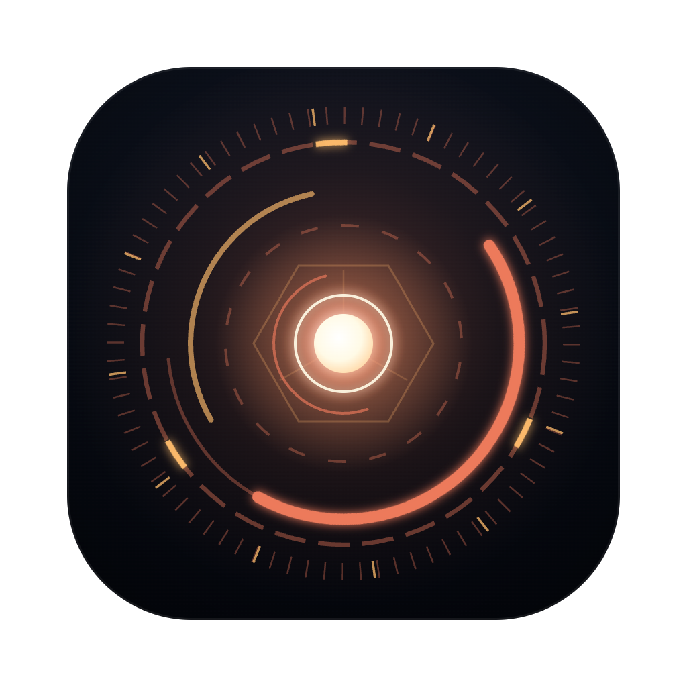
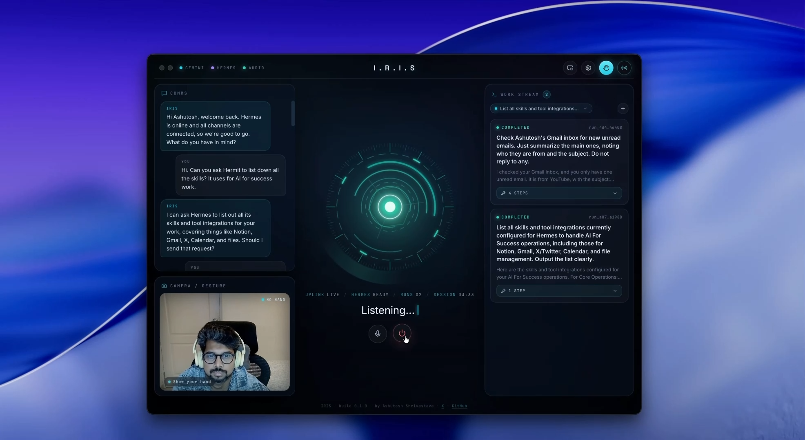
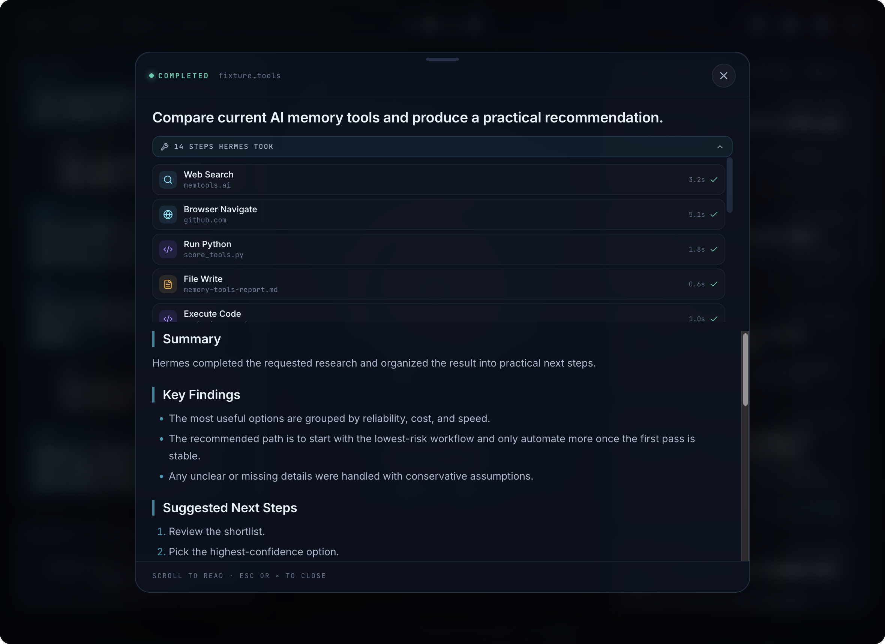
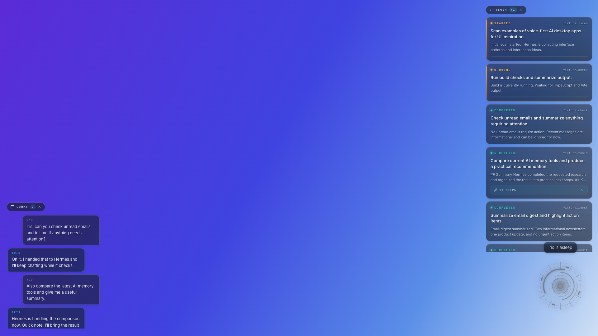
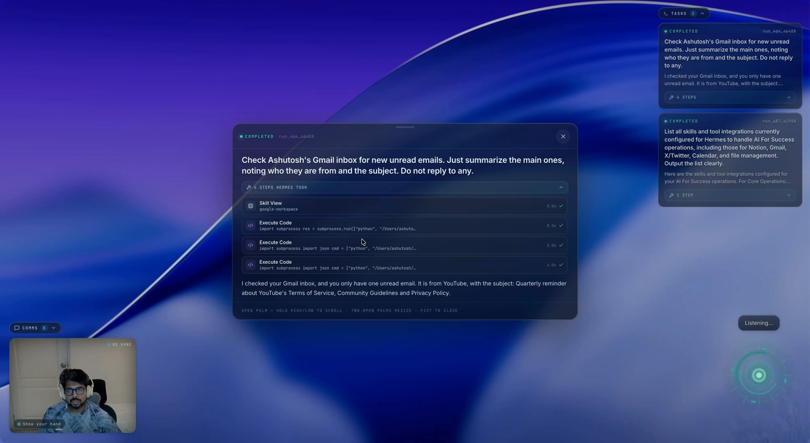
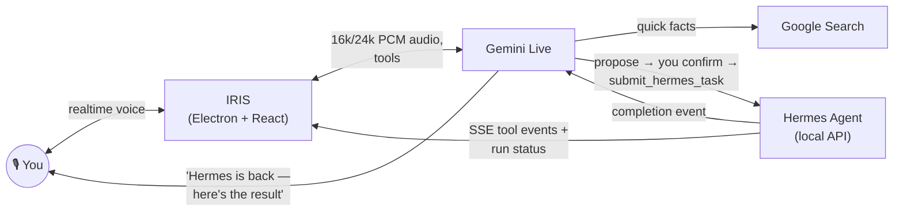

<div align="center">



# I.R.I.S

**A JARVIS-style voice companion for your desktop.**
Talk naturally. Delegate real work. Control it with your hands. Let it float over everything you do.

[](LICENSE)
[](#-quick-start)
[](#-tech-stack)
[](#-contributing)
[](https://x.com/ai_for_success)

**Gemini Live** is the voice. **Hermes Agent** is the muscle. Iris is the bridge between you and both.

[Demo](#-demo) · [Features](#-features) · [Glass HUD](#-glass-hud-mode) · [Quick Start](#-quick-start) · [How It Works](#-how-it-works) · [Roadmap](#-roadmap)


*Real session at 5× speed — **[▶ watch the full demo with audio](media/demo.mp4)***

</div>

---

## 🎬 Demo

<!--
  MAINTAINER NOTE (inline playback): GitHub only renders an embedded video
  player for videos uploaded through the web UI. To upgrade the link below to
  a real inline player, open this README in the GitHub editor, drag
  media/demo.mp4 into it, and replace the link with the generated
  user-attachments URL.
-->

The hero above is the actual app. For the full tour with audio: **[▶ media/demo.mp4](media/demo.mp4)** — waking Iris by voice, delegating a task to Hermes mid-conversation, live tool steps streaming in, opening the result hands-free with a finger point, and Glass HUD mode over the desktop.

<div align="center">

</div>

---

## ✨ What is Iris?

Iris is a **voice-first desktop companion** built on a two-brain architecture:

- 🎙️ **Gemini Live** handles realtime conversation — you speak, it answers instantly with natural voice, handles interruptions (talk over it, it stops), and uses built-in Google Search for quick facts.
- 🛠️ **[Hermes Agent](https://github.com/NousResearch)** does the real work — research, coding, files, terminal, browser automation, email, Notion, anything tool-heavy. Iris hands tasks to Hermes **in the background** and keeps chatting with you while Hermes grinds.
- 🖐️ **MediaPipe hand tracking** lets you drive the whole UI in the air — point-and-hold to click anything, open palm to scroll, fist to close. Fully on-device.
- 🪟 **Glass HUD mode** turns Iris into a transparent, click-through overlay floating above your entire screen — keep coding, browsing, writing, while Iris hovers like a heads-up display.

When Hermes finishes a background task, Iris **proactively speaks up**: *"Quick update — Hermes is back with the result."* That's the loop: you talk, Iris routes, Hermes works, Iris reports back.

---

## 🚀 Features

### Voice & conversation
- **Realtime voice** via Gemini Live (16 kHz in / 24 kHz out, WebRTC echo cancellation — works fine on laptop speakers)
- **"Hey Iris" wake word** — local, on-device ONNX inference; nothing leaves your machine while asleep
- **Barge-in** — interrupt Iris mid-sentence and it yields immediately
- **Voice-driven UI** — "open the latest result", "show the steps", "open the failed one", "close it" — fuzzy-matched against what's on screen
- **Personal context** — reads Hermes's own memory (`USER.md`, `MEMORY.md`) so task briefs are written like it knows you (because it does)

### The Hermes work loop
- **Background delegation** — tasks return a `run_id` instantly; conversation never blocks
- **Live activity feed** — every tool call Hermes makes (browser, code, files, search) streams into the task card in real time with durations
- **Proactive completion announcements** — Iris tells you the moment work finishes and summarizes it out loud
- **System-enforced confirmation gate** — Iris *cannot* dispatch to Hermes until it reads the brief back and you say yes, in your own turn. Enforced in code, not by prompt hopes. Unconfirmed submits are rejected by the app itself.
- **Anti-hallucination guardrails** — status and results can only come from real Hermes API responses; "still working" is the only honest answer until then, and tool responses say so explicitly

### Sessions & memory
- **One pinned Hermes chat thread** — like picking a chat in the Hermes app; no stray sessions
- **Session switcher on the main page** — chip at the top of the Work Stream lists your Iris sessions; **+** starts a new thread (named by Hermes, titled by your first prompt, like every chat tool)
- **History restore** — close Iris, reopen it, and your past completed runs are rebuilt from Hermes's own session transcript. Nothing is lost between launches.

### Hands-free control
- **Point-and-hold to click anything** (~0.3 s) — cards, buttons, toggles, chips; the reticle visibly "charges" while arming
- **Open palm** — joystick scrolling over whatever region your hand hovers: work stream, comms, step timelines, the reader
- **Two open palms** — resize the reader
- **Closed fist** — close the reader
- All tracking is **on-device** (MediaPipe GestureRecognizer); frames never leave your machine

### Design
- **Deep-space design system** — electric cyan + violet on near-black, glass panels, Inter / Space Grotesk / JetBrains Mono
- **The orb** — a canvas-drawn arc reactor that breathes with the actual audio level, changes palette per state (listening / speaking / working), and flashes when work is handed off
- **Comet handoff** — a particle streaks from the orb to the task card when Gemini delegates, and back when Hermes returns
- **Cinematic boot sequence**, animated transitions, and a custom app icon rendered from the orb itself

<div align="center">


*Every tool Hermes used — searches, browsing, code, files — with timings, one voice command away.*
</div>

---

## 🪟 Glass HUD mode

The signature feature. Press **⌥ Space** anywhere:

<div align="center">

</div>

- Iris becomes a **transparent, always-on-top overlay** across your whole screen
- **Click-through everywhere** except Iris's own elements — your mouse works normally in the apps underneath
- Collapsible **Tasks** and **Comms** chips, camera tile, caption pill by the orb
- Open results in a glass reader **without blacking out your desktop**
- Gestures get even better here: your hand reticle floats over your entire screen
- Menu-bar tray icon keeps Iris alive in the background (wake/sleep/HUD from the tray)

<div align="center">

</div>

---

## ⚡ Quick Start

### Prerequisites

- **Node.js 20+** and npm
- **[Hermes Agent](https://github.com/NousResearch)** installed with the gateway running
- A free **Gemini API key** from [Google AI Studio](https://aistudio.google.com/apikey)
- macOS, Windows, or Linux (Glass HUD is built and tuned on macOS)

### 1 — Install & run

```bash
git clone https://github.com/ASHR12/iris.git
cd iris
npm install
npm run dev
```

### 2 — Enable the Hermes API

```bash
echo 'API_SERVER_ENABLED=true' >> ~/.hermes/.env
echo 'API_SERVER_KEY=iris-local-dev' >> ~/.hermes/.env
hermes gateway restart
```

### 3 — Complete the setup wizard

Iris opens an **onboarding wizard** on first launch — paste your Gemini key (with a live **Test** button), point it at Hermes (**Test** that too), pick a voice (with preview), grant mic permission. Everything saves to `~/.iris/.env`. **No manual file editing needed.**

### 4 — Wake it up

Press **W** (or say **"Hey Iris"** if you enabled the wake word). Ask it something. Then ask it to *do* something — "check my unread emails and summarize what needs attention" — confirm the brief, and watch Hermes go to work while you keep talking.

> **Try it with zero keys:** toggle **demo mode** in Settings → Advanced. `D` loads a full fake workspace, `G` plays a simulated handoff. Great for screenshots and poking at the UI.

<details>
<summary><b>Production build & packaging</b></summary>

```bash
npm start            # build + launch production bundle
npm run package:mac  # macOS .app (unsigned by default)
npm run dist:win     # Windows distributable
```

The packaged app reads config from `~/.iris/.env` (`%USERPROFILE%\.iris\.env` on Windows), written by the wizard.

</details>

---

## 🎮 Controls

| Input | Action |
| --- | --- |
| **W** / **S** | Wake / sleep |
| **⌥ Space** | Toggle Glass HUD (global — works from any app; configurable via `IRIS_HUD_HOTKEY`) |
| **"Hey Iris"** | Wake by voice (opt-in, on-device) |
| Top-right buttons | HUD toggle · Settings · hand-tracking toggle · link status |
| Menu-bar icon | Wake/sleep, HUD, show deck, quit |
| **D** / **G** | Load demo data / simulate a handoff (demo mode only) |

### Hand gestures

| Gesture | Action |
| --- | --- |
| ☝️ Point (index up) | Move the cursor — **hold ~0.3 s over anything clickable to click it** |
| ✋ Open palm | Hold-to-scroll whatever region your hand is over (high = up, low = down) |
| 🙌 Two open palms | Resize the open reader |
| ✊ Closed fist | Close the reader |

### Say things like

- *"What's the latest on the OpenAI news?"* → answered directly with Google Search
- *"Check my unread emails and tell me if anything needs attention"* → read-back → your "yes" → Hermes runs it in the background
- *"How's that task going?"* → real status from the Hermes API, never invented
- *"Open the latest result"* / *"show the steps"* / *"open the failed one"* → UI obeys

---

## 🧠 How it works



1. **Electron main owns the Gemini Live session** — mic audio streams up, voice streams back, transcripts and state events flow to the UI.
2. **Gemini routes**: quick things it answers itself (with Google Search when needed); real work goes through the **two-step dispatch gate** — `propose_hermes_task` stages a complete brief, Iris reads it back, and only your explicit yes (in your own turn — enforced by a state machine, not the prompt) unlocks `submit_hermes_task`.
3. **Hermes runs in the background** via its local API (`POST /v1/runs`), returning a `run_id` immediately. Iris polls status and consumes the SSE event stream, painting every tool call onto the task card live.
4. **On completion**, Iris injects a system event into Gemini so it proactively announces and summarizes the result — then you can open it by voice, mouse, or finger.
5. **Sessions mirror Hermes**: all work lives in one pinned Hermes chat thread; the Work Stream rebuilds from that thread's transcript on every launch.

<details>
<summary><b>Pinned models, SDKs & known footguns (for contributors)</b></summary>

| Purpose | Identifier | Where |
| --- | --- | --- |
| Gemini Live model | `models/gemini-3.1-flash-live-preview` | `electron/main.mjs` (`GEMINI_LIVE_MODEL`) |
| Gemini SDK | `@google/genai` | `package.json` |
| Gesture runtime | `@mediapipe/tasks-vision` (WASM pinned to same version in `useHandControl.ts`) | `package.json` |
| Wake word | openWakeWord-style ONNX via `onnxruntime-web` | `public/wakeword/` |

- Live models are a distinct family — a normal `gemini-*` chat model will not open a Live session. Keep the `models/` prefix.
- Gemini Live audio is fixed-format: **send 16 kHz PCM, receive 24 kHz PCM**.
- Live function calls are synchronous — never block a tool call on Hermes work; return the `run_id` immediately.
- Keep the MediaPipe WASM CDN version identical to the installed npm package version.
- MediaPipe WASM + model are fetched from CDN on first gesture use — first run needs network.

</details>

---

## ⚙️ Configuration

Everything is configurable through **Settings (gear icon)** — the file below is written for you. Power users can edit `~/.iris/.env` directly:

```bash
GEMINI_API_KEY=...                                # required — aistudio.google.com/apikey
IRIS_USER_NAME=Ashutosh                           # what Iris calls you
GEMINI_LIVE_MODEL=models/gemini-3.1-flash-live-preview
GEMINI_LIVE_VOICE=Zephyr                          # pick + preview in Settings
HERMES_API_URL=http://127.0.0.1:8642
API_SERVER_KEY=iris-local-dev                     # must match Hermes's ~/.hermes/.env
HERMES_HOME=~/.hermes                             # optional, auto-detected
IRIS_HERMES_SESSION=iris-voice                    # pinned Hermes chat (or use the UI switcher)
IRIS_WAKE_WORD=true                               # "Hey Iris" on-device wake word
IRIS_HUD_HOTKEY=Alt+Space                         # global Glass HUD hotkey
IRIS_LOAD_TEST_DATA=false                         # demo mode
```

Config resolution order: repo `.env` (dev) → `~/.iris/.env` (wizard/packaged) → bundled `.env`.

---

## 📁 Project structure

```
electron/          main process — Gemini Live session, Hermes bridge, dispatch
                   gate, Glass HUD window control, tray, config
src/
  components/      TopBar, CommsPanel, WorkStream, WorkCard, CenterStage,
                   HudShell, ReaderOverlay, SessionSwitcher, SetupPanel, …
  hooks/           useAudioPipeline, useHandControl, useWakeWord, useHandoffFx
  lib/             audio/PCM helpers, task utils + fuzzy matching, fixtures
  styles/          deep-space design system (tokens → base → deck → overlays → fx → hud)
public/wakeword/   on-device "Hey Iris" ONNX models
build/             app icon (SVG source + renderer) and tray assets
scripts/           dev launcher, icon renderer
```

---

## 🛠 Tech stack

| Layer | Tech |
| --- | --- |
| Shell | Electron (transparent frameless window, global shortcuts, tray) |
| UI | React 19 + TypeScript + Vite, custom CSS design system |
| Voice | Gemini Live API (`@google/genai`), Web Audio (capture, playback, metering) |
| Agent | Hermes Agent local API (runs, SSE events, sessions) |
| Gestures | MediaPipe Tasks Vision `GestureRecognizer` (GPU, on-device) |
| Wake word | onnxruntime-web, openWakeWord-style mel → embedding → classifier pipeline |

---

## 🗺 Roadmap

- [ ] **Screen awareness** — share a window/screen into Gemini Live: "what am I looking at?"
- [ ] **Orb micro-expressions** — thinking swirls, wake pulses, distinct voice signatures for you vs Iris
- [ ] **Sound design** — subtle wake/sleep/task-sent/task-done cues
- [ ] **Interactive approvals** — approve Hermes's sensitive actions by voice
- [ ] **Streaming results** — partial output flowing into the reader while Hermes works
- [ ] **Two-hand spatial controls** — expand/zoom/compare with both hands
- [ ] **Memory write-back** — "remember this" flowing into Hermes memory
- [ ] **macOS app control** — Siri-style system actions (AppleScript / Shortcuts fast path)

---

## 🤝 Contributing

PRs and issues are very welcome. Good first areas: new orb themes, additional gesture mappings, Windows/Linux HUD polish, sound design, more voice UI commands.

```bash
npm run dev      # hot-reload dev loop
npm run build    # typecheck + bundle
```

Please keep the two golden rules: **voice must never regress because of gestures**, and **Iris never invents Hermes results** — status comes from the API or it doesn't exist.

## ⚠️ Privacy & security notes

- Your Gemini key and Hermes key live in `~/.iris/.env` — never committed.
- Camera frames and wake-word audio are processed **entirely on-device** and never uploaded.
- Conversation audio goes to Gemini Live (Google) while Iris is awake; asleep, nothing streams anywhere.
- The default `API_SERVER_KEY=iris-local-dev` is for local development — change it if you expose Hermes beyond localhost.

## 📄 License

[MIT](LICENSE) — build wild things with it.

---

<div align="center">

Built by **[Ashutosh Shrivastava](http://ashutoshai.com/)** — AI consultant & tech storyteller, 1M+ weekly reach on X

[🌐 Website](http://ashutoshai.com/) · [𝕏 / Twitter](https://x.com/ai_for_success) · [YouTube](https://www.youtube.com/@AIforSuccess) · [LinkedIn](https://www.linkedin.com/in/aiforsuccess/) · [Instagram](https://www.instagram.com/ashutosh.s.ai/) · [Threads](https://www.threads.com/@ashutosh.s.ai) · [GitHub](https://github.com/ASHR12)

Crafted with **Gemini Live**, **Hermes Agent**, and an unreasonable love for arc reactors.

⭐ **If Iris made you grin, star the repo — it genuinely helps.**

</div>
