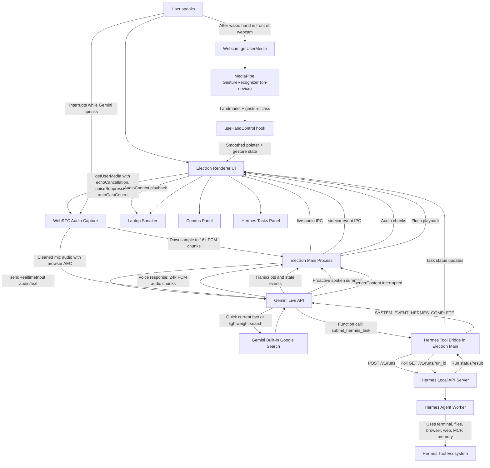
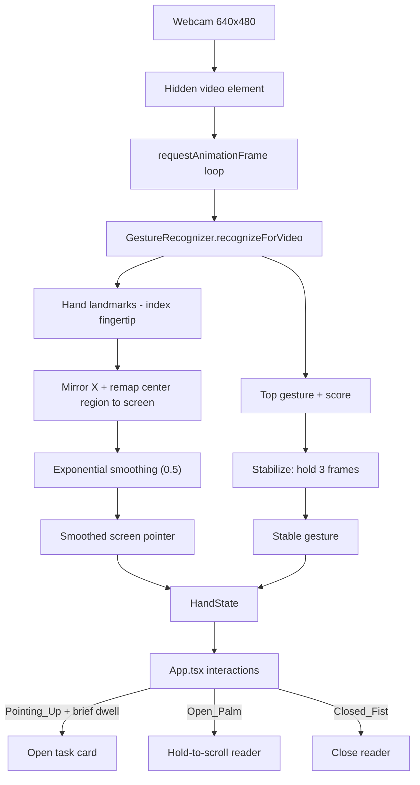

# Iris

A desktop voice companion that uses **Gemini Live** for natural realtime conversation and **Hermes Agent** for long-running work.

The app is designed as a voice-first front-end: you speak naturally, Gemini Live responds in realtime, and when the request needs tools or autonomous work, Gemini hands it to Hermes in the background.

## What This App Does

- Captures your microphone through Electron/Chromium with WebRTC audio cleanup.
- Streams cleaned audio to Gemini Live as 16 kHz PCM.
- Plays Gemini Live audio responses through the app using browser `AudioContext`.
- Lets Gemini use built-in Google Search for quick current facts.
- Lets Gemini hand serious work to Hermes through the Hermes local API server — behind a **system-enforced confirmation gate**: Gemini must stage the brief with `propose_hermes_task`, read it back, and can only `submit_hermes_task` after you explicitly say yes in your own turn (unconfirmed submits are rejected in code, not just by prompt).
- Anti-hallucination guardrails: status/result answers must come from `get_hermes_task_status` or the completion event — tool responses carry explicit "no result exists yet" instructions so Iris can't invent Hermes findings.
- Shows conversation in the Comms panel and Hermes jobs in the Hermes Tasks panel.
- Talks to Hermes in **one pinned chat session** at a time — every task lands in that thread, exactly like picking a chat in Hermes desktop. The session chip at the top of the Work Stream switches between your Iris sessions (API-created only; your Hermes TUI chats are never touched), and the **+** button asks Hermes to create a fresh thread — Hermes assigns its own native session id, and like any chat tool the thread shows as "New chat" until your first task names it (from the first prompt's opening words). The last-used session loads by default (`IRIS_HERMES_SESSION` in `~/.iris/.env`).
- Restores past completed work into the Work Stream after a restart by reading that session's transcript from Hermes (`/api/sessions/{id}/messages`), so results are not lost when you close Iris. Switching sessions re-syncs the Work Stream to the new thread.
- Proactively announces Hermes results when a background task finishes.
- Supports interruption/barge-in: when you speak over Gemini, playback is flushed.
- Uses a dark-only "Orbital Deck" UI with an animated voice orb, keyboard shortcuts, Comms, Camera/Gesture, and Work Stream columns.
- Ships a **first-run onboarding wizard** plus a **Settings panel** (gear icon) to set your Gemini key, Hermes connection, name, voice, and permissions — no manual file editing required. Settings are saved to `~/.iris/.env`.
- Reads your personal context from Hermes's own memory (`~/.hermes/memories/USER.md` and `MEMORY.md`) so Gemini writes accurate, well-formed task briefs.
- Adds **camera hand-gesture control** (MediaPipe) after wake so you can drive the UI in the air: point to move a cursor, dwell to open a task, open-palm to scroll, and make a fist to dismiss.
- Uses a simple polished reader open/close animation for expanded Hermes results.

## Current Architecture



## How The Flow Works

1. **You speak to the app.**

   Electron captures your microphone using Chromium's WebRTC audio path:

   ```ts
   echoCancellation: true
   noiseSuppression: true
   autoGainControl: true
   ```

   This gives the app laptop-speaker echo cancellation similar to browser/mobile voice apps.

2. **The renderer streams audio to Electron main.**

   The renderer downsamples microphone audio to 16 kHz PCM chunks and sends them over Electron IPC.

3. **Electron main streams to Gemini Live.**

   Electron main owns the Gemini Live session using `@google/genai` and sends audio via `sendRealtimeInput`.

4. **Gemini decides the route.**

   Gemini has two tool paths:

   - **Google Search** for quick current facts and simple web lookups.
   - **Hermes tools** for real work: deals, research, coding, files, terminal work, email checks, browser tasks, automation, and anything that should continue in the background.

5. **Hermes runs work in the background.**

   When Gemini calls `submit_hermes_task`, Electron main submits the task to Hermes using:

   ```text
   POST /v1/runs
   ```

   Hermes returns a `run_id` immediately, so Gemini can keep talking instead of waiting.

6. **The app tracks Hermes.**

   Electron polls Hermes run status and updates the Hermes Tasks panel.

7. **Hermes completion is fed back to Gemini.**

   When a run completes, Electron sends Gemini an internal message:

   ```text
   SYSTEM_EVENT_HERMES_COMPLETE
   ```

   Gemini then proactively tells you Hermes has returned, summarizes the result, and asks whether you want to go through the details before continuing.

8. **You can interrupt Gemini.**

   If you speak while Gemini is talking, Gemini sends an interruption event. The app flushes queued playback so Gemini stops talking over you.

## Main Components

### Electron Main

File: `electron/main.mjs`

Responsibilities:

- Loads configuration (from `~/.iris/.env` written by the onboarding wizard, plus optional `.env` files).
- Powers the onboarding/settings UI: read/save config, validate the Gemini key, health-check Hermes, and preview voices.
- Reads your personal context from Hermes memory (`USER.md` / `MEMORY.md`) and injects it into Gemini's system prompt.
- Creates the Gemini Live session.
- Defines Gemini tools.
- Bridges Gemini tool calls to Hermes.
- Sends/receives Gemini audio.
- Polls Hermes runs and streams live tool/activity events to the UI.
- Announces Hermes completion back into Gemini.

### Electron Preload

File: `electron/preload.cjs`

Responsibilities:

- Exposes safe IPC APIs to the renderer.
- Sends microphone PCM chunks to Electron main.
- Receives Gemini audio chunks and interruption events.
- Receives app state events.

### React Renderer

Files:

- `src/App.tsx` — top-level state + composition
- `src/components/` — UI components (TopBar, CommsPanel, CameraDock, CenterStage, WorkStream, WorkCard, ReaderOverlay, HistoryDrawer, TaskChooser, HandoffLayer, HandReticles, BootSequence, SetupPanel, ReactorCore)
- `src/hooks/` — `useAudioPipeline`, `useHandoffFx`, `useHandControl` (MediaPipe), `useWakeWord`
- `src/lib/` — audio/PCM helpers, task utilities, demo fixtures
- `src/styles/` — "Deep Space" design system (tokens, base, deck, overlays, fx)

Responsibilities:

- Renders the UI.
- Captures microphone with WebRTC audio cleanup.
- Downsamples mic audio to 16 kHz PCM.
- Plays Gemini audio through `AudioContext`.
- Shows Comms and Hermes Tasks.
- Renders the dark-only Orbital Deck layout.
- Provides keyboard shortcuts.
- Runs camera hand-gesture control after wake and simple reader open/close animation.

### Python Sidecar

Files under `sidecar/`

This was the original Gemini Live/PyAudio prototype. The current app now uses Electron-native audio for better laptop-speaker echo cancellation, but the Python sidecar remains useful as a reference and for future experiments.

## Hand & Gesture Control (MediaPipe)

The app can be driven in the air with your webcam. The camera does **not** start
on app boot; it is enabled automatically after wake, once Gemini Live and mic
capture are initialized. Hand tracking and gesture
classification run **fully on-device** using Google's
[MediaPipe Tasks Vision](https://ai.google.dev/edge/mediapipe/solutions/vision/gesture_recognizer)
`GestureRecognizer`. No camera frames ever leave your machine — only the derived
pointer position and gesture label are used by the UI.

File: `src/useHandControl.ts` (consumed by `src/App.tsx`).

### What we use

- **Package:** `@mediapipe/tasks-vision` (the WebAssembly "Tasks Vision" runtime).
- **Task:** `GestureRecognizer` — a pre-trained model that returns both hand
  landmarks and a classified gesture in one pass.
- **Model asset:** `gesture_recognizer.task` (Google's canned-gesture classifier).
- **WASM runtime:** loaded via `FilesetResolver.forVisionTasks(...)` from the
  MediaPipe CDN.

### How we configure it

```ts
const fileset = await FilesetResolver.forVisionTasks(WASM_URL);
recognizer = await GestureRecognizer.createFromOptions(fileset, {
  baseOptions: { modelAssetPath: MODEL_URL, delegate: "GPU" },
  runningMode: "VIDEO",
  numHands: 1,
  minHandDetectionConfidence: 0.6,
  minHandPresenceConfidence: 0.6,
  minTrackingConfidence: 0.6,
  cannedGesturesClassifierOptions: { scoreThreshold: 0.55 },
});
```

- **GPU delegate** for low-latency inference, **VIDEO** running mode for a live
  webcam stream.
- **One hand** is tracked to keep the interaction unambiguous.
- Confidence floors (`0.6`) and a canned-gesture score threshold (`0.55`) reject
  weak/uncertain frames.

### The processing pipeline

1. After wake, `navigator.mediaDevices.getUserMedia` opens the front camera at
   640×480 into a hidden `<video>` element.
2. A `requestAnimationFrame` loop calls
   `recognizer.recognizeForVideo(video, performance.now())` each frame.
3. From the result we read the first hand's **landmarks** and the **top gesture**.
4. **Pointer:** we take the index-fingertip landmark (`hand[8]`), mirror X
   (`1 - x`) for a natural selfie view, then remap a comfortable center region of
   the frame to the full screen (so you don't have to reach the physical edges):

   ```ts
   const INPUT_RANGE = { xMin: 0.18, xMax: 0.82, yMin: 0.12, yMax: 0.82 };
   ```

   The mapped point is then **exponentially smoothed** (factor `0.5`) to remove jitter.
5. **Gesture stabilization:** a raw gesture must persist for **3 frames** before it
   becomes the "stable" gesture, which prevents flicker between classes.

### Gesture → action mapping

| Gesture (MediaPipe class) | Action in the app |
| --- | --- |
| `Pointing_Up` | Move the on-screen cursor; **dwell ~850 ms** over a task card to open it |
| `Open_Palm` | **Hold-to-scroll** the open reader (joystick: hold high = scroll up, low = scroll down, middle = neutral; speed scales with distance) |
| `Closed_Fist` | Close the expanded reader |
| `None` / other | Idle — pointer hidden |

### Gesture control flow



### Reader animation

Expanded Hermes task results open with a simple scale/fade pop and close with a
short fade/scale animation. The intentionally simple animation keeps the UI
clean and avoids expensive DOM rasterization.

## Gemini Tools

Gemini Live is configured with:

```js
tools: [
  { googleSearch: {} },
  {
    functionDeclarations: [
      check_hermes_status,
      submit_hermes_task,
      get_hermes_task_status,
      stop_hermes_task,
      approve_hermes_action,
    ]
  }
]
```

Routing behavior:

- Quick answer or current fact: **Gemini Search**.
- Multi-step work or background task: **Hermes**.
- Hermes completion: **Gemini proactively announces result**.

## Hermes Requirements

The app expects the Hermes API server to be reachable at:

```text
http://127.0.0.1:8642
```

Your Hermes config should enable the local API server. Add this to
`~/.hermes/.env` (macOS/Linux) or the equivalent Hermes env file on Windows:

```bash
API_SERVER_ENABLED=true
API_SERVER_KEY=iris-local-dev
```

Restart Hermes gateway after changing this:

```bash
hermes gateway restart
```

Verify:

```bash
curl -s http://127.0.0.1:8642/health
```

Expected output:

```json
{"status":"ok"}
```

> Tip: you don't have to use `curl` — Iris's setup wizard (and Settings) has a
> **Test Hermes** button that checks this connection for you and shows the Hermes
> version.

## First-Run Setup (Onboarding)

Iris configures itself through a built-in **setup wizard** — you do **not** need to
hand-edit any files to get started.

- On first launch (when no Gemini key is found), Iris opens the **onboarding
  wizard** automatically.
- You can reopen it anytime from the **gear icon (top-right) → Settings → Run
  setup wizard**.
- Everything you enter is saved to **`~/.iris/.env`** (per-user; the exact path is
  shown at the bottom of Settings). Your repo stays clean — no secrets committed.

### What the wizard asks for

| Step | Field | What to enter |
| --- | --- | --- |
| **Gemini** | API key *(required)* | A free key from [Google AI Studio](https://aistudio.google.com/apikey). Press **Test Gemini** to verify it works. |
| **Hermes** | API URL | Address of your local Hermes API server. Default `http://127.0.0.1:8642` — keep it unless you changed Hermes's port. |
| **Hermes** | API key | Must match `API_SERVER_KEY` in Hermes's own `~/.hermes/.env`. Default for local dev is `iris-local-dev`. Press **Test Hermes** to verify. |
| **Hermes** | Hermes home *(optional)* | Folder where Hermes stores data + memory (`memories/USER.md`, `MEMORY.md`). Leave blank to use `~/.hermes`. |
| **Hermes** | Hermes binary *(optional)* | Full path to the `hermes` executable. Leave blank — only set it if Iris can't find Hermes on your PATH. |
| **You & voice** | Display name | What Iris calls you out loud. |
| **You & voice** | Voice | Pick a Gemini Live voice and press **Preview** to hear a sample. |
| **You & voice** | Model | Gemini Live model (keep the default). |
| **Permissions** | Microphone *(required)* / Camera *(optional)* | Allow the mic so Iris can hear you; the camera is only needed for hand gestures. |
| **Advanced** | Load demo / test data | **On** fills the UI with fake tasks/conversation for screenshots and trying things out; keep **Off** for normal use. |

Read-only values (voice duplex mode, speaker echo guard) are shown for reference
and can only be changed in `.env`.

### Personal context (shared with Hermes)

Iris automatically reads Hermes's own memory files —
`~/.hermes/memories/USER.md` and `~/.hermes/memories/MEMORY.md` — and feeds them
into Gemini so it understands who you are and can write accurate, well-formed task
briefs. There is nothing to copy. If Hermes lives somewhere other than `~/.hermes`,
set **Hermes home** in Settings (or `HERMES_HOME` in `.env`).

### Advanced: manual configuration (optional)

Power users can set values directly instead of using the wizard. Iris reads config
from these locations (first match wins per key):

1. `.env` in the repo (developer convenience when running from source)
2. `~/.iris/.env` (written by the setup wizard; used by the packaged app — on
   Windows this is `%USERPROFILE%\\.iris\\.env`)
3. `.env` bundled next to app resources (optional packaging flow)

Supported keys:

```bash
GEMINI_API_KEY=your_google_ai_studio_key          # required
IRIS_USER_NAME=your name
GEMINI_LIVE_MODEL=models/gemini-3.1-flash-live-preview
GEMINI_LIVE_VOICE=Zephyr
HERMES_API_URL=http://127.0.0.1:8642
API_SERVER_KEY=iris-local-dev
HERMES_HOME=~/.hermes                             # optional (auto-detected)
HERMES_BIN=/full/path/to/hermes                   # optional (auto-detected on PATH)
IRIS_LOAD_TEST_DATA=false                         # true = load demo UI data
```

A `.env.example` is included for reference, but most users should just run Iris and
complete the wizard.

## Exact Google Models, SDKs & Assets (pinned reference)

Use this table as the single source of truth for **which Google pieces we use**,
so future changes don't reintroduce wrong/deprecated names or version drift.

| Purpose | Exact identifier we use | Where it's set | Source |
| --- | --- | --- | --- |
| Gemini Live model | `models/gemini-3.1-flash-live-preview` | `electron/main.mjs` (`GEMINI_LIVE_MODEL` env override) | Google AI Studio / Gemini API |
| Gemini voice | `Zephyr` | `electron/main.mjs` (`GEMINI_LIVE_VOICE` env override) | Gemini Live prebuilt voices |
| Gemini SDK | `@google/genai` `^2.10.0` | `package.json` | npm |
| Gemini built-in search tool | `{ googleSearch: {} }` | `electron/main.mjs` `tools` | Gemini Live tools |
| Gesture/hand ML runtime | `@mediapipe/tasks-vision` `^0.10.35` | `package.json` | npm |
| MediaPipe WASM fileset | `https://cdn.jsdelivr.net/npm/@mediapipe/tasks-vision@0.10.35/wasm` | `src/useHandControl.ts` (`WASM_URL`) | jsDelivr CDN |
| MediaPipe model asset | `https://storage.googleapis.com/mediapipe-tasks/gesture_recognizer/gesture_recognizer.task` | `src/useHandControl.ts` (`MODEL_URL`) | Google Cloud Storage |

### Known footguns / lessons (avoid repeating these)

- **Use the exact Live model name `gemini-3.1-flash-live-preview`.** Live models
  are a distinct family from regular `gemini-*` chat models; a normal chat model
  name will fail to open a Live session. Keep the `models/` prefix.
- **Keep the MediaPipe WASM URL version equal to the installed npm version.**
  Both are pinned to `0.10.35` today. A mismatch between the JS API
  (`@mediapipe/tasks-vision`) and the WASM fileset can cause subtle runtime/ABI
  breakage, so update the `@x.y.z` in `WASM_URL` whenever you bump the package
  (or self-host the WASM from the installed package instead of a CDN).
- **MediaPipe WASM + model are fetched from Google/jsDelivr at first load**, so
  gesture control needs network access on first run. Vendor both locally if you
  need fully offline startup.
- **Gemini Live audio formats are fixed:** send **16 kHz** PCM, receive **24 kHz**
  PCM. Don't assume a single sample rate for both directions.
- **Gemini 3.1 Live function calls are synchronous** — never block a tool call on
  long Hermes work; return a `run_id` immediately and track completion separately.
- **Send realtime input with `sendRealtimeInput`** (not the deprecated
  `media_chunks` path) for audio/text streaming.

## Setup From Source

### Prerequisites

- Node.js 20+ (LTS recommended).
- npm.
- Hermes Agent installed and able to run `hermes gateway`.
- A Gemini API key for the Live model (`GEMINI_API_KEY`).
- macOS, Windows, or Linux with microphone permission available.

### 1. Install dependencies

```bash
npm install
```

### 2. Configure Gemini and Iris

No file editing needed — just run the app (next steps) and complete the
**onboarding wizard**, which saves your settings to `~/.iris/.env`. You'll paste a
Gemini key from [Google AI Studio](https://aistudio.google.com/apikey) and can
**Test Gemini** / **Test Hermes** right in the wizard.

Prefer files? Copy `.env.example` to `.env` and set at least `GEMINI_API_KEY`
(see [First-Run Setup](#first-run-setup-onboarding) for all keys).

### 3. Enable Hermes gateway API

Make sure Hermes API is enabled:

```bash
echo 'API_SERVER_ENABLED=true' >> ~/.hermes/.env
echo 'API_SERVER_KEY=iris-local-dev' >> ~/.hermes/.env
hermes gateway restart
```

On Windows, edit your Hermes env file manually and add the same two values:

```env
API_SERVER_ENABLED=true
API_SERVER_KEY=iris-local-dev
```

Then restart Hermes gateway.

Verify:

```bash
curl http://127.0.0.1:8642/health
```

Expected:

```json
{"status":"ok"}
```

### 4. Run in development mode

```bash
npm run dev
```

This starts Vite and Electron with hot reload. In dev mode the macOS Dock may
show the generic Electron app name, but the packaged app is named Iris.

### 5. Run a production build without packaging

```bash
npm start
```

This builds `dist/` and launches Electron from the built files.

If you already built once:

```bash
npm run start:prod
```

### 6. Build/check only

```bash
npm run build
```

## Packaging

### macOS

```bash
npm run package:mac
open release/mac-arm64/Iris.app
```

The app is unsigned by default. If macOS blocks it, right-click the app and choose
**Open** once.

### Windows

From Windows:

```powershell
npm install
npm run dev
# then complete the onboarding wizard (saves to %USERPROFILE%\.iris\.env)
```

To create an unpacked Windows app directory:

```powershell
npm run package:win
```

To create a distributable Windows build:

```powershell
npm run dist:win
```

For the packaged Windows app, just launch it and complete the onboarding wizard —
it writes your settings to:

```text
%USERPROFILE%\\.iris\\.env
```

(You can also create/edit that file by hand if you prefer.)

## Controls

- **W**: Wake
- **S**: Sleep
- Top-right gear icon: open **Settings** (and "Run setup wizard")
- Top-right signal icon: live connection indicator
- Top-right hand icon: manually enables/disables camera gesture tracking

Camera/gesture behavior:

- App boot: camera is off.
- Wake (`W`): Gemini Live starts, mic capture starts, then camera/gesture control starts automatically.
- Sleep (`S`): Gemini, mic, and camera/gesture control stop.

### Hand gestures (when camera control is enabled)

- **Point (index up)**: move the cursor; hold over a task card briefly to open it
- **Open palm**: hold-to-scroll inside Comms, Work Stream, and the open reader (high = up, low = down)
- **Closed fist**: close the reader

> The first launch will prompt for camera permission. Frames are processed
> on-device by MediaPipe and never uploaded.

## Notes

- The app now uses Electron/Chromium microphone capture instead of Python `pyaudio` for the main Gemini Live path. This gives better echo cancellation on laptop speakers.
- Gemini Live model: `gemini-3.1-flash-live-preview`.
- Gemini 3.1 Live function calls are synchronous, so Hermes tasks return a `run_id` immediately and finish in the background.
- Hermes remains your actual worker agent for tool-heavy tasks.
- Hand tracking uses `@mediapipe/tasks-vision` (`GestureRecognizer`) entirely on-device and starts only after wake unless manually enabled.

## Open-Source Notes

- `.env` is ignored. Do not commit real Gemini keys or Hermes API keys.
- The default `API_SERVER_KEY=iris-local-dev` is for local development only; choose
  your own local key if you share the app broadly.
- The packaged app is unsigned unless you add your own Apple/Windows signing
  certificates.
- Licensed under the MIT License. See `LICENSE`.
