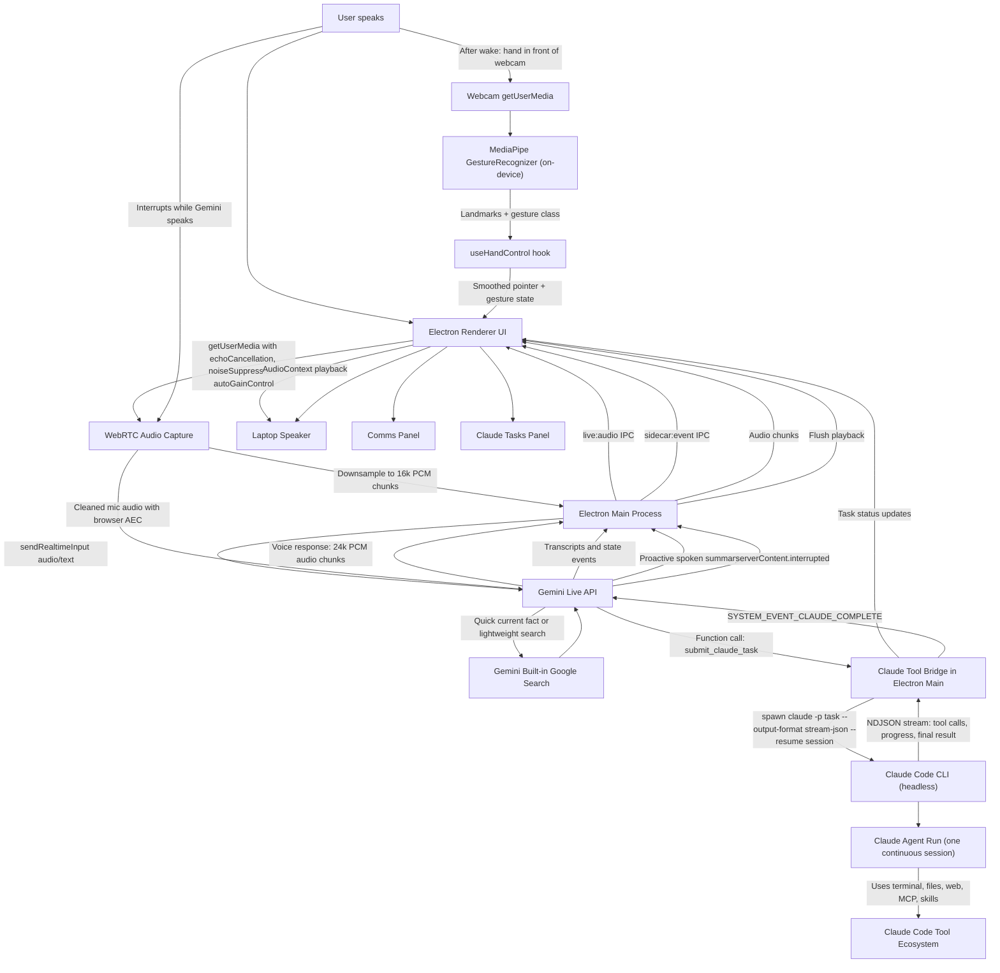

# Iris Architecture

[← Back to README](../README.md)

How the Gemini↔Claude bridge works end to end: the realtime audio path, the delegation flow, the main process/renderer split, and the exact Gemini tool surface.

## Current Architecture



## How The Flow Works

1. **You speak to the app.**

   Electron captures your microphone using Chromium's WebRTC audio path:

   ```ts
   echoCancellation: true
   noiseSuppression: true
   autoGainControl: true
   ```

   This gives the app laptop-speaker echo cancellation similar to browser/mobile voice apps.

2. **The renderer streams audio to Electron main.**

   The renderer downsamples microphone audio to 16 kHz PCM chunks and sends them over Electron IPC.

3. **Electron main streams to Gemini Live.**

   Electron main owns the Gemini Live session using `@google/genai` and sends audio via `sendRealtimeInput`.

4. **Gemini decides the route.**

   Gemini has two tool paths:

   - **Google Search** for quick current facts and simple web lookups.
   - **Claude tools** for real work: deals, research, coding, files, terminal work, email checks, browser tasks, automation, and anything that should continue in the background.

5. **Claude runs work in the background — one continuous session, one task at a time.**

   When Gemini calls `submit_claude_task`, Electron main spawns a headless Claude Code run:

   ```text
   claude -p "<task>" --output-format stream-json --verbose --permission-mode bypassPermissions
   ```

   The spawn returns a `run_id` immediately, so Gemini can keep talking while Claude works. Sessions are **user-controlled**: the Work Stream panel has a session picker and a **New** button, and the active session can also be reset by voice ("Iris, new session"). Every task resumes the active session (`--resume`), so Claude remembers earlier tasks and follow-ups build on previous work — Gemini cannot pick or invent session ids. Tasks run strictly **one at a time**: if Claude is busy, the new task is queued and starts automatically when the current one finishes. Sessions persist across app restarts (`~/.iris/claude-sessions.json`).

6. **The app streams Claude progress live.**

   Electron parses the NDJSON stream as Claude works: every tool call (`[Bash] npm test …`) and intermediate note appears in the task card in realtime, so you can see what Claude is doing. When the process exits, the card shows the final result.

7. **Claude completion is fed back to Gemini.**

   When a run completes, Electron sends Gemini an internal message:

   ```text
   SYSTEM_EVENT_CLAUDE_COMPLETE
   ```

   Gemini then proactively tells you Claude has returned, summarizes the result, and asks whether you want to go through the details before continuing.

8. **You can interrupt Gemini.**

   If you speak while Gemini is talking, Gemini sends an interruption event. The app flushes queued playback so Gemini stops talking over you.

## Main Components

### Electron Main

File: `electron/main.mjs`

Responsibilities:

- Loads `.env`.
- Creates the Gemini Live session.
- Defines Gemini tools.
- Bridges Gemini tool calls to headless Claude Code runs (`claude -p`).
- Sends/receives Gemini audio.
- Tracks Claude runs and keeps per-session continuity via `--resume`.
- Announces Claude completion back into Gemini.

### Electron Preload

File: `electron/preload.cjs`

Responsibilities:

- Exposes safe IPC APIs to the renderer.
- Sends microphone PCM chunks to Electron main.
- Receives Gemini audio chunks and interruption events.
- Receives app state events.

### React Renderer

Files:

- `src/App.tsx`
- `src/App.css`
- `src/deck.css`
- `src/ReactorCore.tsx`
- `src/BootSequence.tsx`
- `src/useHandControl.ts` (MediaPipe hand/gesture hook)

Responsibilities:

- Renders the UI.
- Captures microphone with WebRTC audio cleanup.
- Downsamples mic audio to 16 kHz PCM.
- Plays Gemini audio through `AudioContext`.
- Shows Comms and Claude Tasks.
- Renders the dark-only Orbital Deck layout.
- Provides keyboard shortcuts.
- Runs camera hand-gesture control after wake and simple reader open/close animation.

## Gemini Tools

Gemini Live is configured with `{ googleSearch: {} }` (if billing is enabled) plus a `functionDeclarations` set that includes interface-control tools (`get_ui_context`, `control_ui`, `go_to_sleep`) always, and the Claude pipeline tools (`check_claude_status`, `submit_claude_task`, `get_claude_task_status`, `stop_claude_task`, `start_new_claude_session`, `get_workspace_info`, `answer_po_question`, `set_agent_model`) **only when the Claude pipeline is available** (see the [Pipeline Guide](PIPELINE_GUIDE.md)) — so in chat-only mode Gemini is never given a tool it can't use, and never offers to delegate.

Routing behavior:

- Quick answer or current fact: **Gemini Search**.
- Multi-step work or background task: **Claude**.
- Claude completion: **Gemini proactively announces result**.
- PO pauses mid-task with a question (`SYSTEM_EVENT_PO_QUESTION`): **Gemini reads it aloud immediately and answers via `answer_po_question`** once the user responds — distinct from the end-of-run "Decisions needed" relay, which still applies to DEV and to PO's lower-stakes calls.
