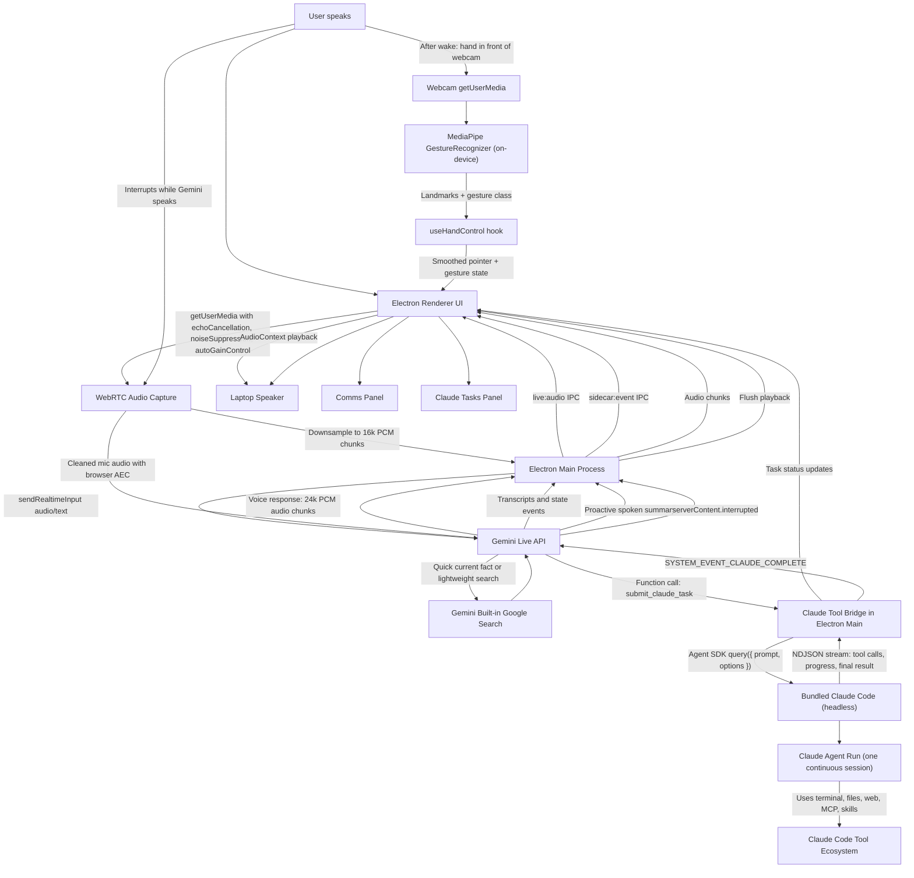

# Iris Architecture

[← Back to README](../README.md)

How the Gemini↔Claude bridge works end to end: the realtime audio path, the delegation flow, the main process/renderer split, and the exact Gemini tool surface.

## Current Architecture


```mermaid
flowchart TD
  User["User speaks"] --> ElectronRenderer["Electron Renderer UI"]

  ElectronRenderer -->|"getUserMedia with echoCancellation, noiseSuppression, autoGainControl"| WebRTCAudio["WebRTC Audio Capture"]
  WebRTCAudio -->|"Downsample to 16k PCM chunks"| ElectronMain["Electron Main Process"]

  ElectronMain -->|"sendRealtimeInput audio/text"| GeminiLive["Gemini Live API"]

  GeminiLive -->|"Voice response: 24k PCM audio chunks"| ElectronMain
  ElectronMain -->|"live:audio IPC"| ElectronRenderer
  ElectronRenderer -->|"AudioContext playback"| Speaker["Laptop Speaker"]

  GeminiLive -->|"Transcripts and state events"| ElectronMain
  ElectronMain -->|"sidecar:event IPC"| ElectronRenderer
  ElectronRenderer --> Comms["Comms Panel"]

  GeminiLive -->|"Quick current fact or lightweight search"| GoogleSearch["Gemini Built-in Google Search"]
  GoogleSearch --> GeminiLive

  GeminiLive -->|"Function call: submit_claude_task"| ClaudeTool["Claude Tool Bridge in Electron Main"]

  ClaudeTool -->|"Agent SDK query({ prompt, options })"| ClaudeCLI["Bundled Claude Code (headless)"]
  ClaudeCLI --> ClaudeAgent["Claude Agent Run (one continuous session)"]

  ClaudeAgent -->|"Uses terminal, files, web, MCP, skills"| ClaudeTools["Claude Code Tool Ecosystem"]

  ClaudeCLI -->|"NDJSON stream: tool calls, progress, final result"| ClaudeTool

  ClaudeTool -->|"Task status updates"| ElectronRenderer
  ElectronRenderer --> ClaudeTasks["Claude Tasks Panel"]

  ClaudeTool -->|"SYSTEM_EVENT_CLAUDE_COMPLETE"| GeminiLive
  GeminiLive -->|"Proactive spoken summary"| ElectronMain
  ElectronMain -->|"Audio chunks"| ElectronRenderer
  ElectronRenderer --> Speaker

  User -->|"Interrupts while Gemini speaks"| WebRTCAudio
  WebRTCAudio -->|"Cleaned mic audio with browser AEC"| GeminiLive
  GeminiLive -->|"serverContent.interrupted"| ElectronMain
  ElectronMain -->|"Flush playback"| ElectronRenderer

  User -->|"After wake: hand in front of webcam"| Camera["Webcam getUserMedia"]
  Camera --> MediaPipe["MediaPipe GestureRecognizer (on-device)"]
  MediaPipe -->|"Landmarks + gesture class"| HandHook["useHandControl hook"]
  HandHook -->|"Smoothed pointer + gesture state"| ElectronRenderer
```

## How The Flow Works

1. **You speak to the app.**

   Electron captures your microphone using Chromium's WebRTC audio path:

   ```ts
   echoCancellation: true
   noiseSuppression: true
   autoGainControl: true
   ```

   This gives the app laptop-speaker echo cancellation similar to browser/mobile voice apps.

2. **The renderer streams audio to Electron main.**

   The renderer downsamples microphone audio to 16 kHz PCM chunks and sends them over Electron IPC.

3. **Electron main streams to Gemini Live.**

   Electron main owns the Gemini Live session using `@google/genai` and sends audio via `sendRealtimeInput`.

4. **Gemini decides the route.**

   Gemini has two tool paths:

   - **Google Search** for quick current facts and simple web lookups.
   - **Claude tools** for real work: deals, research, coding, files, terminal work, email checks, browser tasks, automation, and anything that should continue in the background.

5. **Claude runs work in the background — one continuous session, one task at a time.**

   When Gemini calls `submit_claude_task`, Electron main starts a headless Claude Code run through the Agent SDK — `query({ prompt, options })` against the `claude` binary bundled inside the app, under `permissionMode: "bypassPermissions"`. There is no `claude -p` subprocess and no host CLI; see [PIPELINE_INTERNALS.md](PIPELINE_INTERNALS.md) for the full option surface.

   The call returns a `run_id` immediately, so Gemini can keep talking while Claude works. Sessions are **user-controlled**: the Work Stream panel has a session picker and a **New** button, and the active session can also be reset by voice ("Iris, new session"). Every task resumes the active session (the SDK's `resume`), so Claude remembers earlier tasks and follow-ups build on previous work — Gemini cannot pick or invent session ids. Tasks run strictly **one at a time**: if Claude is busy, the new task is queued and starts automatically when the current one finishes. Sessions persist across app restarts (`~/.iris/claude-sessions.json`).

6. **The app streams Claude progress live.**

   Electron parses the NDJSON stream as Claude works: every tool call (`[Bash] npm test …`) and intermediate note appears in the task card in realtime, so you can see what Claude is doing. When the process exits, the card shows the final result.

7. **Claude completion is fed back to Gemini.**

   When a run completes, Electron sends Gemini an internal message:

   ```text
   SYSTEM_EVENT_CLAUDE_COMPLETE
   ```

   Gemini then proactively tells you Claude has returned, summarizes the result, and asks whether you want to go through the details before continuing.

8. **You can interrupt Gemini.**

   If you speak while Gemini is talking, Gemini sends an interruption event. The app flushes queued playback so Gemini stops talking over you.

## Main Components

Two-process Electron app. The Gemini↔Claude bridge used to live almost entirely
in `electron/main.mjs`; it's now ~40 single-responsibility modules under
`electron/`, with Electron API access confined to four of them (`main.mjs`,
`ipc.mjs`, `window.mjs`, `renderer-security.mjs`) — every other module is
Electron-free and importable in a plain vitest file with no harness. See the
`main-process-structure` capability spec for the full discipline.

- **`electron/main.mjs`** (~240 lines) — the composition root: imports every module, wires dependency injection via `wiring.mjs`, and runs the `app.whenReady()` startup sequence, `shutdownTeardown`, and quit handlers. No domain logic.
- **`electron/wiring.mjs`** (+ **`wiring-capabilities.mjs`**, **`wiring-live.mjs`**) — the composition root's dependency-injection wiring, split across three files purely because the block exceeded the 450-line file-size convention once every module existed. `wiring-capabilities.mjs` wires the canvas/second-brain capabilities, run-exec, and the Gemini tool/prompt modules; `wiring-live.mjs` wires the Live session, listening mode, and window/HUD/tray (a genuine three-way mutual dependency).
- **`electron/ipc.mjs`** — every `ipcMain.handle`/`on` registration (the renderer↔main channel surface), diffable against `preload.cjs`. Marshals arguments and delegates only.
- **`electron/window.mjs`** — the main window, the Glass HUD shape-morph (`enterHud`/`exitHud`/`toggleHud`), and the Tray.
- **`electron/renderer-security.mjs`** — navigation containment and device-permission scoping (`renderer-content-security` capability); installed before the first window is created.
- **`electron/live-session.mjs`** (+ **`live-messages.mjs`**) — the Gemini Live session (`@google/genai`): connect/reconnect lifecycle in the former, server-message/tool-call handling in the latter.
- **`electron/listen-mode.mjs`** — listening mode's enter/exit/rotation sequences and engagement state; drives `live-session.mjs` via named transitions, never raw field writes.
- **`electron/gemini-tools.mjs`** / **`gemini-prompts.mjs`** — Gemini's function-declaration schemas and system-instruction prose; both compose contributions from registered capabilities rather than hardcoding them.
- **`electron/session-store.mjs`** — workstreams, the agent roster, and per-role model selection.
- **`electron/run-dispatch.mjs`** (+ **`run-stream.mjs`**, **`run-exec.mjs`**) — the pre-dispatch review gate and tool-execution surface; run activity/tool-step streaming and the PO live-question relay; driving DEV and PO runs (both via the Agent SDK's `query()`).
- **`electron/announcements.mjs`** — voice announcements to the Live session, buffered while offline.
- **`electron/pipeline-probes.mjs`** / **`pipeline-install.mjs`** — Claude/OpenSpec availability probing (binary + credential) and skill installation.
- **`electron/bundled-binaries.mjs`** — resolves the app's own `claude` and `openspec`, including the `app.asar` → `app.asar.unpacked` rewrite. The only module that knows asar exists.
- **`electron/agent-definitions.mjs`** — parses `resources/personas/*.md` into the SDK's `AgentDefinition`, so personas are passed to `query()` by value instead of installed into `~/.claude/agents`.
- **`resources/iris-plugin/`** — a Claude Code plugin (`.claude-plugin/plugin.json` + `skills/` + `commands/opsx/`) shipped with the app and passed to every run via the SDK's `plugins` option. Everything it provides is namespaced `iris:*` (`iris:grilling`, `/iris:opsx:apply`) — the personas reference those names.
- **`electron/user-config.mjs`** — env/user config, the prompt-review-mode flag, and API-key/token handling.
- **`electron/capabilities/canvas.mjs`** / **`capabilities/second-brain.mjs`** — the canvas-claude-mcp and personal-knowledge-notes/second-brain capabilities, each owning its own state, IPC handlers, teardown, and Gemini prompt fragment end to end (`electron/capabilities/` is where a new capability's main-process code should live).
- **`electron/live-config.mjs`** — `buildLiveConfig()`, extracted so the Live session config (converse vs. listening) is testable without booting Electron.
- **`electron/listen-boundary.mjs`** — the measured chunk-boundary sequence (`runBoundary()`) listening mode's rotations and exit run through; takes an injected session-like driver so it's testable without a live connection.
- **`electron/role-prompt.mjs`** / **`run-budget.mjs`** / **`run-skills.mjs`** / **`run-hooks.mjs`** / **`run-output-format.mjs`** / **`run-sessions.mjs`** — the per-run policy modules both roles route through, in the same "one policy, so the two can't drift" shape as `worker-env.mjs`: the base system prompt, the turn/spend ceilings, the per-role skill list, the SDK hook callbacks (guard + tool boundary), the structured-decisions schema, and session liveness/naming. All Electron-free, no I/O.
- **`electron/po-session.mjs`** — the stateful PO module: Agent SDK session lifecycle, streaming user-message channel, and the `canUseTool` callback intercepting `AskUserQuestion`. Isolated so DEV's one-shot path never has to know it exists.
- **`electron/preload.cjs`** — the `window.iris` IPC bridge. Any new renderer↔main channel must be exposed here.
- **`src/App.tsx`** (by far the largest file in the repo) — renderer: mic capture (WebRTC AEC → 16 kHz PCM), Gemini playback (24 kHz PCM), the "Orbital Deck" UI, keyboard shortcuts, gestures, and the `uiMode` (`deck` | `hud`) switch.
- **`src/components/HudShell.tsx`** + **`src/styles/hud.css`** — the Glass HUD overlay; pointer-transparent except `.hud-hit` islands (App.tsx reports pointer-over-island via `hud:interactive`; main toggles `setIgnoreMouseEvents`).
- **`src/hooks/useHandControl.ts`** — MediaPipe `GestureRecognizer` hook (on-device, starts only after wake).
- **`src/components/ReactorCore.tsx`, `src/components/BootSequence.tsx`, `src/styles/`** — UI/animation. `src/styles/tokens.css`, `base.css`, `deck.css`, `fx.css`, `overlays.css`, `index.css` are adopted **upstream-verbatim and must stay byte-identical** so upstream ports diff cleanly; all Claude/Iris-specific styling goes in `src/styles/claude.css` (see the `deepspace-skin` capability spec).
- **`scripts/run-electron.mjs`** — launcher; clears `ELECTRON_RUN_AS_NODE`, supports `--prod`.

### Electron Preload

`electron/preload.cjs` exposes the safe IPC surface to the renderer: microphone
PCM chunks out, Gemini audio chunks and interruption events in, plus app-state
events. Any new renderer↔main channel must be declared here — it is meant to be
diffed against `electron/ipc.mjs`.

### React Renderer

Beyond the files above, the renderer captures the microphone with WebRTC audio
cleanup, downsamples to 16 kHz PCM, plays Gemini audio through an `AudioContext`,
renders the Comms and Claude Tasks panes and the dark-only Orbital Deck layout,
provides the keyboard shortcuts, and runs camera hand-gesture control after wake.

## Gemini Tools

Gemini Live is configured with `{ googleSearch: {} }` (if billing is enabled) plus a `functionDeclarations` set that includes interface-control tools (`get_ui_context`, `control_ui`, `go_to_sleep`) always, and the Claude pipeline tools (`check_claude_status`, `submit_claude_task`, `get_claude_task_status`, `stop_claude_task`, `start_new_claude_session`, `get_workspace_info`, `answer_po_question`, `set_agent_model`) **only when the Claude pipeline is available** (see the [Pipeline Guide](PIPELINE_GUIDE.md)) — so in chat-only mode Gemini is never given a tool it can't use, and never offers to delegate.

Routing behavior:

- Quick answer or current fact: **Gemini Search**.
- Multi-step work or background task: **Claude**.
- Claude completion: **Gemini proactively announces result**.
- PO pauses mid-task with a question (`SYSTEM_EVENT_PO_QUESTION`): **Gemini reads it aloud immediately and answers via `answer_po_question`** once the user responds — distinct from the end-of-run "Decisions needed" relay, which still applies to DEV and to PO's lower-stakes calls.

## Listening mode

A toggle (ear icon, tray item, `IRIS_LISTEN_HOTKEY`) that puts the Gemini Live session into a listen-only configuration: Iris hears and retains everything but is structurally incapable of taking a turn the user did not ask for. See `openspec/specs/listening-mode/spec.md` for the full authoritative behavior; this section is the practical summary plus the constraints that will trip up anyone touching the code.

- **Mechanism**: the same Live session, reconnected with `realtimeInputConfig.automaticActivityDetection.disabled: true`, `turnCoverage: "TURN_INCLUDES_ALL_INPUT"`, and an empty tool set (`electron/live-config.mjs`, `mode: "listen"`). Silence is a property of this config, not a system-prompt instruction.
- **Chunking**: the Live connection lasts ~10 minutes, shorter than the monologues this mode is for, so a listening session rotates on its own timer (`IRIS_LISTEN_CHUNK_MS`, default 8 minutes) and immediately on the server's `goAway`. Each rotation is a **boundary** (`electron/listen-boundary.mjs`): close the activity, wait for the turn it forces to complete, wait for a **fresh** resumption handle, then reconnect. Boundary turns are suppressed in `electron/live-messages.mjs`'s `handleLiveMessage` — never heard, never shown as a transcript line, and any tool call they trigger is ignored.
- **Ending the mode**: a final boundary (suppressed like any rotation), then a reconnect into ordinary conversation, and only then does Iris speak a synthesis of everything it heard — drawn from an in-memory segment record that exists only for the life of the listening session and is never written to disk or the notes vault.
- **Three measured constraints** a future change here will otherwise trip over:
  1. Audio streamed outside an explicitly opened activity (`activityStart`) is discarded entirely — there is no "accumulate quietly, answer when asked" shortcut.
  2. Closing the session without first sending `activityEnd` loses the whole current chunk — there is no way to commit context except through a boundary.
  3. No resumption checkpoint is issued while an activity is open. A boundary must wait for a checkpoint issued **after** its own `activityEnd`, not merely check that some handle exists — a stale handle from before the boundary began is instantly non-null and will satisfy a naive check while reproducing total context loss.
- **User-visible surprises**: voice sleep and voice-triggered delegation don't work while engaged (both need a model turn, and none can complete mid-chunk); a PO question raised while engaged times out to its default, unheard; the mode ends itself if the machine sleeps long enough to drop the connection; and there is no signal if microphone capture silently dies, since silence is the whole point of the mode.
