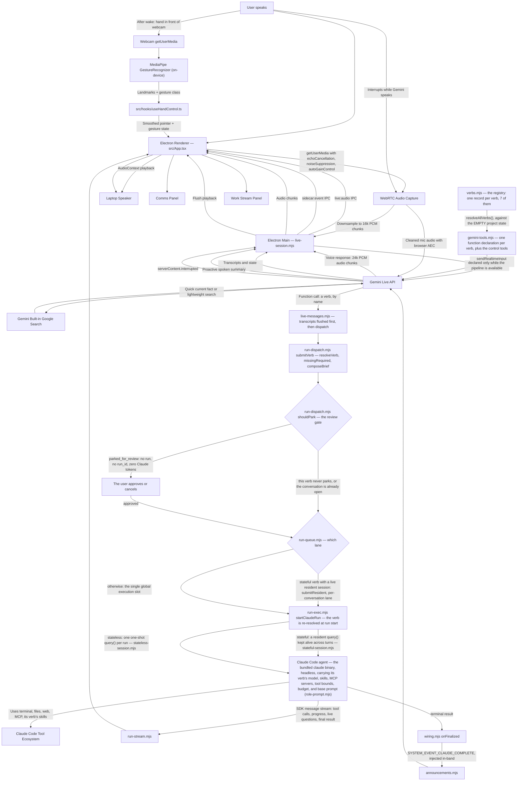

# Iris Architecture

[← Back to README](../README.md)

How the Gemini↔Claude bridge works end to end: the realtime audio path, the delegation flow, the main process/renderer split, and the exact Gemini tool surface.

**The shape of the whole thing, in one paragraph.** Every tool Gemini Live can
call for real work **is a verb** — one of the seven records in
`electron/verbs.mjs`, each with its own parameter schema. Behind a verb is not a
function but a **full Claude Code agent**: the Agent SDK's `query()` against the
`claude` binary bundled in the app, running with that verb's own lifetime
(resident session or one-shot), model, skills, MCP servers, tool bounds, and
spend ceiling. **Gemini picks the verb, per request** — there is no role to set,
no mode to operate, and no requirement that the user knows verbs exist. The one
place a human stands in the path is the **review gate**, which parks a
privileged request before any token is spent and waits for an approval or a
cancellation. Talk/Build is *explanatory* vocabulary Iris uses when asked what
she can do, not a switch anyone throws (the `talk-and-build-modes` spec requires
exactly that).

## Current Architecture


```mermaid
flowchart TD
  User["User speaks"] --> ElectronRenderer["Electron Renderer — src/App.tsx"]

  ElectronRenderer -->|"getUserMedia with echoCancellation, noiseSuppression, autoGainControl"| WebRTCAudio["WebRTC Audio Capture"]
  WebRTCAudio -->|"Downsample to 16k PCM chunks"| ElectronMain["Electron Main — live-session.mjs"]

  ElectronMain -->|"sendRealtimeInput audio/text"| GeminiLive["Gemini Live API"]

  GeminiLive -->|"Voice response: 24k PCM audio chunks"| ElectronMain
  ElectronMain -->|"live:audio IPC"| ElectronRenderer
  ElectronRenderer -->|"AudioContext playback"| Speaker["Laptop Speaker"]

  GeminiLive -->|"Transcripts and state events"| ElectronMain
  ElectronMain -->|"sidecar:event IPC"| ElectronRenderer
  ElectronRenderer --> Comms["Comms Panel"]

  GeminiLive -->|"Quick current fact or lightweight search"| GoogleSearch["Gemini Built-in Google Search"]
  GoogleSearch --> GeminiLive

  Registry["verbs.mjs — the registry: one record per verb, 7 of them"]
  Registry -->|"resolveAllVerbs(), against the EMPTY project state"| Declarations["gemini-tools.mjs — one function declaration per verb, plus the control tools"]
  Declarations -->|"declared only while the pipeline is available"| GeminiLive

  GeminiLive -->|"Function call: a verb, by name"| ToolCall["live-messages.mjs — transcripts flushed first, then dispatch"]
  ToolCall --> Submit["run-dispatch.mjs submitVerb — resolveVerb, missingRequired, composeBrief"]
  Submit --> Gate{"run-dispatch.mjs shouldPark — the review gate"}
  Gate -->|"parked_for_review: no run, no run_id, zero Claude tokens"| Human["The user approves or cancels"]
  Gate -->|"this verb never parks, or the conversation is already open"| Lane{"run-queue.mjs — which lane"}
  Human -->|"approved"| Lane
  Lane -->|"stateful verb with a live resident session: submitResident, per-conversation lane"| Exec["run-exec.mjs startClaudeRun — the verb is re-resolved at run start"]
  Lane -->|"otherwise: the single global execution slot"| Exec

  Exec -->|"stateful: a resident query() kept alive across turns — stateful-session.mjs"| ClaudeAgent["Claude Code agent — the bundled claude binary, headless, carrying its verb's model, skills, MCP servers, tool bounds, budget, and base prompt (role-prompt.mjs)"]
  Exec -->|"stateless: one one-shot query() per run — stateless-session.mjs"| ClaudeAgent
  ClaudeAgent -->|"Uses terminal, files, web, MCP, its verb's skills"| ClaudeTools["Claude Code Tool Ecosystem"]

  ClaudeAgent -->|"SDK message stream: tool calls, progress, live questions, final result"| Stream["run-stream.mjs"]
  Stream --> ElectronRenderer
  ElectronRenderer --> ClaudeTasks["Work Stream Panel"]

  ClaudeAgent -->|"terminal result"| Finalize["wiring.mjs onFinalized"]
  Finalize -->|"SYSTEM_EVENT_CLAUDE_COMPLETE, injected in-band"| Announce["announcements.mjs"]
  Announce --> GeminiLive
  GeminiLive -->|"Proactive spoken summary"| ElectronMain
  ElectronMain -->|"Audio chunks"| ElectronRenderer
  ElectronRenderer --> Speaker

  User -->|"Interrupts while Gemini speaks"| WebRTCAudio
  WebRTCAudio -->|"Cleaned mic audio with browser AEC"| GeminiLive
  GeminiLive -->|"serverContent.interrupted"| ElectronMain
  ElectronMain -->|"Flush playback"| ElectronRenderer

  User -->|"After wake: hand in front of webcam"| Camera["Webcam getUserMedia"]
  Camera --> MediaPipe["MediaPipe GestureRecognizer (on-device)"]
  MediaPipe -->|"Landmarks + gesture class"| HandHook["src/hooks/useHandControl.ts"]
  HandHook -->|"Smoothed pointer + gesture state"| ElectronRenderer
```

Stations carry file names and no line numbers: the names stay greppable against
the tree as the files move, and the line references live in the prose below,
where they are cheap to re-check.

## How The Flow Works

1. **You speak to the app.**

   Electron captures your microphone using Chromium's WebRTC audio path:

   ```ts
   echoCancellation: true
   noiseSuppression: true
   autoGainControl: true
   ```

   This gives the app laptop-speaker echo cancellation similar to browser/mobile voice apps.

2. **The renderer streams audio to Electron main.**

   The renderer downsamples microphone audio to 16 kHz PCM chunks and sends them over Electron IPC.

3. **Electron main streams to Gemini Live.**

   Electron main owns the Gemini Live session using `@google/genai` and sends audio via `sendRealtimeInput`.

4. **Gemini decides the route.**

   Gemini has two tool paths:

   - **Google Search** for quick current facts and simple web lookups.
   - **A verb** for real work: research, coding, files, terminal work, shaping a change, working on a note, and anything that should continue in the background.

5. **What Gemini was offered came from the registry.**

   `electron/verbs.mjs` holds one record per verb, and `buildVerbDeclarations()` (`electron/gemini-tools.mjs:48-54`) maps `resolveAllVerbs()` onto `{ name, description, parameters }`. The declarations are built against the **empty** project state on purpose (`gemini-tools.mjs:46-47`): what a verb is *called for* does not change with the project — only how it then runs does. `buildPipelineToolDeclarations()` adds the control tools, `buildAlwaysToolDeclarations()` adds the interface tools, and each registered capability contributes its own `toolDeclarations`. The full surface is enumerated under [Gemini Tools](#gemini-tools) below.

6. **The tool call arrives — and the words that caused it are flushed first.**

   `message.toolCall` is handled in `electron/live-messages.mjs:213`. Before dispatch, the pending transcription is flushed into the ring (`:226-233`), because the run's brief is composed from that transcript the moment dispatch happens — the one sentence a request most needs was otherwise still sitting in a buffer. While listen-only mode is engaged, tool calls are refused here (`:237-238`), before any verb can cost money or write.

7. **One dispatch path, whichever verb it was.**

   `executeClaudeTool` (`electron/run-dispatch.mjs:527-533`) applies the `PIPELINE_ONLY_TOOLS` backstop (`:512`) and then hands every verb to the one entry point, `submitVerb` (`:310-322`): `resolveVerb(verb, projectState)` resolves the record, `missingRequired` rejects an incomplete call against the verb's own schema, and `composeBrief` builds the prompt from that schema — no verb has formatting code of its own.

8. **The review gate is where a human stands in the path.**

   `run-dispatch.mjs:326-336`: `shouldPark` (`:292-300`) reads `getPromptReviewMode()` and the verb's **declared** `park` label — never the brief's wording. A parked request returns `parked_for_review` and has **no run and no `run_id`**: zero Claude tokens are spent until the user approves it.

9. **Which lane the run takes.**

   `run-dispatch.mjs:222-235`. A stateful verb whose conversation is *already open* goes to `runQueue.submitResident` (`electron/run-queue.mjs:335-354`) — a per-conversation lane, so the next sentence in a live conversation does not wait behind an unrelated twenty-minute job. Everything else takes the single global execution slot (`run-queue.mjs:142`), which is what "Claude does one thing at a time" means. These are two different questions wearing similar names: consent (has the user taken part in this conversation) is the gate above, mechanics (is there a live session to push a turn into) is this line.

10. **The agent runs.**

    `startClaudeRun` (`electron/run-exec.mjs:300`) re-resolves the verb **at run start**, so a change proposed while the run sat queued is seen by it, then starts either `startStatefulRun` — a resident `query()` via `electron/stateful-session.mjs` — or `startStatelessRun`, one one-shot `query()`. Either way it is `query({ prompt, options })` against the `claude` binary bundled inside the app under `permissionMode: "bypassPermissions"`, carrying that verb's model, `skills`, `mcpServers`, tool bounds and budget, with the base prompt coming from one policy module (`electron/role-prompt.mjs`). There is no `claude -p` subprocess and no host CLI; see [PIPELINE_INTERNALS.md](PIPELINE_INTERNALS.md) for the full option surface.

    The tool call returns immediately — a `run_id` for a fresh run, or a queue position — so Gemini can keep talking while Claude works. Sessions are **user-controlled**: the Work Stream panel has a session picker and a **New** button, and the active session can also be reset by voice ("Iris, new session"). Every verb resumes its own prior session (the SDK's `resume`), stateless ones included, so follow-ups build on previous work — Gemini cannot pick or invent session ids. Sessions persist across app restarts (`~/.myiris/claude-sessions.json`).

11. **The app streams progress live.**

    `electron/run-stream.mjs` projects the SDK message stream: every tool call (`[Bash] npm test …`) and intermediate note appears in the task card in realtime, so you can see what Claude is doing. A run permitted to ask — every stateful verb, and `execute` when no change is open — has its mid-turn `AskUserQuestion` relayed by voice from here. On the terminal `result` message the card shows the final result.

12. **Completion is fed back to Gemini in-band.**

    `wiring.mjs:126-188` runs on finalize: the run's tokens are counted, the outcome is appended to the second brain, and then `announceVerbatimResult` (for verbs declaring `spokenResult: "verbatim"` — bounded at 8000 chars) or `announceClaudeCompletion` (2500) hands off to `electron/announcements.mjs`, which injects

    ```text
    SYSTEM_EVENT_CLAUDE_COMPLETE
    ```

    into the Live conversation. It is a message *in* the conversation, not a callback: Gemini then proactively tells you Claude has returned, summarizes the result, and asks whether you want the details.

13. **You can interrupt Gemini.**

    If you speak while Gemini is talking, Gemini sends an interruption event. The app flushes queued playback so Gemini stops talking over you.

## Main Components

Two-process Electron app. The Gemini↔Claude bridge used to live almost entirely
in `electron/main.mjs`; it is now spread across single-responsibility modules
under `electron/`, with Electron API access confined to four of them
(`main.mjs`, `ipc.mjs`, `window.mjs`, `renderer-security.mjs`) — every other
module is Electron-free and importable in a plain vitest file with no harness.
See the `main-process-structure` capability spec for the full discipline. (Module
and line counts are deliberately not stated here: nothing keeps such a number
true, and every one this doc used to carry had rotted.)

- **`electron/main.mjs`** — the composition root: imports every module, wires dependency injection via `wiring.mjs`, and runs the `app.whenReady()` startup sequence, `shutdownTeardown`, and quit handlers. No domain logic.
- **`electron/wiring.mjs`** (+ **`wiring-capabilities.mjs`**, **`wiring-live.mjs`**) — the composition root's dependency-injection wiring, split across three files purely because the block exceeded the 450-line file-size convention once every module existed. `wiring-capabilities.mjs` wires the canvas/second-brain capabilities, run-exec, and the Gemini tool/prompt modules; `wiring-live.mjs` wires the Live session and window/HUD/tray (a mutual dependency: window reads Live status and listen-only state, Live session reads the tray's `updateTrayMenu`).
- **`electron/ipc.mjs`** — every `ipcMain.handle`/`on` registration (the renderer↔main channel surface), diffable against `preload.cjs`. Marshals arguments and delegates only. Includes the OS-permission surface (`permissions:query` / `:request` / `:open-settings`) and the self-test arming pair (`system-audio-self-test:arm` / `:disarm`).
- **`electron/window.mjs`** — the main window, the Glass HUD shape-morph (`enterHud`/`exitHud`/`toggleHud`), and the Tray.
- **`electron/renderer-security.mjs`** — navigation containment and device-permission scoping (`renderer-content-security` capability); installed before the first window is created. Also composes the system-audio self-test arming and consults it in the display-media handler.
- **`electron/os-permissions.mjs`** — what macOS has granted (the four states, `restricted` kept distinct from not-yet-asked) and where the user changes it (the deep link plus the written pane path). Electron-free: `ipc.mjs` makes the thin `systemPreferences`/`shell` calls and marshals through it. Deliberately *not* in `renderer-security.mjs`, which answers "may this document capture" (containment) rather than "what has the OS granted" (reporting).
- **`electron/system-audio-self-test.mjs`** — the Permissions step's self-test arming: one grant, to the frame that armed it, on an absolute 6s deadline that re-arming does not extend. Electron-free over an injected clock, so the bound is assertable without booting Electron.
- **`electron/live-session.mjs`** (+ **`live-messages.mjs`**) — the Gemini Live session (`@google/genai`): connect/reconnect lifecycle plus the main-owned listen-only mode state in the former, server-message/tool-call handling in the latter.
- **`electron/listen-window.mjs`** — the bound on a listen-only engagement: one absolute deadline, opened when the mode engages and never extended, whichever of the user or the deadline ends it. Electron-free over an injected clock for the same reason `system-audio-self-test.mjs` is — the five-minute bound is then a plain assertion. Knows nothing of what expiry means; it calls back and `live-session.mjs` decides, which keeps `setListenOnlyEngaged` the mode's only writer.
- **`electron/prepared-material.mjs`** — reads the folder the user has open for prepared answers: `.md`/`.txt` only, dotted and vendored directories skipped, under a file-count cap and a size cap, then bounded to what may reach the voice model in one call. Pure over an injected `fs` and never throws — a folder that vanished is an empty result, not an error in front of an audience. It does not decide which passage answers the question; local scoring runs only when the folder overflows the bound, and the narrowing is reported.
- **`electron/capabilities/prepared-answers.mjs`** — the `find_prepared_answer` declaration and prompt fragment. The open folder arrives as an injected getter (the same one `get_workspace_info` reports), the text is fenced with `fenceUntrustedText` on the way to the model, and the capability holds no state and owns no channel.
- **`electron/gemini-tools.mjs`** / **`gemini-prompts.mjs`** — Gemini's function-declaration schemas and system-instruction prose; both compose contributions from registered capabilities rather than hardcoding them.
- **`electron/session-store.mjs`** — workstreams, the agent roster, and per-role model selection.
- **`electron/verbs.mjs`** — the verb registry: one record per verb, and everything a run needs follows from it. Statefulness, park label, session key, model, `skills`, `mcpServers`, budget, parameter schema, persona and clause — plus the fields that are easy to miss and shape real behavior: `speakWhileWorking` (whether the worker's own prose is spoken as it works, read at `run-stream.mjs`), `spokenResult` (`"verbatim"` gets read out at up to 8000 chars instead of summarized), `vault` (second-brain access: `additionalDirectories` plus the notes clause), `structuredOutput` (the `summary`/`decisions[]` schema in `run-output-format.mjs`), `disallowedTools` (the *structural* tool bound — this, not the prompt, is what makes "cannot ask" and "cannot write" guarantees), and `guardOpenNoteWrites` (the Edit/Write confirm seam over the note the user has open). Pure, Electron-free, and the single definition every consumer derives from.
- **`electron/run-dispatch.mjs`** (+ **`run-stream.mjs`**, **`run-exec.mjs`**) — the pre-dispatch review gate and tool-execution surface; run activity/tool-step streaming and the live-question relay; the shared preamble in front of both run shapes (stateful and stateless, both via the Agent SDK's `query()`).
- **`electron/run-queue.mjs`** — the two lanes a submitted run can take. `submit` acquires the **single global execution slot** (`active`, backed by an idle watchdog): that slot is what "Claude does one thing at a time" means, and a run that cannot have it is queued and starts automatically. `submitResident` is the **per-conversation lane** for a turn pushed into a conversation that is already open — it never takes the slot and waits only for the previous turn of its own conversation, because a turn into a live session shares one context window and cannot begin a second worker. Safe against the slot by construction: every slot side-effect in `finalize` is guarded on `active === runId`, so a resident run cannot disarm the active run's watchdog or take its place in the queue. Both lanes finalize through the same `finalize()`.
- **`electron/run-context.mjs`** (+ **`untrusted-text.mjs`**) — composes a run's brief from its verb's own parameter schema and attaches the bounded, fenced transcript of what the user actually said.
- **The note reader's hand-editing write** (`add-manual-note-editing`) — `secondbrain:write-note` and `secondbrain:open-note-externally` in `capabilities/second-brain.mjs`, the app's **only** arbitrary-content vault write. It is reachable from the note reader's editor and from nowhere else: not a verb, not an MCP tool, not in any skills surface — which is what keeps `personal-knowledge-notes`'s model-facing rule ("only enumerated structural operations") true while the vault's owner can still type in their own note. It shares `resolveVaultNotePath(id)` with `read-note`, so ghost nodes, unknown ids and symlinks escaping the vault are refused by the same guard. `read-note` serves a content-hash `revision` that a save must present, so a write is **refused** (never merged, never silently clobbered) when Claude's note session, a capture, or another app changed the file in between; overwriting is a separate explicit user act. A save to the currently-open note pushes a `SYSTEM_EVENT_NOTE_EDITED` so a resident note session re-reads instead of acting on a superseded paragraph division. `shell.openPath` is injected as `openPathExternally` from `main.mjs` through the wiring, so the capability stays Electron-free.
- **`electron/vault-write.mjs`** — the one module that owns writing to the second-brain vault: synchronous and async spool-append (`appendSpoolRecordSync`/`appendSpoolRecord`), an atomic, title-sanitized note-page writer (`createNotePage`), and the three enumerated structural edits (`linkNotes`, `unlinkNotes`, `setNoteTags`) that back the `mutate_vault_notes` tool. Electron-free, injected `fs`, never throws.
- **`electron/run-inbox.mjs`** — appends one record per finished run to the second-brain run-outcome spool, through `vault-write.mjs`. A plain `fs` append: no run, no tokens, no execution slot.
- **`electron/session-capture.mjs`** — the opt-in ambient session capture policy (`ambient-session-capture`): the enabled flag, the per-session watermark that makes progressive flushing idempotent, and the self-describing room-transcript rendering — whose header states both that the words may not be the user's own AND that they are **automatic speech recognition**, so the curator weaving spools into durable pages knows a confident-looking sentence may never have been said. Electron-free, injected `fs`/clock, never throws; `electron/capabilities/second-brain.mjs` owns the actual fail-closed gate and wires the flush triggers.
- **`electron/focus.mjs`** — the shared focus (`second-brain-focus`): the set of vault notes currently selected in the galaxy. Pure state transitions over `{ ids, at }` (`toggle`/`set`/`clear`) plus `resolve(focus, graph)`, which resolves ids to titles/tags against a graph passed in by the caller — no import of `vault-graph.mjs`, so it is testable with a literal graph object. `electron/capabilities/second-brain.mjs` holds the one instance.
- **`electron/announcements.mjs`** — voice announcements to the Live session, buffered while offline.
- **`electron/pipeline-probes.mjs`** / **`pipeline-install.mjs`** — Claude/OpenSpec availability probing (binary + credential) and skill installation.
- **`electron/bundled-binaries.mjs`** — resolves the app's own `claude` and `openspec`, including the `app.asar` → `app.asar.unpacked` rewrite. The only module that knows asar exists.
- **`electron/agent-definitions.mjs`** — parses `resources/personas/*.md` into the SDK's `AgentDefinition`, so personas are passed to `query()` by value instead of installed into `~/.claude/agents`.
- **`resources/iris-plugin/`** — a Claude Code plugin (`.claude-plugin/plugin.json` + `skills/` + `commands/opsx/`) shipped with the app and passed to every run via the SDK's `plugins` option. Everything it provides is namespaced `iris:*` (`iris:grilling`, `/iris:opsx:apply`) — the personas reference those names.
- **`electron/user-config.mjs`** — env/user config, the prompt-review-mode flag, and API-key/token handling.
- **`electron/capabilities/canvas.mjs`** / **`capabilities/second-brain.mjs`** — the canvas-claude-mcp and personal-knowledge-notes/second-brain capabilities, each owning its own state, IPC handlers, teardown, and Gemini prompt fragment end to end (`electron/capabilities/` is where a new capability's main-process code should live).
- **`electron/live-config.mjs`** — `buildLiveConfig()`, extracted so the Live session config is testable without booting Electron.
- **`electron/role-prompt.mjs`** / **`run-budget.mjs`** / **`run-skills.mjs`** / **`run-hooks.mjs`** / **`run-output-format.mjs`** / **`run-sessions.mjs`** — the per-run policy modules both run shapes route through, in the same "one policy, so the two can't drift" shape as `worker-env.mjs`: the base system prompt, the turn/spend ceilings, the per-verb skill list, the SDK hook callbacks (guard + tool boundary), the structured-decisions schema plus how a run's failure is worded, and session liveness/naming. All Electron-free, no I/O.
- **`electron/stateful-session.mjs`** / **`stateless-session.mjs`** — the two run shapes, named for the property that differs: a resident `query()` session kept alive across turns, and a one-shot `query()` per run. The stateful module owns the session lifecycle, the streaming user-message channel, and the `canUseTool` callback intercepting `AskUserQuestion`; the stateless module owns the per-run query and its finalization. Neither knows the other exists — `run-exec.mjs` is the shared preamble in front of both, and delegates on the verb's declared shape. Both persona-agnostic: handed a system prompt and a skill list rather than building either.
- **`electron/app-identity.mjs`** — the single declaration of `PRODUCT_NAME`, `BUNDLE_ID`, and `STATE_ROOT_DIR`: the identifiers that keep this fork distinct from upstream `ASHR12/iris`. `package.json` cannot import it (electron-builder reads static JSON), so `app-identity.test.mjs` asserts the parity instead — the installer's `rm -rf` guard is only protective while the two agree. Nothing else may declare these.
- **`electron/app-paths.mjs`** — every child of the state root (`.env`, `claude-home`, the session store, the canvas store, the default workspace), one accessor each, `homedir` injectable. The only module that joins the state root onto a home directory. Carries the reasoning for pinning `CLAUDE_CONFIG_DIR`, which moved here from `worker-env.mjs`.
- **`electron/preload.cjs`** — the `window.iris` IPC bridge. Any new renderer↔main channel must be exposed here. (The bridge name is deliberately unchanged by the app rename — it is an in-process binding with no cross-application visibility.)
- **`src/App.tsx`** — the renderer's **composition root**, and nothing else: it calls the domain hooks below and composes the deck and HUD branches. It is a recorded size exception at 745 code lines (286 of them the JSX itself), ratcheted by `scripts/check-file-size.mjs` so the number may fall and cannot rise. See the `renderer-structure` spec for what "orchestrator" is now bounded to mean.
- **`src/hooks/*.ts`** — **one hook per domain of renderer state**, each owning that domain's `useState` bindings, the effects that maintain them, and the `window.iris` wiring that feeds them, and each returning a **domain object** rather than loose bindings. `useSessions` / `useSessionStatus` / `useSessionLifecycle` (workstreams, verb roster, live status, start/stop order), `useTaskStream` + `useReviewGate` (the work stream and the parked-run gate — deliberately separate), `useHudMode` + `useHudClickThrough` + `useReaderSlot` (mode, the mutually-exclusive HUD layer — one slot holding `"drawing"` or `"secondBrain"`, both **feature** names, never the name of the rendering a feature currently uses — and the single reader slot), `useListenOnlyMode`, `useClaudeQuestion`, `useOrbExpressions`, `useStreams`, `useWakeControl`, `useAmbientCapture`, `useAppConfig`, `useHandGestures`, `useIrisSubscriptions`, `useBootGate`. A hook's *decisions* live as pure modules under `src/lib/` with their own tests — `sidecar-router`, `ui-actions`, `reader-slot`, `hud-layers`, `reveal-latch`, `tasks`, `streams`, `caption` — so a precedence rule or state machine is testable without a renderer. **There is deliberately no shared app-state context or store**: it would meet the line count while making every consumer re-render on every change.
- **`src/components/HudShell.tsx`** + **`src/styles/hud.css`** — the Glass HUD overlay; pointer-transparent except `.hud-hit` islands (`useHudClickThrough` reports pointer-over-island via `hud:interactive`; main toggles `setIgnoreMouseEvents`).
- **`src/hooks/useHandControl.ts`** — MediaPipe `GestureRecognizer` hook (on-device, starts only after wake); `useHandGestures` holds the three `requestAnimationFrame` loops it feeds (dwell-to-click, palm scroll, fist/pinch orb drive) as one hook, because each frame all three negotiate the same claim on the surface.
- **`src/components/ReactorCore.tsx`, `src/components/BootSequence.tsx`, `src/styles/`** — UI/animation. `src/styles/tokens.css`, `base.css`, `deck.css`, `fx.css`, `overlays.css`, `index.css` are adopted **upstream-verbatim and must stay byte-identical** so upstream ports diff cleanly; all Claude/Iris-specific styling goes in `src/styles/claude.css` (see the `deepspace-skin` capability spec).
- **`scripts/run-electron.mjs`** — launcher; clears `ELECTRON_RUN_AS_NODE`, supports `--prod`.

### Electron Preload

`electron/preload.cjs` exposes the safe IPC surface to the renderer: microphone
PCM chunks out, Gemini audio chunks and interruption events in, plus app-state
events. Any new renderer↔main channel must be declared here — it is meant to be
diffed against `electron/ipc.mjs`.

### React Renderer

Beyond the files above, the renderer captures the microphone with WebRTC audio
cleanup, downsamples to 16 kHz PCM, plays Gemini audio through an `AudioContext`,
renders the Comms and Claude Tasks panes and the dark-only Orbital Deck layout,
provides the in-window keyboard shortcuts, and runs camera hand-gesture control
after wake. The shortcuts that must work while another app has focus — the HUD
toggle, listen-only, and wake/sleep — are `globalShortcut` registrations in the
main process instead, and reach the renderer over the same channels the tray
uses (see the `wake-sleep-voice` and `hud-activation` specs).

## Gemini Tools

Gemini Live is configured with `{ googleSearch: {} }` (if billing is enabled)
plus one `functionDeclarations` set, assembled in `electron/gemini-tools.mjs`
from four sources.

**The seven verbs** — the work surface, derived from `electron/verbs.mjs` and
never written out in the tools module: `shape_requirements`, `shape_on_canvas`,
`work_on_note`, `execute`, `finish`, `investigate`, `capture_learning`. Each
carries its own parameter schema, because prose is advice a model may ignore and
a schema is a contract the calling interface enforces. The per-verb detail —
model, statefulness, park label, skills, tool bounds — is in
[PIPELINE_INTERNALS.md](PIPELINE_INTERNALS.md#the-verb-registry).

**The control tools** — everything about a run that is not the work itself:
`check_claude_status`, `get_workspace_info`, `get_project_state`,
`get_claude_task_status`, `stop_claude_task`, `start_new_claude_session`,
`answer_claude_question` (answers a **live**, blocking mid-run question),
`set_verb_model`, and `respond_to_task_review` (approves or cancels a **parked**
request that has not started at all — deliberately a different tool from
`answer_claude_question`, because they act on different things).

**The interface tools**, declared always because they have nothing to do with
Claude: `get_ui_context`, `control_ui`, `go_to_sleep`.

**The worker-free tools**, contributed by capabilities: `capture_note`,
`find_note_by_name`, `mutate_vault_notes`
(`electron/capabilities/second-brain.mjs`) and `find_prepared_answer`
(`electron/capabilities/prepared-answers.mjs`). These are local reads and
enumerated writes — no run, no tokens, no execution slot, no credential — which
is why they sit outside `PIPELINE_ONLY_TOOLS` on purpose.

The verbs and the control tools are declared **only when the Claude pipeline is
available** (see the [Pipeline Guide](PIPELINE_GUIDE.md)) — so in chat-only mode
Gemini is never given a tool it can't use, and never offers to delegate.
`executeClaudeTool` re-checks `PIPELINE_ONLY_TOOLS` at call time as a defensive
backstop, not as the primary gate.

`submit_claude_task` still appears in the declarations, described to the model as
**deprecated — do not call this**. It exists only so a Gemini session resumed
mid-conversation does not call a tool that has vanished; it dispatches as
`execute`, and it is retained for one release. It is not the delegation path and
nothing new should route through it.

Routing behavior:

- Quick answer or current fact: **Gemini Search**.
- Multi-step work or background task: **a verb** — Gemini picks which one.
- A request purely about the interface, not new work: **`control_ui`**, never a verb.
- Claude completion: **Gemini proactively announces result**.
- A stateful run pauses mid-task with a question (`SYSTEM_EVENT_CLAUDE_QUESTION`): **Gemini reads it aloud immediately and answers via `answer_claude_question`** once the user responds — distinct from the end-of-run "Decisions needed" relay, which applies to the stateless verbs and to a stateful run's lower-stakes calls.

## Listen-only mode — hearing a question you will be asked about

A toggle (headphone icon, tray item, `IRIS_LISTEN_HOTKEY`) that does two things at once: it makes Iris **completely silent**, and it makes her hear **the audio the machine is playing** as well as the microphone. It exists for the one situation a microphone alone cannot cover — someone asking the user a question from the room, from a call, or from a video — where the remote voices reach the user's speakers and never reach Iris.

**Silence.** While engaged, every reply turn is discarded in `electron/live-messages.mjs`: no audio to the renderer, no transcript text, no speaking state. That client-side discarding *is* the guarantee. The session is additionally sent an in-band request to stay quiet (`LISTEN_ONLY_ENGAGE_REQUEST` in `electron/gemini-prompts.mjs`, delivered by `sendClientContent({ turnComplete: false })` so it never asks for a reply), but that is only a cost reduction — it lives in the conversation and `contextWindowCompression` can evict it. Activity detection is deliberately left alone, so the model keeps producing replies that are thrown away; that is what keeps input transcription flushing, which is what puts the live readout under the orb on screen.

**System audio.** `getDisplayMedia({ video: false, audio: true })` in `src/hooks/useAudioPipeline.ts`, answered by `setDisplayMediaRequestHandler` in `electron/renderer-security.mjs` with `{ audio: "loopback" }` — audio only, the app's own frame only, and only while the mode is engaged (read from main's own state, never from the renderer). It is summed into the existing `mic-downsample` worklet through a gain node, so one mixed PCM stream still crosses IPC, exactly as before. `src/lib/system-audio.ts` owns the mix (the mic's gain is derived from `IRIS_SYSTEM_AUDIO_GAIN` so the sum keeps headroom) and the liveness check: a capture that delivers bit-exact zeroes is treated as failed, because that — not a rejected promise — is how this fails in practice.

**Exactly two things disengage the mode: the user, and the window's deadline.** A silent or dead capture drops only the system-audio source; a reconnect, or exhausting reconnect attempts, leaves the mode engaged. Disengaging restores Iris's voice, and a network blip is not a reason to make her audible in a room she was silenced for. The one exception is a capture that cannot be acquired at all as the mode engages: the renderer reports that fact and main disengages, so the user never loses her voice for a mode that has nothing to offer.

**The engagement is bounded, and nothing is retained.** Engaging opens a listening window (`electron/listen-window.mjs`) whose deadline is **absolute** — measured from the moment of engagement, and never extended by anything Iris hears, because continuous speech is exactly what this mode is pointed at. At the deadline the window calls `setListenOnlyEngaged(false)`, the same writer the user's toggle calls, so the renderer push, the in-band disengage request, the ambient-capture re-sync and the tray update all happen on one path and cannot drift from the manual one. The length is `IRIS_LISTEN_MAX_MINUTES`, resolved in `electron/user-config.mjs`, default 5 and clamped to 15; there is no unbounded value. The renderer is pushed the absolute deadline with the mode state and counts down locally — main owns expiry, the renderer only renders — and that countdown is the warning, since Iris is silent and cannot give one by voice.

Nothing is written to disk. What Iris heard stays in the **voice session's own conversation, as audio**, which is the form the session receives accurately and the form the user asks against; the conversation panel gets one entry stating how long she listened, and that is all. This is what the bound buys: five minutes of audio is ~9,600 tokens, far below `live-config.mjs`'s compression trigger, so the whole engagement is still there to be asked about. The mode used to retain a per-engagement transcript to its own vault area, built from the least reliable output the session produces; `listen-window-is-bounded` removed that, and files already written there are the user's and are left in place (see that change's archived spec delta for the path and the migration note). Ambient session capture stands aside for the mode's whole span — its reason is the **consent** (what Iris hears widens to other people's audio, which is outside what that preference was given for), so the span is retained by nobody.

`IRIS_SYSTEM_AUDIO=0` restores the pre-change behaviour of the capture half entirely: silence only, no capture, no recording indicator. The listening window still bounds the engagement, because the bound belongs to the mode rather than to the capture. See `openspec/specs/listen-only-mode/spec.md` for the full authoritative behavior.

### The prepared answer — what happens the moment listening ends

Iris attends to **three** things in this situation, and none of them needs a verb: what the person in the room said (the microphone), what the machine's speakers played (the loopback capture), and **the folder the user has open**. The third is the one that holds the answer. The user is presenting; the question they are about to be asked is usually one they prepared for, in their own words, in the folder they are working out of.

So the disengage note (`LISTEN_ONLY_DISENGAGE_REQUEST`) is a **settling step**: it tells Iris to call `find_prepared_answer` at once, before any verb is considered. That tool is the fourth member of the worker-free class (`capture_note`, `find_note_by_name`, `mutate_vault_notes`) — a local read of `.md`/`.txt` files under the active session's `cwd`, deliberately outside `PIPELINE_ONLY_TOOLS`, so it costs no run, no tokens, no execution slot and no credential. `electron/prepared-material.mjs` walks and bounds the folder; `electron/capabilities/prepared-answers.mjs` fences the text and contributes the declaration and prompt fragment.

Two properties are load-bearing. **The app returns material, not a verdict** — the model that heard the question does the matching, because a keyword scorer in front of the model would be the most fragile step in the chain, and one talk's prep folder fits in context several times over; local scoring appears only when the folder overflows the bound, and then the narrowing is *stated* rather than silently applied. **A found answer is announced, not performed** — one short line, then Iris waits for the user's cue before reading, and she reads their wording as written. If she waits and they wanted it read, the cost is a beat; if she reads and they meant to answer themselves, she talks over a live presentation. That one line is also the *only* thing a disengage may produce: a miss is completely silent until the user speaks. Nothing needed to be built to stop the lookup firing mid-engagement — `live-messages.mjs` already refuses every tool call while the mode is engaged, before dispatch. See `openspec/specs/prepared-answers/spec.md`.
