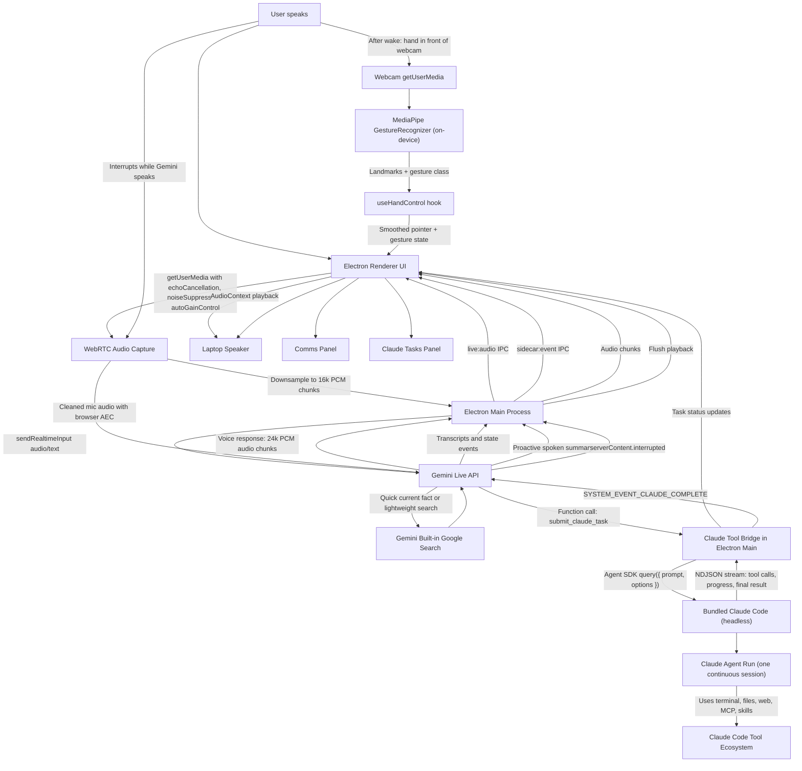

# Iris Architecture

[← Back to README](../README.md)

How the Gemini↔Claude bridge works end to end: the realtime audio path, the delegation flow, the main process/renderer split, and the exact Gemini tool surface.

## Current Architecture


```mermaid
flowchart TD
  User["User speaks"] --> ElectronRenderer["Electron Renderer UI"]

  ElectronRenderer -->|"getUserMedia with echoCancellation, noiseSuppression, autoGainControl"| WebRTCAudio["WebRTC Audio Capture"]
  WebRTCAudio -->|"Downsample to 16k PCM chunks"| ElectronMain["Electron Main Process"]

  ElectronMain -->|"sendRealtimeInput audio/text"| GeminiLive["Gemini Live API"]

  GeminiLive -->|"Voice response: 24k PCM audio chunks"| ElectronMain
  ElectronMain -->|"live:audio IPC"| ElectronRenderer
  ElectronRenderer -->|"AudioContext playback"| Speaker["Laptop Speaker"]

  GeminiLive -->|"Transcripts and state events"| ElectronMain
  ElectronMain -->|"sidecar:event IPC"| ElectronRenderer
  ElectronRenderer --> Comms["Comms Panel"]

  GeminiLive -->|"Quick current fact or lightweight search"| GoogleSearch["Gemini Built-in Google Search"]
  GoogleSearch --> GeminiLive

  GeminiLive -->|"Function call: submit_claude_task"| ClaudeTool["Claude Tool Bridge in Electron Main"]

  ClaudeTool -->|"Agent SDK query({ prompt, options })"| ClaudeCLI["Bundled Claude Code (headless)"]
  ClaudeCLI --> ClaudeAgent["Claude Agent Run (one continuous session)"]

  ClaudeAgent -->|"Uses terminal, files, web, MCP, skills"| ClaudeTools["Claude Code Tool Ecosystem"]

  ClaudeCLI -->|"NDJSON stream: tool calls, progress, final result"| ClaudeTool

  ClaudeTool -->|"Task status updates"| ElectronRenderer
  ElectronRenderer --> ClaudeTasks["Claude Tasks Panel"]

  ClaudeTool -->|"SYSTEM_EVENT_CLAUDE_COMPLETE"| GeminiLive
  GeminiLive -->|"Proactive spoken summary"| ElectronMain
  ElectronMain -->|"Audio chunks"| ElectronRenderer
  ElectronRenderer --> Speaker

  User -->|"Interrupts while Gemini speaks"| WebRTCAudio
  WebRTCAudio -->|"Cleaned mic audio with browser AEC"| GeminiLive
  GeminiLive -->|"serverContent.interrupted"| ElectronMain
  ElectronMain -->|"Flush playback"| ElectronRenderer

  User -->|"After wake: hand in front of webcam"| Camera["Webcam getUserMedia"]
  Camera --> MediaPipe["MediaPipe GestureRecognizer (on-device)"]
  MediaPipe -->|"Landmarks + gesture class"| HandHook["useHandControl hook"]
  HandHook -->|"Smoothed pointer + gesture state"| ElectronRenderer
```

## How The Flow Works

1. **You speak to the app.**

   Electron captures your microphone using Chromium's WebRTC audio path:

   ```ts
   echoCancellation: true
   noiseSuppression: true
   autoGainControl: true
   ```

   This gives the app laptop-speaker echo cancellation similar to browser/mobile voice apps.

2. **The renderer streams audio to Electron main.**

   The renderer downsamples microphone audio to 16 kHz PCM chunks and sends them over Electron IPC.

3. **Electron main streams to Gemini Live.**

   Electron main owns the Gemini Live session using `@google/genai` and sends audio via `sendRealtimeInput`.

4. **Gemini decides the route.**

   Gemini has two tool paths:

   - **Google Search** for quick current facts and simple web lookups.
   - **Claude tools** for real work: deals, research, coding, files, terminal work, email checks, browser tasks, automation, and anything that should continue in the background.

5. **Claude runs work in the background — one continuous session, one task at a time.**

   When Gemini calls `submit_claude_task`, Electron main starts a headless Claude Code run through the Agent SDK — `query({ prompt, options })` against the `claude` binary bundled inside the app, under `permissionMode: "bypassPermissions"`. There is no `claude -p` subprocess and no host CLI; see [PIPELINE_INTERNALS.md](PIPELINE_INTERNALS.md) for the full option surface.

   The call returns a `run_id` immediately, so Gemini can keep talking while Claude works. Sessions are **user-controlled**: the Work Stream panel has a session picker and a **New** button, and the active session can also be reset by voice ("Iris, new session"). Every task resumes the active session (the SDK's `resume`), so Claude remembers earlier tasks and follow-ups build on previous work — Gemini cannot pick or invent session ids. Tasks run strictly **one at a time**: if Claude is busy, the new task is queued and starts automatically when the current one finishes. Sessions persist across app restarts (`~/.myiris/claude-sessions.json`).

6. **The app streams Claude progress live.**

   Electron parses the NDJSON stream as Claude works: every tool call (`[Bash] npm test …`) and intermediate note appears in the task card in realtime, so you can see what Claude is doing. When the process exits, the card shows the final result.

7. **Claude completion is fed back to Gemini.**

   When a run completes, Electron sends Gemini an internal message:

   ```text
   SYSTEM_EVENT_CLAUDE_COMPLETE
   ```

   Gemini then proactively tells you Claude has returned, summarizes the result, and asks whether you want to go through the details before continuing.

8. **You can interrupt Gemini.**

   If you speak while Gemini is talking, Gemini sends an interruption event. The app flushes queued playback so Gemini stops talking over you.

## Main Components

Two-process Electron app. The Gemini↔Claude bridge used to live almost entirely
in `electron/main.mjs`; it's now ~40 single-responsibility modules under
`electron/`, with Electron API access confined to four of them (`main.mjs`,
`ipc.mjs`, `window.mjs`, `renderer-security.mjs`) — every other module is
Electron-free and importable in a plain vitest file with no harness. See the
`main-process-structure` capability spec for the full discipline.

- **`electron/main.mjs`** (~240 lines) — the composition root: imports every module, wires dependency injection via `wiring.mjs`, and runs the `app.whenReady()` startup sequence, `shutdownTeardown`, and quit handlers. No domain logic.
- **`electron/wiring.mjs`** (+ **`wiring-capabilities.mjs`**, **`wiring-live.mjs`**) — the composition root's dependency-injection wiring, split across three files purely because the block exceeded the 450-line file-size convention once every module existed. `wiring-capabilities.mjs` wires the canvas/second-brain capabilities, run-exec, and the Gemini tool/prompt modules; `wiring-live.mjs` wires the Live session and window/HUD/tray (a mutual dependency: window reads Live status and listen-only state, Live session reads the tray's `updateTrayMenu`).
- **`electron/ipc.mjs`** — every `ipcMain.handle`/`on` registration (the renderer↔main channel surface), diffable against `preload.cjs`. Marshals arguments and delegates only. Includes the OS-permission surface (`permissions:query` / `:request` / `:open-settings`) and the self-test arming pair (`system-audio-self-test:arm` / `:disarm`).
- **`electron/window.mjs`** — the main window, the Glass HUD shape-morph (`enterHud`/`exitHud`/`toggleHud`), and the Tray.
- **`electron/renderer-security.mjs`** — navigation containment and device-permission scoping (`renderer-content-security` capability); installed before the first window is created. Also composes the system-audio self-test arming and consults it in the display-media handler.
- **`electron/os-permissions.mjs`** — what macOS has granted (the four states, `restricted` kept distinct from not-yet-asked) and where the user changes it (the deep link plus the written pane path). Electron-free: `ipc.mjs` makes the thin `systemPreferences`/`shell` calls and marshals through it. Deliberately *not* in `renderer-security.mjs`, which answers "may this document capture" (containment) rather than "what has the OS granted" (reporting).
- **`electron/system-audio-self-test.mjs`** — the Permissions step's self-test arming: one grant, to the frame that armed it, on an absolute 6s deadline that re-arming does not extend. Electron-free over an injected clock, so the bound is assertable without booting Electron.
- **`electron/live-session.mjs`** (+ **`live-messages.mjs`**) — the Gemini Live session (`@google/genai`): connect/reconnect lifecycle plus the main-owned listen-only mode state in the former, server-message/tool-call handling in the latter.
- **`electron/gemini-tools.mjs`** / **`gemini-prompts.mjs`** — Gemini's function-declaration schemas and system-instruction prose; both compose contributions from registered capabilities rather than hardcoding them.
- **`electron/session-store.mjs`** — workstreams, the agent roster, and per-role model selection.
- **`electron/verbs.mjs`** — the verb registry: one record per verb (statefulness, park label, session key, model, skills, MCP servers, budget, parameter schema, persona, clause). Pure, Electron-free, and the single definition every consumer derives from.
- **`electron/run-dispatch.mjs`** (+ **`run-stream.mjs`**, **`run-exec.mjs`**) — the pre-dispatch review gate and tool-execution surface; run activity/tool-step streaming and the live-question relay; driving both run shapes (stateful and stateless, both via the Agent SDK's `query()`).
- **`electron/run-context.mjs`** (+ **`untrusted-text.mjs`**) — composes a run's brief from its verb's own parameter schema and attaches the bounded, fenced transcript of what the user actually said.
- **The note reader's hand-editing write** (`add-manual-note-editing`) — `secondbrain:write-note` and `secondbrain:open-note-externally` in `capabilities/second-brain.mjs`, the app's **only** arbitrary-content vault write. It is reachable from the note reader's editor and from nowhere else: not a verb, not an MCP tool, not in any skills surface — which is what keeps `personal-knowledge-notes`'s model-facing rule ("only enumerated structural operations") true while the vault's owner can still type in their own note. It shares `resolveVaultNotePath(id)` with `read-note`, so ghost nodes, unknown ids and symlinks escaping the vault are refused by the same guard. `read-note` serves a content-hash `revision` that a save must present, so a write is **refused** (never merged, never silently clobbered) when Claude's note session, a capture, or another app changed the file in between; overwriting is a separate explicit user act. A save to the currently-open note pushes a `SYSTEM_EVENT_NOTE_EDITED` so a resident note session re-reads instead of acting on a superseded paragraph division. `shell.openPath` is injected as `openPathExternally` from `main.mjs` through the wiring, so the capability stays Electron-free.
- **`electron/vault-write.mjs`** — the one module that owns writing to the second-brain vault: synchronous and async spool-append (`appendSpoolRecordSync`/`appendSpoolRecord`), an atomic, title-sanitized note-page writer (`createNotePage`), and the three enumerated structural edits (`linkNotes`, `unlinkNotes`, `setNoteTags`) that back the `mutate_vault_notes` tool. Electron-free, injected `fs`, never throws.
- **`electron/run-inbox.mjs`** — appends one record per finished run to the second-brain run-outcome spool, through `vault-write.mjs`. A plain `fs` append: no run, no tokens, no execution slot.
- **`electron/session-capture.mjs`** — the opt-in ambient session capture policy (`ambient-session-capture`): the enabled flag, the per-session watermark that makes progressive flushing idempotent, and the self-describing room-transcript rendering. Electron-free, injected `fs`/clock, never throws; `electron/capabilities/second-brain.mjs` owns the actual fail-closed gate and wires the flush triggers.
- **`electron/focus.mjs`** — the shared focus (`second-brain-focus`): the set of vault notes currently selected in the galaxy. Pure state transitions over `{ ids, at }` (`toggle`/`set`/`clear`) plus `resolve(focus, graph)`, which resolves ids to titles/tags against a graph passed in by the caller — no import of `vault-graph.mjs`, so it is testable with a literal graph object. `electron/capabilities/second-brain.mjs` holds the one instance.
- **`electron/announcements.mjs`** — voice announcements to the Live session, buffered while offline.
- **`electron/pipeline-probes.mjs`** / **`pipeline-install.mjs`** — Claude/OpenSpec availability probing (binary + credential) and skill installation.
- **`electron/bundled-binaries.mjs`** — resolves the app's own `claude` and `openspec`, including the `app.asar` → `app.asar.unpacked` rewrite. The only module that knows asar exists.
- **`electron/agent-definitions.mjs`** — parses `resources/personas/*.md` into the SDK's `AgentDefinition`, so personas are passed to `query()` by value instead of installed into `~/.claude/agents`.
- **`resources/iris-plugin/`** — a Claude Code plugin (`.claude-plugin/plugin.json` + `skills/` + `commands/opsx/`) shipped with the app and passed to every run via the SDK's `plugins` option. Everything it provides is namespaced `iris:*` (`iris:grilling`, `/iris:opsx:apply`) — the personas reference those names.
- **`electron/user-config.mjs`** — env/user config, the prompt-review-mode flag, and API-key/token handling.
- **`electron/capabilities/canvas.mjs`** / **`capabilities/second-brain.mjs`** — the canvas-claude-mcp and personal-knowledge-notes/second-brain capabilities, each owning its own state, IPC handlers, teardown, and Gemini prompt fragment end to end (`electron/capabilities/` is where a new capability's main-process code should live).
- **`electron/live-config.mjs`** — `buildLiveConfig()`, extracted so the Live session config is testable without booting Electron.
- **`electron/role-prompt.mjs`** / **`run-budget.mjs`** / **`run-skills.mjs`** / **`run-hooks.mjs`** / **`run-output-format.mjs`** / **`run-sessions.mjs`** — the per-run policy modules both roles route through, in the same "one policy, so the two can't drift" shape as `worker-env.mjs`: the base system prompt, the turn/spend ceilings, the per-role skill list, the SDK hook callbacks (guard + tool boundary), the structured-decisions schema, and session liveness/naming. All Electron-free, no I/O.
- **`electron/po-session.mjs`** — the stateful run shape: Agent SDK session lifecycle, streaming user-message channel, and the `canUseTool` callback intercepting `AskUserQuestion`. Isolated so the one-shot path never has to know it exists. Persona-agnostic — it is handed a system prompt and a skill list rather than building either.
- **`electron/app-identity.mjs`** — the single declaration of `PRODUCT_NAME`, `BUNDLE_ID`, and `STATE_ROOT_DIR`: the identifiers that keep this fork distinct from upstream `ASHR12/iris`. `package.json` cannot import it (electron-builder reads static JSON), so `app-identity.test.mjs` asserts the parity instead — the installer's `rm -rf` guard is only protective while the two agree. Nothing else may declare these.
- **`electron/app-paths.mjs`** — every child of the state root (`.env`, `claude-home`, the session store, the canvas store, the default workspace), one accessor each, `homedir` injectable. The only module that joins the state root onto a home directory. Carries the reasoning for pinning `CLAUDE_CONFIG_DIR`, which moved here from `worker-env.mjs`.
- **`electron/preload.cjs`** — the `window.iris` IPC bridge. Any new renderer↔main channel must be exposed here. (The bridge name is deliberately unchanged by the app rename — it is an in-process binding with no cross-application visibility.)
- **`src/App.tsx`** (by far the largest file in the repo) — renderer: mic capture (WebRTC AEC → 16 kHz PCM), Gemini playback (24 kHz PCM), the "Orbital Deck" UI, keyboard shortcuts, gestures, and the `uiMode` (`deck` | `hud`) switch.
- **`src/components/HudShell.tsx`** + **`src/styles/hud.css`** — the Glass HUD overlay; pointer-transparent except `.hud-hit` islands (App.tsx reports pointer-over-island via `hud:interactive`; main toggles `setIgnoreMouseEvents`).
- **`src/hooks/useHandControl.ts`** — MediaPipe `GestureRecognizer` hook (on-device, starts only after wake).
- **`src/components/ReactorCore.tsx`, `src/components/BootSequence.tsx`, `src/styles/`** — UI/animation. `src/styles/tokens.css`, `base.css`, `deck.css`, `fx.css`, `overlays.css`, `index.css` are adopted **upstream-verbatim and must stay byte-identical** so upstream ports diff cleanly; all Claude/Iris-specific styling goes in `src/styles/claude.css` (see the `deepspace-skin` capability spec).
- **`scripts/run-electron.mjs`** — launcher; clears `ELECTRON_RUN_AS_NODE`, supports `--prod`.

### Electron Preload

`electron/preload.cjs` exposes the safe IPC surface to the renderer: microphone
PCM chunks out, Gemini audio chunks and interruption events in, plus app-state
events. Any new renderer↔main channel must be declared here — it is meant to be
diffed against `electron/ipc.mjs`.

### React Renderer

Beyond the files above, the renderer captures the microphone with WebRTC audio
cleanup, downsamples to 16 kHz PCM, plays Gemini audio through an `AudioContext`,
renders the Comms and Claude Tasks panes and the dark-only Orbital Deck layout,
provides the in-window keyboard shortcuts, and runs camera hand-gesture control
after wake. The shortcuts that must work while another app has focus — the HUD
toggle, listen-only, and wake/sleep — are `globalShortcut` registrations in the
main process instead, and reach the renderer over the same channels the tray
uses (see the `wake-sleep-voice` and `hud-activation` specs).

## Gemini Tools

Gemini Live is configured with `{ googleSearch: {} }` (if billing is enabled) plus a `functionDeclarations` set that includes interface-control tools (`get_ui_context`, `control_ui`, `go_to_sleep`) always, and the Claude pipeline tools (`check_claude_status`, `submit_claude_task`, `get_claude_task_status`, `stop_claude_task`, `start_new_claude_session`, `get_workspace_info`, `answer_po_question`, `set_agent_model`) **only when the Claude pipeline is available** (see the [Pipeline Guide](PIPELINE_GUIDE.md)) — so in chat-only mode Gemini is never given a tool it can't use, and never offers to delegate.

Routing behavior:

- Quick answer or current fact: **Gemini Search**.
- Multi-step work or background task: **Claude**.
- Claude completion: **Gemini proactively announces result**.
- A stateful run pauses mid-task with a question (`SYSTEM_EVENT_PO_QUESTION`): **Gemini reads it aloud immediately and answers via `answer_claude_question`** once the user responds — distinct from the end-of-run "Decisions needed" relay, which applies to the stateless verbs and to a stateful run's lower-stakes calls.

## Listen-only mode — Iris's meeting mode

A toggle (headphone icon, tray item, `IRIS_LISTEN_HOTKEY`) that does two things at once: it makes Iris **completely silent**, and it makes her hear **the audio the machine is playing** as well as the microphone. It exists for the one situation a microphone alone cannot cover — a meeting, a call, a video — where the remote voices reach the user's speakers and never reach Iris.

**Silence.** While engaged, every reply turn is discarded in `electron/live-messages.mjs`: no audio to the renderer, no transcript text, no speaking state. That client-side discarding *is* the guarantee. The session is additionally sent an in-band request to stay quiet (`LISTEN_ONLY_ENGAGE_REQUEST` in `electron/gemini-prompts.mjs`, delivered by `sendClientContent({ turnComplete: false })` so it never asks for a reply), but that is only a cost reduction — it lives in the conversation and `contextWindowCompression` can evict it mid-meeting. Activity detection is deliberately left alone, so the model keeps producing replies that are thrown away; that is what keeps input transcription flushing, which is what fills the record.

**System audio.** `getDisplayMedia({ video: false, audio: true })` in `src/hooks/useAudioPipeline.ts`, answered by `setDisplayMediaRequestHandler` in `electron/renderer-security.mjs` with `{ audio: "loopback" }` — audio only, the app's own frame only, and only while the mode is engaged (read from main's own state, never from the renderer). It is summed into the existing `mic-downsample` worklet through a gain node, so one mixed PCM stream still crosses IPC, exactly as before. `src/lib/system-audio.ts` owns the mix (the mic's gain is derived from `IRIS_SYSTEM_AUDIO_GAIN` so the sum keeps headroom) and the liveness check: a capture that delivers bit-exact zeroes is treated as failed, because that — not a rejected promise — is how this fails in practice.

**Nothing disengages the mode except the user.** A silent or dead capture drops only the system-audio source; a reconnect, or exhausting reconnect attempts, leaves the mode engaged. Disengaging restores Iris's voice, and a network blip is not a reason to make her audible in a room she was silenced for. The one exception is a capture that cannot be acquired at all as the mode engages: the renderer reports that fact and main disengages, so the user never loses her voice for a mode that has nothing to offer.

**Retention.** Everything Iris hears while engaged is written to `inbox/meetings/` in the notes vault (`electron/meeting-capture.mjs`), one file per engagement, fed from raw `inputAudioTranscription` fragments rather than the bounded recent-utterance ring. This is gated on the **mode**, not on the ambient-capture preference — engaging the mode is the consent point, stated the first time — and ambient capture yields the span so the same speech is never written to two areas under two consents.

`IRIS_SYSTEM_AUDIO=0` restores the pre-change behaviour entirely: silence only, no capture, no retention. See `openspec/specs/listen-only-mode/spec.md` for the full authoritative behavior.
