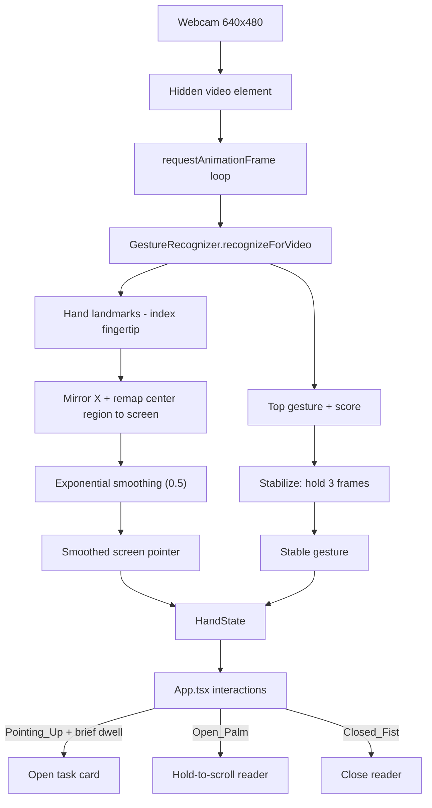

# Hand & Gesture Control (MediaPipe)

[← Back to README](../README.md)

The app can be driven in the air with your webcam. The camera does **not** start
on app boot; it is enabled automatically after wake, once Gemini Live and mic
capture are initialized. Hand tracking and gesture
classification run **fully on-device** using Google's
[MediaPipe Tasks Vision](https://ai.google.dev/edge/mediapipe/solutions/vision/gesture_recognizer)
`GestureRecognizer`. No camera frames ever leave your machine — only the derived
pointer position and gesture label are used by the UI.

File: `src/useHandControl.ts` (consumed by `src/App.tsx`).

### What we use

- **Package:** `@mediapipe/tasks-vision` (the WebAssembly "Tasks Vision" runtime).
- **Task:** `GestureRecognizer` — a pre-trained model that returns both hand
  landmarks and a classified gesture in one pass.
- **Model asset:** `gesture_recognizer.task` (Google's canned-gesture classifier).
- **WASM runtime:** loaded via `FilesetResolver.forVisionTasks(...)` from the
  MediaPipe CDN.

### How we configure it

```ts
const fileset = await FilesetResolver.forVisionTasks(WASM_URL);
recognizer = await GestureRecognizer.createFromOptions(fileset, {
  baseOptions: { modelAssetPath: MODEL_URL, delegate: "GPU" },
  runningMode: "VIDEO",
  numHands: 1,
  minHandDetectionConfidence: 0.6,
  minHandPresenceConfidence: 0.6,
  minTrackingConfidence: 0.6,
  cannedGesturesClassifierOptions: { scoreThreshold: 0.55 },
});
```

- **GPU delegate** for low-latency inference, **VIDEO** running mode for a live
  webcam stream.
- **One hand** is tracked to keep the interaction unambiguous.
- Confidence floors (`0.6`) and a canned-gesture score threshold (`0.55`) reject
  weak/uncertain frames.

### The processing pipeline

1. After wake, `navigator.mediaDevices.getUserMedia` opens the front camera at
   640×480 into a hidden `<video>` element.
2. A `requestAnimationFrame` loop calls
   `recognizer.recognizeForVideo(video, performance.now())` each frame.
3. From the result we read the first hand's **landmarks** and the **top gesture**.
4. **Pointer:** we take the index-fingertip landmark (`hand[8]`), mirror X
   (`1 - x`) for a natural selfie view, then remap a comfortable center region of
   the frame to the full screen (so you don't have to reach the physical edges):

   ```ts
   const INPUT_RANGE = { xMin: 0.18, xMax: 0.82, yMin: 0.12, yMax: 0.82 };
   ```

   The mapped point is then **exponentially smoothed** (factor `0.5`) to remove jitter.
5. **Gesture stabilization:** a raw gesture must persist for **3 frames** before it
   becomes the "stable" gesture, which prevents flicker between classes.

### Gesture → action mapping

| Gesture (MediaPipe class) | Action in the app |
| --- | --- |
| `Pointing_Up` | Move the on-screen cursor; **dwell ~850 ms** over a task card to open it |
| `Open_Palm` | **Hold-to-scroll** the open reader (joystick: hold high = scroll up, low = scroll down, middle = neutral; speed scales with distance) |
| `Closed_Fist` | Close the expanded reader |
| `None` / other | Idle — pointer hidden |

### Gesture control flow



### Reader animation

Expanded Claude task results open with a simple scale/fade pop and close with a
short fade/scale animation. The intentionally simple animation keeps the UI
clean and avoids expensive DOM rasterization.
