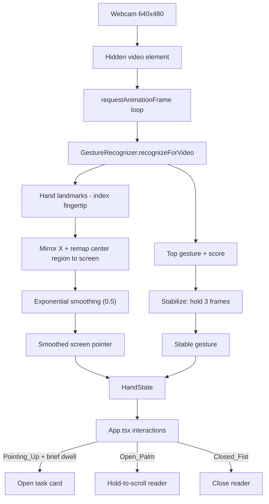

# Hand & Gesture Control (MediaPipe)

[← Back to README](../README.md)

The app can be driven in the air with your webcam. The camera does **not** start
on app boot; it is enabled automatically after wake, once Gemini Live and mic
capture are initialized. Hand tracking and gesture
classification run **fully on-device** using Google's
[MediaPipe Tasks Vision](https://ai.google.dev/edge/mediapipe/solutions/vision/gesture_recognizer)
`GestureRecognizer`. No camera frames ever leave your machine — only the derived
pointer position and gesture label are used by the UI.

File: `src/useHandControl.ts` (consumed by `src/App.tsx`).

### What we use

- **Package:** `@mediapipe/tasks-vision` (the WebAssembly "Tasks Vision" runtime).
- **Task:** `GestureRecognizer` — a pre-trained model that returns both hand
  landmarks and a classified gesture in one pass.
- **Model asset:** `gesture_recognizer.task` (Google's canned-gesture classifier).
- **WASM runtime:** loaded via `FilesetResolver.forVisionTasks(...)` from
  locally vendored assets under `public/runtime/mediapipe/` (see
  `scripts/vendor-runtime-assets.mjs` and `docs/REFERENCE.md`) — no CDN fetch.

### How we configure it

```ts
const fileset = await FilesetResolver.forVisionTasks(WASM_URL);
recognizer = await GestureRecognizer.createFromOptions(fileset, {
  baseOptions: { modelAssetPath: MODEL_URL, delegate: "GPU" },
  runningMode: "VIDEO",
  numHands: 1,
  minHandDetectionConfidence: 0.6,
  minHandPresenceConfidence: 0.6,
  minTrackingConfidence: 0.6,
  cannedGesturesClassifierOptions: { scoreThreshold: 0.55 },
});
```

- **GPU delegate** for low-latency inference, **VIDEO** running mode for a live
  webcam stream.
- **One hand** is tracked to keep the interaction unambiguous.
- Confidence floors (`0.6`) and a canned-gesture score threshold (`0.55`) reject
  weak/uncertain frames.

### The processing pipeline

1. After wake, `navigator.mediaDevices.getUserMedia` opens the front camera at
   640×480 into a hidden `<video>` element.
2. A `requestAnimationFrame` loop calls
   `recognizer.recognizeForVideo(video, performance.now())` each frame.
3. From the result we read the first hand's **landmarks** and the **top gesture**.
4. **Pointer:** we take the index-fingertip landmark (`hand[8]`), mirror X
   (`1 - x`) for a natural selfie view, then remap a comfortable center region of
   the frame to the full screen (so you don't have to reach the physical edges):

   ```ts
   const INPUT_RANGE = { xMin: 0.18, xMax: 0.82, yMin: 0.12, yMax: 0.82 };
   ```

   The mapped point is then **exponentially smoothed** (factor `0.5`) to remove jitter.
5. **Gesture stabilization:** a raw gesture must persist for **3 frames** before it
   becomes the "stable" gesture, which prevents flicker between classes.

### Gesture → action mapping

| Gesture (MediaPipe class) | Action in the app |
| --- | --- |
| `Pointing_Up` | Move the on-screen cursor; **dwell ~850 ms** over a task card to open it |
| `Open_Palm` | **Hold-to-scroll** the open reader (joystick: hold high = scroll up, low = scroll down, middle = neutral; speed scales with distance) |
| `Closed_Fist` | Close the expanded reader |
| `None` / other | Idle — pointer hidden |

### Gesture control flow


```mermaid
flowchart TD
  Webcam["Webcam 640x480"] --> Video["Hidden video element"]
  Video --> Loop["requestAnimationFrame loop"]
  Loop --> Recognize["GestureRecognizer.recognizeForVideo"]
  Recognize --> Landmarks["Hand landmarks - index fingertip"]
  Recognize --> GestureClass["Top gesture + score"]

  Landmarks --> Mirror["Mirror X + remap center region to screen"]
  Mirror --> Smooth["Exponential smoothing (0.5)"]
  Smooth --> Pointer["Smoothed screen pointer"]

  GestureClass --> Stabilize["Stabilize: hold 3 frames"]
  Stabilize --> StableGesture["Stable gesture"]

  Pointer --> HandState["HandState"]
  StableGesture --> HandState
  HandState --> AppUI["App.tsx interactions"]

  AppUI -->|"Pointing_Up + brief dwell"| OpenCard["Open task card"]
  AppUI -->|"Open_Palm"| Scroll["Hold-to-scroll reader"]
  AppUI -->|"Closed_Fist"| Close["Close reader"]
```

### Second-brain galaxy gestures

The second-brain galaxy (`src/lib/galaxy-nav.ts`, driven by `VaultGalaxy.tsx`)
partitions the hand into its own set of drives, active only while the galaxy
is open and no reader is open over it:

| Pose | Action |
| --- | --- |
| `Pointing_Up` | Node dwell — hold over a node 300 ms to **open** it (same dwell mechanic as the deck) |
| `Victory` (two fingers) | **Inspect** — hold near a node to light up its link cluster while held. Selects nothing, opens nothing, leaves nothing behind |
| `Closed_Fist` | Orbit the camera around the graph |
| Two open palms | Zoom the camera — not a galaxy binding but the general two-hand rule applied to whichever layer owns the surface |
| Anything else (a single open palm, unrecognized, resting) | Drives nothing |

**A pinch has no meaning in the galaxy at all.** Whatever canned class the
recognizer assigns a pinched hand is what drives it — a tight pinch reads as
`Closed_Fist` and orbits like any other fist, and the thumb-index distance is
never read. An earlier design split the pinch into a quick tap that selected
and a held pinch that zoomed; `two-palm-galaxy-zoom` replaced both with the
two-open-palms rule above and removed the pinch entirely, which also removed
the need for a tap/hold discrimination window.

**Only the opening dwell has a state machine.** `Pointing_Up` is the one pose
that commits to something, so it is the one that needs a hold, a dead-band and
a leave-and-re-acquire rule (all in `dwellStep`). The inspect pose commits to
nothing, so it has no hold at all: the cluster lights the moment the pose is
near a node, and nothing fires on release.

**Pointing at a node lights up its links — and dims everything else.** The
links incident to whatever node is pointed at are drawn bright, that node plus
its one-hop neighbours at full strength, and the rest of the galaxy is dimmed
around them. A spotlight, not an accent: in a dense galaxy a merely-brighter
cluster still sits inside a mesh of everything else, so the thing being asked
about has to be the only thing lit.

**Pointing takes precedence over the focus's own dimming**, rather than adding a
second bright island beside it — one question is answered at a time. So pointing
at a node the focus had dimmed still reveals what that node connects to without
changing the focus, and releasing restores the focus's dimming exactly (it is
recomputed from whatever is current, never restored from a saved copy). A
**focused** node stays visibly focused even while the spotlight is elsewhere:
losing sight of a selection because you pointed at something else is a worse
trade than the spotlight is worth.

There is exactly ONE set of "nodes exempt from dimming" in the code — `litIds` —
and the caller decides what it is (the pointed-at cluster, else the focus's, else
nothing). The spotlight and the focus declutter are therefore the same mechanism
rather than two that have to be reconciled at each call site. It changes nothing
and accumulates nothing: one node is lit at a time, and ceasing to point restores
the view.

Three producers, one rendering — the mouse hovering a node, the `Victory`
inspect pose, and the node a `Pointing_Up` dwell is charging against. The
hand wins when both a hand and the mouse could apply. A hand that **drives
nothing also shows nothing**: an earlier pass let the highlight follow a hand
in any pose, reasoning that a highlight is feedback rather than a drive, and in
use that lit one cluster after another as a hand drifted — the view twitching at
the hand instead of answering a question. A camera drive suppresses it too,
since while orbiting or zooming the hand's position means "camera", not
"target".

**Why the lit links are bright enough to see:** `linkOpacity` is a graph-wide
constant that three-forcegraph *multiplies* into each link's own colour alpha,
so a value below 1 is a **ceiling on every link**. It is therefore set to `1`,
with the resting dimness folded into `LINK_BASE_COLOR`'s own alpha — resting
links render at exactly the opacity they always did, while a lit one can reach
near-full intensity instead of being capped at half.

**Clearing the focus is a control, not a gesture** — a button in the HUD's
control island, reachable by dwell like every other control there. An
accidental pinch over empty space does nothing (it neither selects nor
clears), so a deliberately-built selection can't be discarded by a stray
gesture with no undo.

**Selection is the mouse's job, deliberately.** A plain click opens a note and a
Cmd/Ctrl-click toggles its focus; **no gesture selects a node.** That is a
recorded decision in `second-brain-gesture-nav`, and it has now been tested
twice over: a first pass at a `Victory`-to-select gesture produced exactly the
failure the decision predicted — sweeping the pose across the graph toggled node
after node into the focus, the bound pushed older ones out so nodes appeared to
light up in sequence, and releasing the pose left a selection behind that the
user never asked for. `Victory` reveals instead, and the focus keeps a single
producer.

**The galaxy frames its whole graph in view once, the first time a fresh open
settles** (`zoomToFit`, on the first `onEngineStop`) — otherwise the default
camera distance is a fixed constant that doesn't scale with the vault's
actual spread, and a vault with many notes would start looking into the
converged core with nothing to orient by. It never re-fires after that first
settle, so a later topology change (a new link, a new note) never yanks the
camera away from wherever the user has since navigated to.

**Selecting a note also declutters the view around it.** A large vault
converges into a dense mass, and rotating in 3D to reach the cluster you want
is real friction. Rather than changing what is fetched or simulated, whatever
is outside the focused note's one-hop link neighborhood (`focusNeighborhood`
in `galaxy-nav.ts`) is dimmed near-invisible — nodes and edges alike — so the
selection and its immediate neighbors stand out without anything moving or
disappearing. Clearing the focus restores the full graph.

### Eye HUD (decorative)

The same camera session also drives a **purely decorative** iris HUD over the
camera preview — a J.A.R.V.I.S.-style lock-on reticle on one eye and a
telemetry callout beside the other. It drives **no** gesture, pointer, or app
behavior; eye position decides only where those two elements are drawn. It has
no switch of its own: it lives and dies with the hand-gesture toggle above.

It uses `FaceLandmarker`, a **sibling task to `GestureRecognizer` in the same
`@mediapipe/tasks-vision` package** — same `FilesetResolver`, same vendored WASM
fileset, one extra model asset (`face_landmarker.task`, vendored by
`scripts/vendor-runtime-assets.mjs` exactly like the gesture model). There is
**no second `getUserMedia`**: `useEyeTracking(stream, enabled)`
(`src/hooks/useEyeTracking.ts`) takes the `MediaStream` `useHandControl` already
opened and runs against its own detached `<video>`, so there is one camera
session and one permission prompt. It is called once in `App.tsx`, not inside
either camera component — the deck and the HUD are mutually exclusive, so a
component-level hook would re-initialize the model on every mode switch.

A failed model load degrades to "no overlays" with nothing shown to the user.

| Piece | Where |
| --- | --- |
| Tracking hook, `EyeState`/`TrackedEye` types | `src/hooks/useEyeTracking.ts` |
| Iris center/radius, the presence gate | `src/lib/eye.ts` |
| Ring geometry, acquire easing, panel side-selection | `src/lib/eye-hud.ts` |
| The SVG ring stack and the tether | `src/components/EyeReticle.tsx` |
| The HTML telemetry panel | `src/components/EyeReadout.tsx` |
| Styling | `src/styles/claude.css` |

**Which eye gets what is fixed.** The ring is driven by MediaPipe's
anatomically-**right** iris (`eyes[EYE_RING]`, boundary landmarks 469–472) and
the panel by the **left** one (`eyes[EYE_READOUT]`, 474–477). The preview is
mirrored, so those two vocabularies agree rather than invert: **the ring
appears on the right of the frame and the panel on its left.** The array is
built in one hardcoded order and never sorted, so the assignment cannot flip
between frames or sessions.

The panel hangs outward from its eye — left, matching the side of the frame it
tracks — and never moves anywhere else. Its position is `eyeX - offset`, a pure
function of that eye alone (`resolveReadoutLayout` in `eye-hud.ts`), so near the
frame's left edge it is simply **clipped**. That is deliberate: it keeps each
eye's instrument in its own half of the frame, where the two can never collide,
and it keeps the panel from relocating while the user turns their head. The
content is placeholder telemetry, so clipping loses nothing real.

### HUD camera zoom

HUD mode has a **Cam** pill above the camera dock that toggles the frame
between its standard size and ~35% larger (300px → 405px wide). It exists
because HUD mode serves two conflicting purposes: it is what is on screen
during a **livestream**, where a bigger face reads better to an audience, and
it is also the **working overlay** kept up while using other applications,
where a large camera eats room other content needs.

The standard size is the default, and the choice is remembered across restarts
(`iris.hudCameraEnlarged` in `localStorage`); an absent or unreadable value
resolves to the standard size, so the failure mode is "reverts to normal",
never "stuck enlarged". Only the camera resizes — the comms panel beside it
keeps its width, and the deck's camera dock has no such control. The eye
overlays rescale with the frame automatically.

### Reader animation

Expanded Claude task results open with a simple scale/fade pop and close with a
short fade/scale animation. The intentionally simple animation keeps the UI
clean and avoids expensive DOM rasterization.
