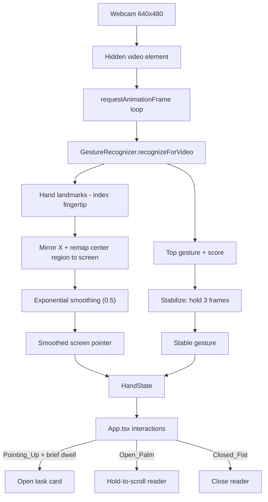

# Hand & Gesture Control (MediaPipe)

[← Back to README](../README.md)

The app can be driven in the air with your webcam. The camera does **not** start
on app boot; it is enabled automatically after wake, once Gemini Live and mic
capture are initialized. Hand tracking and gesture
classification run **fully on-device** using Google's
[MediaPipe Tasks Vision](https://ai.google.dev/edge/mediapipe/solutions/vision/gesture_recognizer)
`GestureRecognizer`. No camera frames ever leave your machine — only the derived
pointer position and gesture label are used by the UI.

File: `src/useHandControl.ts` (consumed by `src/App.tsx`).

### What we use

- **Package:** `@mediapipe/tasks-vision` (the WebAssembly "Tasks Vision" runtime).
- **Task:** `GestureRecognizer` — a pre-trained model that returns both hand
  landmarks and a classified gesture in one pass.
- **Model asset:** `gesture_recognizer.task` (Google's canned-gesture classifier).
- **WASM runtime:** loaded via `FilesetResolver.forVisionTasks(...)` from
  locally vendored assets under `public/runtime/mediapipe/` (see
  `scripts/vendor-runtime-assets.mjs` and `docs/REFERENCE.md`) — no CDN fetch.

### How we configure it

```ts
const fileset = await FilesetResolver.forVisionTasks(WASM_URL);
recognizer = await GestureRecognizer.createFromOptions(fileset, {
  baseOptions: { modelAssetPath: MODEL_URL, delegate: "GPU" },
  runningMode: "VIDEO",
  numHands: 1,
  minHandDetectionConfidence: 0.6,
  minHandPresenceConfidence: 0.6,
  minTrackingConfidence: 0.6,
  cannedGesturesClassifierOptions: { scoreThreshold: 0.55 },
});
```

- **GPU delegate** for low-latency inference, **VIDEO** running mode for a live
  webcam stream.
- **One hand** is tracked to keep the interaction unambiguous.
- Confidence floors (`0.6`) and a canned-gesture score threshold (`0.55`) reject
  weak/uncertain frames.

### The processing pipeline

1. After wake, `navigator.mediaDevices.getUserMedia` opens the front camera at
   640×480 into a hidden `<video>` element.
2. A `requestAnimationFrame` loop calls
   `recognizer.recognizeForVideo(video, performance.now())` each frame.
3. From the result we read the first hand's **landmarks** and the **top gesture**.
4. **Pointer:** we take the index-fingertip landmark (`hand[8]`), mirror X
   (`1 - x`) for a natural selfie view, then remap a comfortable center region of
   the frame to the full screen (so you don't have to reach the physical edges):

   ```ts
   const INPUT_RANGE = { xMin: 0.18, xMax: 0.82, yMin: 0.12, yMax: 0.82 };
   ```

   The mapped point is then **exponentially smoothed** (factor `0.5`) to remove jitter.
5. **Gesture stabilization:** a raw gesture must persist for **3 frames** before it
   becomes the "stable" gesture, which prevents flicker between classes.

### Gesture → action mapping

| Gesture (MediaPipe class) | Action in the app |
| --- | --- |
| `Pointing_Up` | Move the on-screen cursor; **dwell ~850 ms** over a task card to open it |
| `Open_Palm` | **Hold-to-scroll** the open reader (joystick: hold high = scroll up, low = scroll down, middle = neutral; speed scales with distance) |
| `Closed_Fist` | Close the expanded reader |
| `None` / other | Idle — pointer hidden |

### Gesture control flow


```mermaid
flowchart TD
  Webcam["Webcam 640x480"] --> Video["Hidden video element"]
  Video --> Loop["requestAnimationFrame loop"]
  Loop --> Recognize["GestureRecognizer.recognizeForVideo"]
  Recognize --> Landmarks["Hand landmarks - index fingertip"]
  Recognize --> GestureClass["Top gesture + score"]

  Landmarks --> Mirror["Mirror X + remap center region to screen"]
  Mirror --> Smooth["Exponential smoothing (0.5)"]
  Smooth --> Pointer["Smoothed screen pointer"]

  GestureClass --> Stabilize["Stabilize: hold 3 frames"]
  Stabilize --> StableGesture["Stable gesture"]

  Pointer --> HandState["HandState"]
  StableGesture --> HandState
  HandState --> AppUI["App.tsx interactions"]

  AppUI -->|"Pointing_Up + brief dwell"| OpenCard["Open task card"]
  AppUI -->|"Open_Palm"| Scroll["Hold-to-scroll reader"]
  AppUI -->|"Closed_Fist"| Close["Close reader"]
```

### Second-brain galaxy gestures

The second-brain galaxy (`src/lib/galaxy-nav.ts`, driven by `VaultGalaxy.tsx`)
partitions the hand into its own set of drives, active only while the galaxy
is open and no reader is open over it:

| Pose | Action |
| --- | --- |
| `Pointing_Up` | Node dwell — hold over a node to open it (same dwell mechanic as the deck) |
| `Closed_Fist` | Orbit the camera around the graph |
| A pinch, released quickly (a **tap**) | Toggles the pointed-at node's focus — see `second-brain-focus` |
| A pinch, held past the tap window | Dollies the camera (zoom) |
| Anything else (open palm, unrecognized, resting) | Drives nothing |

The pinch is deliberately split into two outcomes rather than always meaning
zoom: a quick pinch-and-release selects (toggles focus), while a held pinch
zooms. The two are told apart by a discrimination window (`TAP_MAX_MS` in
`galaxy-nav.ts`) — the camera does not move at all until the window elapses,
so the graph never shifts under the hand between the gesture and its effect,
and a pinch that has already become a zoom never fires a tap on release no
matter how slowly it is released.

**Clearing the focus is a control, not a gesture** — a button in the HUD's
control island, reachable by dwell like every other control there. An
accidental pinch over empty space does nothing (it neither selects nor
clears), so a deliberately-built selection can't be discarded by a stray
gesture with no undo.

Selection is also reachable with hand control off, by mouse: a plain click
still opens a note, and a Cmd/Ctrl-click toggles its focus instead.

**The galaxy frames its whole graph in view once, the first time a fresh open
settles** (`zoomToFit`, on the first `onEngineStop`) — otherwise the default
camera distance is a fixed constant that doesn't scale with the vault's
actual spread, and a vault with many notes would start looking into the
converged core with nothing to orient by. It never re-fires after that first
settle, so a later topology change (a new link, a new note) never yanks the
camera away from wherever the user has since navigated to.

**Selecting a note also declutters the view around it.** A large vault
converges into a dense mass, and rotating in 3D to reach the cluster you want
is real friction. Rather than changing what is fetched or simulated, whatever
is outside the focused note's one-hop link neighborhood (`focusNeighborhood`
in `galaxy-nav.ts`) is dimmed near-invisible — nodes and edges alike — so the
selection and its immediate neighbors stand out without anything moving or
disappearing. Clearing the focus restores the full graph.

### Reader animation

Expanded Claude task results open with a simple scale/fade pop and close with a
short fade/scale animation. The intentionally simple animation keeps the UI
clean and avoids expensive DOM rasterization.
