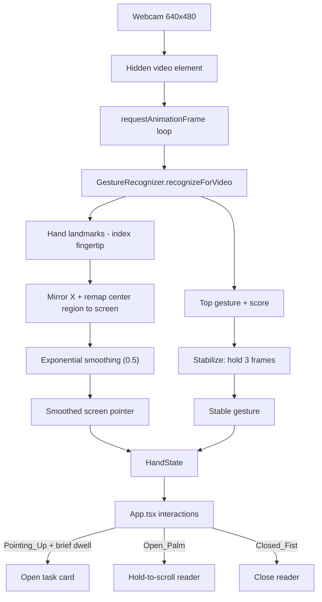

# Hand & Gesture Control (MediaPipe)

[← Back to README](../README.md)

The app can be driven in the air with your webcam. The camera does **not** start
on app boot; it is enabled automatically after wake, once Gemini Live and mic
capture are initialized. Hand tracking and gesture
classification run **fully on-device** using Google's
[MediaPipe Tasks Vision](https://ai.google.dev/edge/mediapipe/solutions/vision/gesture_recognizer)
`GestureRecognizer`. No camera frames ever leave your machine — only the derived
pointer position and gesture label are used by the UI.

File: `src/useHandControl.ts` (consumed by `src/App.tsx`).

### What we use

- **Package:** `@mediapipe/tasks-vision` (the WebAssembly "Tasks Vision" runtime).
- **Task:** `GestureRecognizer` — a pre-trained model that returns both hand
  landmarks and a classified gesture in one pass.
- **Model asset:** `gesture_recognizer.task` (Google's canned-gesture classifier).
- **WASM runtime:** loaded via `FilesetResolver.forVisionTasks(...)` from
  locally vendored assets under `public/runtime/mediapipe/` (see
  `scripts/vendor-runtime-assets.mjs` and `docs/REFERENCE.md`) — no CDN fetch.

### How we configure it

```ts
const fileset = await FilesetResolver.forVisionTasks(WASM_URL);
recognizer = await GestureRecognizer.createFromOptions(fileset, {
  baseOptions: { modelAssetPath: MODEL_URL, delegate: "GPU" },
  runningMode: "VIDEO",
  numHands: 1,
  minHandDetectionConfidence: 0.6,
  minHandPresenceConfidence: 0.6,
  minTrackingConfidence: 0.6,
  cannedGesturesClassifierOptions: { scoreThreshold: 0.55 },
});
```

- **GPU delegate** for low-latency inference, **VIDEO** running mode for a live
  webcam stream.
- **One hand** is tracked to keep the interaction unambiguous.
- Confidence floors (`0.6`) and a canned-gesture score threshold (`0.55`) reject
  weak/uncertain frames.

### The processing pipeline

1. After wake, `navigator.mediaDevices.getUserMedia` opens the front camera at
   640×480 into a hidden `<video>` element.
2. A `requestAnimationFrame` loop calls
   `recognizer.recognizeForVideo(video, performance.now())` each frame.
3. From the result we read the first hand's **landmarks** and the **top gesture**.
4. **Pointer:** we take the index-fingertip landmark (`hand[8]`), mirror X
   (`1 - x`) for a natural selfie view, then remap a comfortable center region of
   the frame to the full screen (so you don't have to reach the physical edges):

   ```ts
   const INPUT_RANGE = { xMin: 0.18, xMax: 0.82, yMin: 0.12, yMax: 0.82 };
   ```

   The mapped point is then **exponentially smoothed** (factor `0.5`) to remove jitter.
5. **Gesture stabilization:** a raw gesture must persist for **3 frames** before it
   becomes the "stable" gesture, which prevents flicker between classes.

### Gesture → action mapping

| Gesture (MediaPipe class) | Action in the app |
| --- | --- |
| `Pointing_Up` | Move the on-screen cursor; **dwell ~850 ms** over a task card to open it |
| `Open_Palm` | **Hold-to-scroll** the open reader (joystick: hold high = scroll up, low = scroll down, middle = neutral; speed scales with distance) |
| `Closed_Fist` | Close the expanded reader |
| `None` / other | Idle — pointer hidden |

### Gesture control flow


```mermaid
flowchart TD
  Webcam["Webcam 640x480"] --> Video["Hidden video element"]
  Video --> Loop["requestAnimationFrame loop"]
  Loop --> Recognize["GestureRecognizer.recognizeForVideo"]
  Recognize --> Landmarks["Hand landmarks - index fingertip"]
  Recognize --> GestureClass["Top gesture + score"]

  Landmarks --> Mirror["Mirror X + remap center region to screen"]
  Mirror --> Smooth["Exponential smoothing (0.5)"]
  Smooth --> Pointer["Smoothed screen pointer"]

  GestureClass --> Stabilize["Stabilize: hold 3 frames"]
  Stabilize --> StableGesture["Stable gesture"]

  Pointer --> HandState["HandState"]
  StableGesture --> HandState
  HandState --> AppUI["App.tsx interactions"]

  AppUI -->|"Pointing_Up + brief dwell"| OpenCard["Open task card"]
  AppUI -->|"Open_Palm"| Scroll["Hold-to-scroll reader"]
  AppUI -->|"Closed_Fist"| Close["Close reader"]
```

### Which layer owns the hand

The Glass HUD has two gesture modes, and nothing declares which is in force —
it is already visible on screen. **Hand reach follows mouse reach**: whatever
the mouse can click at this moment, the hand can dwell at this moment.

- **Shared, decided by position.** The galaxy and the drawing panel are painted
  *beneath* `.hud-chrome` — the review stack, the tasks column, the comms
  column, the orb island — which stay visible and mouse-clickable over them. So
  each keeps its own bindings and the hand belongs to whichever one it is over:
  dwell and palm-scroll work on the chrome, the layer's own drives work on the
  layer. `src/lib/hudChrome.ts` is the single declaration both the CSS stacking
  and the gesture loops read.
- **Focused, held exclusively.** An open reader — the task run-reader or the
  vault note reader — paints a full-screen backdrop over all of it and takes
  *every* gesture until it closes, at which point the hand returns to the shared
  mode. `App.tsx`'s one `readerOpen` value is what says so.

One asymmetry inside the shared mode: the galaxy's **pointing** drives (node
dwell, inspect) yield over chrome, so a finger aimed at a task card never also
charges a dwell on a node behind it. Its **camera** drive (two-palm
fly-to-note) does not yield — it acts on the whole view, and stalling it because
the hand crossed a panel would feel broken. Authoritative: the
`two-hand-gestures` and `second-brain-gesture-nav` specs.

### Second-brain galaxy gestures

The second-brain galaxy (`src/lib/galaxy-nav.ts`, driven by `VaultGalaxy.tsx`)
partitions the hand into its own set of drives, active while the galaxy is open,
no reader is open over it, and the hand is over the galaxy rather than the HUD
chrome above it:

| Pose | Action |
| --- | --- |
| `Pointing_Up` | Node dwell — hold over a node 300 ms to **open** it (same dwell mechanic as the deck) |
| `Victory` (two fingers) | **Inspect** — hold near a node to light up its link cluster while held. Selects nothing, opens nothing, leaves nothing behind |
| A single `Open_Palm` | **Aims** — the sight follows it and chooses the note to lock (D24/D25). Commits nothing. With both hands up, the one further RIGHT on screen wins, which the mirrored preview makes the user's right hand |
| `Closed_Fist` | **Turns the camera** around the locked note (D25) — and does **nothing at all until a note is locked**. A fist does not aim — one job per pose, or the turn would re-target on its own movement |
| Two open palms | Zoom **the middle of the view** — along the axis the camera already looks down |
| `Closed_Fist` + an open palm | **Reels in** on the locked note: the fist holds it while the other hand pulls you toward it (D26), and like the turn it is inert until something is locked. Which *kind* of zoom you get is still carried by the hands rather than by hidden state. The fist is measured at the **wrist**: a fingertip travels a long way just from curling, and this law maps distance straight to camera radius, so reading the fingertip turned knuckle movement into camera travel |
| Anything else (a single open palm, unrecognized, resting) | Drives nothing |
| A hand in the **bottom third of the frame**, whatever it is doing | Drives nothing, and releases a drive in progress |

**A pinch has no meaning in the galaxy at all.** Whatever canned class the
recognizer assigns a pinched hand is what drives it — a tight pinch reads as
`Closed_Fist`, which drives nothing, and the thumb-index distance is
never read. An earlier design split the pinch into a quick tap that selected
and a held pinch that zoomed; `two-palm-galaxy-zoom` replaced both with the
two-open-palms rule above and removed the pinch entirely, which also removed
the need for a tap/hold discrimination window.

**Only the opening dwell has a state machine.** `Pointing_Up` is the one pose
that commits to something, so it is the one that needs a hold, a dead-band and
a leave-and-re-acquire rule (all in `dwellStep`). The inspect pose commits to
nothing, so it has no hold at all: the cluster lights the moment the pose is
near a node, and nothing fires on release.

**Pointing at a node lights up its links — and dims everything else.** The
links incident to whatever node is pointed at are drawn bright, that node plus
its one-hop neighbours at full strength, and the rest of the galaxy is dimmed
around them. A spotlight, not an accent: in a dense galaxy a merely-brighter
cluster still sits inside a mesh of everything else, so the thing being asked
about has to be the only thing lit.

**Pointing takes precedence over the focus's own dimming**, rather than adding a
second bright island beside it — one question is answered at a time. So pointing
at a node the focus had dimmed still reveals what that node connects to without
changing the focus, and releasing restores the focus's dimming exactly (it is
recomputed from whatever is current, never restored from a saved copy). A
**focused** node stays visibly focused even while the spotlight is elsewhere:
losing sight of a selection because you pointed at something else is a worse
trade than the spotlight is worth.

There is exactly ONE set of "nodes exempt from dimming" in the code — `litIds` —
and the caller decides what it is (the pointed-at cluster, else the focus's, else
nothing). The spotlight and the focus declutter are therefore the same mechanism
rather than two that have to be reconciled at each call site. It changes nothing
and accumulates nothing: one node is lit at a time, and ceasing to point restores
the view.

Three producers, one rendering — the mouse hovering a node, the `Victory`
inspect pose, and the node a `Pointing_Up` dwell is charging against. The
hand wins when both a hand and the mouse could apply. A hand that **drives
nothing also shows nothing**: an earlier pass let the highlight follow a hand
in any pose, reasoning that a highlight is feedback rather than a drive, and in
use that lit one cluster after another as a hand drifted — the view twitching at
the hand instead of answering a question. A camera drive suppresses it too,
since while flying the camera the hand's position means "camera", not
"target".

**Why the lit links are bright enough to see:** `linkOpacity` is a graph-wide
constant that three-forcegraph *multiplies* into each link's own colour alpha,
so a value below 1 is a **ceiling on every link**. It is therefore set to `1`,
with the resting dimness folded into `LINK_BASE_COLOR`'s own alpha — resting
links render at exactly the opacity they always did, while a lit one can reach
near-full intensity instead of being capped at half.

**Clearing the focus is a control, not a gesture** — a button in the HUD's
control island, reachable by dwell like every other control there. An
accidental pinch over empty space does nothing (it neither selects nor
clears), so a deliberately-built selection can't be discarded by a stray
gesture with no undo.

**Selection is the mouse's job, deliberately.** A plain click opens a note and a
Cmd/Ctrl-click toggles its focus; **no gesture selects a node.** That is a
recorded decision in `second-brain-gesture-nav`, and it has now been tested
twice over: a first pass at a `Victory`-to-select gesture produced exactly the
failure the decision predicted — sweeping the pose across the graph toggled node
after node into the focus, the bound pushed older ones out so nodes appeared to
light up in sequence, and releasing the pose left a selection behind that the
user never asked for. `Victory` reveals instead, and the focus keeps a single
producer.

**The galaxy frames its whole graph in view once, the first time a fresh open
settles** (`zoomToFit`, on the first `onEngineStop`) — otherwise the default
camera distance is a fixed constant that doesn't scale with the vault's
actual spread, and a vault with many notes would start looking into the
converged core with nothing to orient by. It never re-fires after that first
settle, so a later topology change (a new link, a new note) never yanks the
camera away from wherever the user has since navigated to.

**Selecting a note also declutters the view around it.** A large vault
converges into a dense mass, and rotating in 3D to reach the cluster you want
is real friction. Rather than changing what is fetched or simulated, whatever
is outside the focused note's one-hop link neighborhood (`focusNeighborhood`
in `galaxy-nav.ts`) is dimmed near-invisible — nodes and edges alike — so the
selection and its immediate neighbors stand out without anything moving or
disappearing. Clearing the focus restores the full graph.

**Note titles are revealed by proximity, not a pointer.** Flying the camera
close enough to a node (`LABEL_MAX_DISTANCE`, `VaultGalaxy.tsx`) draws its
title as text beside it; pulling back past that distance hides it again. It
needs no hover, click, or gesture — the point of the feature is that the
galaxy is otherwise unreadable while flying through it under hand control,
where there is no pointer at all. The count on screen at once is bounded by a
fixed budget (`LABEL_BUDGET`), filled nearest-camera-first, so the cost is the
same in a small vault and a large one. Titles respect the same one-hop
declutter as the dimming above — a node the focus has dimmed carries no title
either, so the two mechanisms never disagree about what is relevant.

**A lowered hand releases the camera.** Mid-air control is tiring, so a user
resting their arm is routine rather than an edge case — and the pose a hand
falls into on the way down is not chosen deliberately. A hand below the bottom
third of the frame (`isHandLowered`, `galaxy-nav.ts`) collapses the drive to
null, which routes through the same "the drive went away" path every other exit
uses: the reference is released rather than frozen, mouse control returns
intact, and raising the hand re-seeds from the live camera so nothing jumps.
This applies to the CAMERA drives only — the dwell, the inspect reveal and the
step rail all require the hand to be held at a target, and a lowered hand
simply is not at one.

### The anchor — what the camera turns around

The galaxy has one **anchor**: the point every camera path, hand and mouse
alike, turns around and dollies toward (`src/lib/galaxy-anchor.ts`, owned by
`useGalaxyAnchor`). It is the graph's centroid by default, a specific node once
one is chosen, or an arbitrary point once the user pans there.

**The hand drive's target is ALWAYS a note** (`pickZoomTarget`, D20) — never a
point in space. Nobody wants to be closer to the emptiness between notes; the
only reason to fly this camera is to reach a note and dwell it open, so the
sight always marks one and spreading always travels toward one. Where two notes
overlap on screen the **nearer** wins, since that is the one drawn on top and so
the only one the user can see to aim at — but depth never outranks aim otherwise,
because a note's distance is invisible except through that overlap. The mouse
path can still leave the anchor at an arbitrary point, at the depth the camera is
already working at (`sightPivotPoint`). There is deliberately no "keep whatever it
was" fallback: an anchor that survives a grab aimed somewhere else is a pivot the
user is not pointing at and cannot see, and most visibly it is the note they last
opened, following them around invisibly.

The anchor also moves when a
note is opened by click or dwell; when the mouse wheel is scrolled with the
pointer over a node; and when the user steps to a note on the rail. Dollying far
enough out — a multiple of the graph's own extent, *or* the dolly clamp,
whichever comes first — releases it back to the centroid, so backing away is the
way out of a note and no separate control is needed.

Two rules make it usable rather than merely present:

- **Re-anchoring never moves the camera.** On engage the spherical is re-derived
  from `camera.position - anchor`; the position is not written at all, so this
  is a property of the code's shape rather than a rule to remember.
- **A camera the user positioned is never discarded.** A mouse pan *sets* the
  anchor (`TrackballControls` pans by mutating `.target` in place, so the galaxy
  listens for its `change` event to notice), and the release path re-syncs the
  target only where doing so cannot overwrite a pan. Previously a fist thrown
  after framing a region by mouse reset the aim to the centroid twice over — on
  engage and again on release.

Because the anchor is chosen from what is *near* the centre, it is routinely a
little off-centre, so a change of **aim** is eased over ~180 ms rather than
snapped. The ease is the galaxy's own (`easeAnchor`), not a library transition:
the gesture loop writes the camera every frame with `transitionMs: 0`, which
ends any tween in flight. Crucially the eased value feeds only the **look-at**;
the travel **origin** stays the target anchor the spherical was seeded against.
Sharing one value between the two roles would lurch the camera by exactly the
anchor delta on every engage.

**The camera is aimed by a sight that follows the hands.** The sight is drawn as a **plus** — a ring says "somewhere in here" and leaves its
own centre undrawn, while two crossing hairlines name a point, which is what a
pivot is. It (`sightPoint`, `galaxy-nav.ts`) sits at the midpoint between two open palms, else
at the primary hand's own point, else at the centre of the view when no hand is in
frame. It is *not* pinned to screen centre, and that is the whole point: a fixed
sight can only be aimed by flying the camera until the target is in the middle,
which is the hardest part of navigating the galaxy demanded before the easy part is
allowed to begin — so spreading two palms dollied toward whatever happened to be at
the centre, which from the user's side is arbitrary. Put your hands over the region
and act instead.

The one remaining drive's input is the distance between the hands, and their
midpoint is unaffected by them parting, so the sight keeps aiming for the whole
drive: moving both hands onto a different note mid-flight re-aims onto it. A
re-aim re-seeds the spherical so the view does not jump — and deliberately does
**not** re-read the hands' separation as the new reference, which would silently
discard the spread already made and stall the remaining travel (D21). It keeps
the reference distance and rescales instead.

Both fist drives are defined in terms of the locked note — one turns around it,
the other reels in on it — so **neither exists until something is locked**. A
fist used to fall back to the point at the centre of the view, which is the
right fallback for the two-palm zoom (it only moves along an axis already on
screen) and the wrong one for a turn, which is entirely about *which* axis:
closing a hand swung the graph around a pivot the user never chose. Two open
palms stay ungated, since free zoom names no target.

While ANY hand is a fist the camera is being driven, so **nothing aims** — that
is what stops a hand's pose dropping out mid-zoom from leaving one palm in
frame, reading as an aim, and re-locking onto a different note (D26).

**Switching to another note takes a deliberate hold** (`ZOOM_LOCK_HOLD_MS`,
`zoomLockStep`, D23). Acquiring a note when none is locked is instant — nothing
is being taken away — but taking the camera off a locked note costs the sight
staying on the new one for the full interval, and drifting away abandons the
charge rather than banking it. Every earlier guard was spatial (a pixel bias, a
depth factor, a movement gate), and none of them could separate a hand moving
deliberately to another note from a hand wobbling between two of them in a dense
cloud: those travel the same pixels, and only time tells them apart. While a new
note charges, a ring **closes onto it** — which says both "there is a note here"
(empty space shows nothing) and "how much longer", and makes the wait legible
instead of feeling like a fault.

**What a grab will take hold of is visible before the grab.** A faint ring marks the
node a grab would anchor to, and a stronger ring marks the live anchor
(`galaxy-anchor-rings.ts`). While a drive is engaged the candidate ring gives way to
a heavier one plus an enlarged sight — the pose has to clear
`stabilizeGesture`'s three-frame gate before anything can move, and without a mark
saying "caught" that wait reads as the camera being slow rather than as the
recognizer still deciding. Both rings are achromatic on purpose — every other
node treatment is a hue (tag colours, the yellow pointed-at highlight, the green
focus), so a neutral outline sits in a different visual channel rather than
competing with "which tag is this" and "is this focused". The candidate is
re-selected on the same rate limit the titles use, not every frame. The marks
stop when hand control is off, when a reader holds the surface, and when Iris
sleeps — they live inside the gesture loop, which is gated on exactly those
terms. The sight is a DOM element **outside** any chrome island, positioned by a
direct `transform` write from the gesture loop (it moves every frame; no re-render
could carry that). Chrome nulls the galaxy's pointing target under the hand, so a
sight carrying `HUD_CHROME_CLASS` would follow the finger around killing node dwell
and inspect wherever it went.

### The step rail — reaching a note without aiming at one

A note's dot is a few pixels across in a self-occluding sphere and hand tracking
jitters by an order of magnitude more, so **finding** a note is not something a
camera drive can be tuned into doing. The rail
(`GalaxyStepRail.tsx` + `src/lib/galaxy-rail.ts`) replaces the problem: a column
of ~200x44 px buttons naming the current note's one-hop neighbours, each showing
its title, tag colour and link count. Activating one flies the camera there over
a short animation, anchors on it, and repopulates the rail with *that* note's
neighbours — hand-over-hand traversal, one short beat per step instead of a
sustained pose.

Above the neighbours sits a second, **permanent** list: the **entry points**.
Stepping one hop at a time cannot reach a note the links do not lead to, and a
vault is routinely more than one cloud — notes written about a separate subject
need not link to the main body at all — so a rail that only walked one hop could
never leave the cloud it started in. Entry points are computed to guarantee
**coverage**: every connected region contributes its most connected note first,
and only then is the remaining budget filled by degree overall. Ordering the whole
vault by degree and taking the top N does not do this — the top N can all sit
inside the cloud the user is already in. The budget therefore bounds the fill and
never the guarantee: more regions than budget yields more entries than budget, and
the island scrolls. A region of one unlinked note contributes nothing, since
stepping to it would land on an empty rail.

They do not change as the user steps, which is what makes them a fixed frame of
reference: the first step needs no aiming, and leaving a cloud — or returning to
the start — never requires walking back hop by hop or closing the galaxy.

**Notes are findable by name, typed or spoken.** A search field at the top of the
rail matches note titles — case- and diacritic-folded, so a Vietnamese title is
found without typing its accents — and the matches step exactly like any other
entry. Stepping is only as good as the reachability of a starting point, and link
topology cannot supply one: someone looking for a note is thinking about its
subject, not about what it links to.

**Asking is what makes this half hands-free.** The universal dwell fires
`.click()` on buttons, and clicking a text field does not type into it, so the
hand can step the results of a search it has no way to start. Saying the name
supplies the words: ask Iris to find a note, and the matches fill the rail to be
stepped by the same point-and-hold as everything else — no keyboard, no new
gesture. That route is `find_note_by_name`, a direct local lookup on the same
terms as `capture_note`: no Claude run, no tokens, no execution slot, and it
works with no Claude credential. It answers with the galaxy closed too, where
there is no rail to fill — and "open my X note" from there brings the galaxy up
around the note, since the reader lives in that layer and does not exist outside
it.

Which notes a name matches is decided in **one** place,
`electron/note-name-match.mjs`, and both routes call it — so what Iris says she
found and what the rail shows cannot disagree. The renderer no longer matches
anything itself; it colours what main ranked.

**Titles only.** The lookup answers *which note is called that*. What the notes
*say* about something is retrieval, and that stays the `capture_learning` verb on
the worker — answering a contents question from a filename would be a confident
wrong answer, which is worse than the slower correct one.

Its one-hop set comes from the same `focusNeighborhood` the declutter and the
highlight use, so nothing in the galaxy can disagree about what one hop means —
which is also why the neighbour list is not capped and the island scrolls
instead.

**The rail needs no new gesture and no galaxy-specific pointing rule.** It is
ordinary HUD chrome (`RAIL_ISLAND_CLASS` carries `HUD_CHROME_CLASS`) made of
plain `<button>`s, so the universal point-and-hold click in `App.tsx` already
reaches it — that rule was not touched, which is exactly what the chrome rule
asks of any island added later. Stepping **selects nothing**: the focus is
unchanged, no note opens, and nothing the voice layer reads moves.

**One deliberate act takes exactly one step.** The dwell keys its fire-once
guarantee on element identity, and a step hands it a freshly-rendered rail — so
a still-held hand would otherwise fly the camera through the graph for as long
as it stayed up. The rail therefore renders its entries `disabled` for ~700 ms
after a step: `.click()` on a disabled button is a no-op, the dwell's `fired`
flag latches, and re-enabling keeps the same element so no new dwell starts.

A ghost entry (an unresolved `[[wikilink]]` target) is steppable — flying to it
is not opening it — and marked as not openable so the user is not misled.

### Eye HUD (decorative)

The same camera session also drives a **purely decorative** iris HUD over the
camera preview — a J.A.R.V.I.S.-style lock-on reticle on one eye and a
telemetry callout beside the other. It drives **no** gesture, pointer, or app
behavior; eye position decides only where those two elements are drawn. It has
no switch of its own: it lives and dies with the hand-gesture toggle above.

It uses `FaceLandmarker`, a **sibling task to `GestureRecognizer` in the same
`@mediapipe/tasks-vision` package** — same `FilesetResolver`, same vendored WASM
fileset, one extra model asset (`face_landmarker.task`, vendored by
`scripts/vendor-runtime-assets.mjs` exactly like the gesture model). There is
**no second `getUserMedia`**: `useEyeTracking(stream, enabled)`
(`src/hooks/useEyeTracking.ts`) takes the `MediaStream` `useHandControl` already
opened and runs against its own detached `<video>`, so there is one camera
session and one permission prompt. It is called once in `App.tsx`, not inside
either camera component — the deck and the HUD are mutually exclusive, so a
component-level hook would re-initialize the model on every mode switch.

A failed model load degrades to "no overlays" with nothing shown to the user.

| Piece | Where |
| --- | --- |
| Tracking hook, `EyeState`/`TrackedEye` types | `src/hooks/useEyeTracking.ts` |
| Iris center/radius, the presence gate | `src/lib/eye.ts` |
| Ring geometry, acquire easing, the lock beat, the dial gauge, panel side-selection | `src/lib/eye-hud.ts` |
| The SVG ring stack and the tether | `src/components/EyeReticle.tsx` |
| The HTML telemetry panel | `src/components/EyeReadout.tsx` |
| Value formatting, meter scales, the display ease, the load ladder | `src/lib/telemetry-format.ts` |
| Host sampling (main process) | `electron/system-telemetry.mjs`, `electron/capabilities/hud-telemetry.mjs` |
| The renderer's subscription | `src/hooks/useSystemTelemetry.ts` |
| Styling | `src/styles/claude.css` |

**Which eye gets what is fixed.** The ring is driven by MediaPipe's
anatomically-**right** iris (`eyes[EYE_RING]`, boundary landmarks 469–472) and
the panel by the **left** one (`eyes[EYE_READOUT]`, 474–477). The preview is
mirrored, so those two vocabularies agree rather than invert: **the ring
appears on the right of the frame and the panel on its left.** The array is
built in one hardcoded order and never sorted, so the assignment cannot flip
between frames or sessions.

The panel hangs outward from its eye — left, matching the side of the frame it
tracks — and never moves anywhere else. Its position is `eyeX - offset`, a pure
function of that eye alone (`resolveReadoutLayout` in `eye-hud.ts`), so near the
frame's left edge it is simply **clipped**. That is deliberate: it keeps each
eye's instrument in its own half of the frame, where the two can never collide,
and it keeps the panel from relocating while the user turns their head. The
readout is decorative and nothing depends on reading it, so clipping loses
nothing real — and that has to stay true, because the moment something needs
the panel legible this placement rule has to be re-opened.

### What the panel shows

**The real host** (`hud-readout-shows-real-telemetry`): processor utilization,
graphics utilization, and network throughput in each direction, measured in the
main process **once a second, and only while the camera is on**. There is no
separate switch, nothing is sampled in the background, nothing is written to
disk, and nothing outside these two overlay components may read the numbers —
no verb, no prompt, no run.

Everything comes from the platform without elevated privileges: the processor
from `os.cpus()` deltas (no subprocess at all), graphics from `ioreg`, network
from `netstat -ib` byte counters. Two parser traps are load-bearing and both are
pinned by fixtures in `electron/system-telemetry.test.mjs` — the graphics
dictionary carries a decoy key that a slightly loose pattern matches *first* and
reports roughly triple, and the network table's rows vary in column count so
only their trailing fields can be indexed.

**A measurement that cannot be taken reads as absent, never as zero** — a host
with no graphics counter, a failed probe, the first second before a rate exists.
Zero is a claim about the machine; absence is the truth.

**Utilizations ease between samples; rates do not.** A utilization is a level,
so interpolating shows values the machine genuinely passed through. A byte rate
is an integral over the sample window, so a value between two window-averages is
the average of nothing — and since rates span decades, easing one would draw
magnitudes that never happened. Displayed figures are written **only when the
rendered value changes**, which is also why the rows no longer update in
lockstep: the panel's old tell was six elements flashing on one shared interval.

Under real load a single ladder — with hysteresis and a minimum dwell, read from
raw samples rather than eased ones — moves the status token, speeds up the scan
band, and puts the panel's **one** warning tone on whichever utilization is
higher. At nominal load no row is amber at all. The ring answers separately: its
24-tick dial is lit from processor load, which is what finally makes the
"graduated element" the spec asks for measure something. The ring alerts; the
panel reports.

The foot carries the last fourteen real processor samples as discrete bars — the
only element in the HUD with a time axis. Bars rather than block glyphs on
purpose: the font stack falls back, fallback glyphs can differ in advance width,
and a data-driven glyph strip would therefore change width with its data.

The panel's height budget is tight and the arithmetic is recorded on
`READOUT_GEOMETRY.height` in `src/lib/eye-hud.ts`. **Any new row has to be paid
for there**, and checked against the *deck's* camera dock — the HUD's larger
frame has slack and will hide an overflow.

### The activity strip

Along the bottom of the frame, in both surfaces, the app's own log
(`camera-activity-log`): the most recent entries, newest at the bottom.

Nothing new is logged for it. The main process has always emitted
`{ type: "log", level, message }` from the run executor, the run hooks (the
destructive-command guard's refusals among them), the live session, the run
stream, hotkey registration and the pipeline installer, and the renderer adds
its own through `pushLog`. All of it was **collected and thrown away** —
`App.tsx` held `const [, setLogs]`, written on every event and read by nobody.
This change is mostly the deletion of that discard.

**How much shows depends on how the app was started**, and on nothing else:
`npm run dev` shows routine progress as well as anything warranting attention,
the built bundle `npm start` runs shows only the latter. There is deliberately
no control and no env override for it — a depth that can be changed is a
preference, a preference invites persisting it, and a persisted one lets a
production build be left permanently verbose by an experiment somebody forgot
about, with the failure showing up on a livestream rather than at a desk. The
threshold affects only what is **drawn**; every entry is still collected.

The rule lives in `src/lib/activity-log.ts` rather than in the component,
because what a production build *hides* is the one thing about this that nobody
would notice being wrong by looking at it: a threshold off by one level draws a
strip that looks entirely plausible while omitting every warning.

The band is a fixed five lines tall whether it holds five or none, and each
entry is truncated rather than wrapped — the gesture chip sits directly above
it, and a strip that grew with its content would nudge the chip on every
arriving line. `.gesture-chip`'s offset is expressed against the band's own
definition (`--cam-log-band`, declared once on `.camera-frame`), so the two
cannot drift apart at either camera size.

It is drawn at `z-index: 1` — above the video and its scan wash, **below**
everything that tracks something: the hand skeleton (2), the eye ring (3), the
eye readout (4). The readout's placement rule lets it reach the bottom of the
frame when the tracked face is low, so overlap is the normal case rather than an
edge one, and the strip is what gives way. That is stated from the strip's side
on purpose: `eye-tracking-hud` needs no amendment, and a future change to the
eye overlays does not have to know this exists.

### HUD camera zoom

HUD mode has a **Cam** pill above the camera dock that toggles the frame
between its standard size and ~35% larger (300px → 405px wide). It exists
because HUD mode serves two conflicting purposes: it is what is on screen
during a **livestream**, where a bigger face reads better to an audience, and
it is also the **working overlay** kept up while using other applications,
where a large camera eats room other content needs.

The standard size is the default, and the choice is remembered across restarts
(`iris.hudCameraEnlarged` in `localStorage`); an absent or unreadable value
resolves to the standard size, so the failure mode is "reverts to normal",
never "stuck enlarged". Only the camera resizes — the comms panel beside it
keeps its width, and the deck's camera dock has no such control. The eye
overlays rescale with the frame automatically.

### Reader animation

Expanded Claude task results open with a simple scale/fade pop and close with a
short fade/scale animation. The intentionally simple animation keeps the UI
clean and avoids expensive DOM rasterization.
