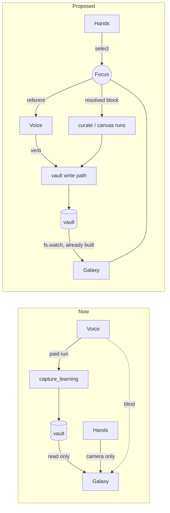

# Proposal: the second brain becomes a workspace you talk to

**Status:** proposal, not yet an OpenSpec change.
**Scope:** `personal-knowledge-notes`, `second-brain-layer`, `galaxy-view`,
`second-brain-gesture-nav`, and the seam to `canvas-claude-mcp`.
**Date:** 2026-08-04.

---

## TL;DR

The notes / galaxy / hand-gesture cluster is three well-built halves of three
different features that were never wired to each other. Concretely:

- The vault can only be **written** by a paid, multi-second Claude run.
- The galaxy can only be **read** — its whole IPC surface is five read channels
  and zero writes.
- The hands can only move **the camera** — not one gesture changes anything.
- And the voice layer, which is the entire point of Iris, **does not know the
  galaxy is open** or what the user is looking at.

So the galaxy is a beautiful read-only screensaver over a vault that is
expensive to fill, and the hands are a worse mouse for it. That is why it does
not feel like a feature worth paying for.

The proposal is one thesis with one new shared concept:

> **Voice supplies the verb. The hand supplies the noun.**
> A single main-process-owned **Focus** — what the user currently has selected
> in the galaxy — is shared by the hand, the voice layer, and Claude's runs. You
> point at two notes, say "connect these," and watch the edge form.

The reason this is worth doing *now* rather than as a rewrite: **most of the
expensive machinery already exists.** The live `fs.watch` → debounced rebuild →
position-preserving renderer reconcile is already built and already spec'd. Make
the vault writable and the graph animates itself. What is missing is small: a
write path, one gesture, one prompt line, and the Focus.

---

## Part 1 — What is actually there (evidence)

### 1.1 The only way a note gets into the vault is a paid agent run

The single write path is the `capture_learning` verb
(`electron/verbs.mjs:291`): a stateless one-shot run on the cheapest model,
carrying all six `wiki-*` skills (`electron/run-skills.mjs`, `NOTE_SKILLS`).

Writing "remember that the API key rotates on the 1st" therefore costs a cold
`query()`, several seconds of latency, and tokens. It also **requires a Claude
credential** — so on a `GEMINI_API_KEY`-only install, the advertised second
brain does not exist at all. Appending a line of markdown to a file needs no LLM.

The skills themselves are third-party and built for a chat client, not a voice
turn. Every one of them opens with a *"Config Discovery — MANDATORY STOP"*
ritual that recursively searches the filesystem for `wiki-config.md` and halts
the turn to ask the user to run an interactive setup command
(`resources/iris-plugin/skills/wiki-crystallize/SKILL.md`, and identically in
`wiki-query`, `wiki-integrate`, …). The living spec already carries the scar of
this mismatch as a requirement:

> *"A first-ever capture does not stall on an unanswerable setup question"* —
> Iris pre-seeds `wiki-config.md` so the worker "proceed[s] to write the note,
> rather than ending the turn asking the user to run an interactive setup step it
> has no way to answer in a one-shot run."
> — `openspec/specs/personal-knowledge-notes/spec.md`

And so does this one:

> *"A note that fails to land in the vault is reported as failed, not
> confirmed"* — Iris must verify a file appeared on disk rather than trust the
> worker's transcript.

Both requirements are defensive plumbing around **using an agent for a
filesystem append**. They are correct, and they are treating the symptom.

The repo already states the right doctrine — in `electron/run-inbox.mjs`:

> *"**This is a file append, not a run.** … Raw capture is a log; synthesis is
> the learning. Separating them means the log can never be lost to a busy queue,
> and the expensive step happens when there is enough material to be worth it."*

That doctrine was applied to *Iris's own run records* and never to *the user's
own thoughts*. Fixing that asymmetry is the whole of Mechanism 1 below.

### 1.2 The galaxy is a read-only filesystem mirror

The entire second-brain IPC surface (`electron/preload.cjs:112-120`):

| channel | direction |
| --- | --- |
| `secondbrain:availability` | read |
| `secondbrain:get-graph` | read |
| `secondbrain:read-note` | read |
| `secondbrain:activate` / `:deactivate` | watcher lifecycle |
| `secondbrain:graph-updated` | read (push) |

**There is no write channel.** From inside the galaxy the user cannot create,
edit, link, tag, rename, or delete a note.

> **Superseded in part.** `mutate_vault_notes` since added the three enumerated
> structural edits (link / unlink / set tags), and `add-manual-note-editing`
> added `secondbrain:write-note` + `secondbrain:open-note-externally` — the note
> reader can now be edited by hand and handed off to an external editor. Create,
> rename and delete are still absent, and there is still no query surface, so
> the rest of this section stands. They also cannot search or filter —
there is no query surface at all.

What the graph shows is thin, too: a node's label is its **filename stem**
(`title: stem` in `electron/vault-graph-parse.mjs`), and its colour is a hash of
its **first tag only** (`VaultGalaxy.tsx:62-70`). No recency, no degree-based
size, no clustering, no excerpt, no search. At 30 notes that is charming; at 300
it is an unnavigable hairball with no way in.

### 1.3 The hands are a camera remote

Every gesture binding in the galaxy resolves to one of three drives
(`src/lib/galaxy-nav.ts`, `driveFor`): `dwell` (open a note), `orbit`, `zoom`.
The reader adds close / scroll / resize.

That is the complete list. **Not one gesture mutates anything.** The hand is an
input device for a viewer, so it is competing directly with a mouse at the one
task a mouse is better at — and losing. The `second-brain-gesture-nav` spec is
long, careful, and correct, and all of that care is spent making a camera
control feel good.

### 1.4 The voice is blind exactly where it matters most

Iris's differentiator is that you talk to it. The galaxy is the one surface
where that channel is severed.

The voice layer's whole knowledge of the second brain is the prompt fragment in
`electron/capabilities/second-brain.mjs` (`promptFragment`): a line offering to
save something, plus the inbox backlog count. It says **nothing** about the
galaxy. Gemini cannot tell whether the galaxy is open, cannot see the graph, and
has no idea which node the user is staring at.

So the two things that make Iris Iris — voice and a spatial view of your own
knowledge — are in the same room and cannot address each other. Every deictic
sentence a human would naturally say here is unavailable: *this*, *that*,
*these two*, *what's missing here*, *why are these connected*.

### 1.5 The heavy layers are mutually exclusive and mutually ignorant

The galaxy and the excalidraw canvas are specified as mutually exclusive HUD
layers (`hud-drawing-canvas` and `second-brain-layer` both require it), for
a sound performance reason. The consequence is that **you cannot look at your
knowledge and sketch at the same time**, and there is no path between them: you
cannot diagram a cluster of notes, and you cannot save a board as a note. The
`canvas-claude-mcp` investment — Claude can already *draw*, with per-element
write results and connector bindings — has no knowledge to draw *from*.

### 1.6 Symptom: the graph gets worse the more you use Iris

A verified defect, not a design opinion. `run-inbox.mjs` appends one record per
finished run to `~/iris-second-brain/inbox/runs/<date>.md`. The galaxy's
user-note predicate excludes `templates/`, `raw/`, `archive/`, `ingested/` —
but **not `inbox/`** (`electron/vault-graph-parse.mjs`, `NOTES_PLUMBING_FOLDERS`):

```
$ node -e "…isUserNote…"
true   inbox/runs/2026-08-04.md
true   inbox/runs/2026-08-03.md
true   My Note.md
false  index.md
false  templates/x.md
false  archive/y.md

NODES: [ '2026-08-04', 'Real Note' ]
```

So every day Iris is used adds one junk node named after a date, forever. This
directly violates the galaxy spec's own stated intent ("only *user* notes appear
as nodes … the `index.md` catalogue does not become a hub node that distorts the
layout"). The exclusion list was written before `inbox/runs/` existed and was
never updated — which is the clearest available evidence that the write side and
the view side are not being designed together.

*(Also worth noting: `~/iris-second-brain` does not exist on this machine. The
author's own vault is empty. A knowledge graph with five notes is worthless no
matter how good the interaction — see Mechanism 2.)*

---

## Part 2 — Root cause, in one sentence

**Notes, galaxy, and hands were built as three separate features that happen to
share a directory, so the vault is expensive to fill, impossible to change from
the view, and invisible to the voice — leaving the hands with nothing to do but
move the camera.**

---

## Part 3 — The proposal

One thesis: **voice supplies the verb, the hand supplies the noun.** Four
mechanisms, of which the first two are cheap plumbing and the third is the
product.



### M1 — Capture is a file write, not a run

A new Electron-free `electron/vault-write.mjs`, modelled on `run-inbox.mjs`
(injected `fs`, never throws, unit-testable without disk) and using the existing
`atomic-file.mjs`:

- `appendCapture(...)` → appends to `inbox/captures/<date>.md`. Zero tokens, zero
  latency, no execution slot.
- `createNote(...)` → writes a schema-conformant page at the vault root.
- `applyVaultEdit(...)` → the small set of *mechanical* structural edits as pure
  markdown text transforms: add a `[[wikilink]]` in both directions, retag,
  rename-with-backlink-repair. No LLM involved, therefore unit-testable and
  deterministic.

New write IPC (`secondbrain:capture`, `secondbrain:mutate`) resolving node ids
through the graph cache and re-asserting the symlink/inside-the-vault check
exactly as `secondbrain:read-note` already does — never a renderer-supplied path.

A new Gemini tool `capture_thought` that is **synchronous and is not a run** (the
shape `check_claude_status` already has): it returns after the file exists. The
spec requirement "confirm only after verifying a matching file exists" stops
being a defence against an unreliable agent and becomes trivially true.

`capture_learning` keeps its name and its six skills and stops being the way
notes get *in*. It becomes purely the **curator** — which is the one job those
skills are genuinely good at, because curation is exactly the deliberate,
batched, ceremony-tolerant work they were written for.

**Also in M1:** add `inbox` to `NOTES_PLUMBING_FOLDERS`, fixing §1.6. This is a
prerequisite for M2, not a drive-by.

**Payoff, on its own:** notes become instant, free, and reliable, and they work
on a `GEMINI_API_KEY`-only install. The second brain stops requiring a Claude
subscription.

### M2 — The graph fills itself (solving cold start)

A knowledge graph is worthless until it has content, and deliberate note-taking
will not fill it — the empty vault on this machine is the evidence.

Iris already has a firehose nobody captures. The verbatim utterance ring in
`electron/renderer-bridge.mjs` is RAM-only and pruned by age: **every
conversation Iris has is thrown away.** Run records are kept but, per §1.6, only
pollute the view.

So: spool the session's utterance ring to `inbox/sessions/<date>.md` on session
end and on a rolling flush — a plain append via M1, no run, no tokens. Point the
curator at all of `inbox/*` rather than just `inbox/runs`, and give it the
cadence the wiki skills already implement: crystallize → integrate → lint.

The inbox is **not part of the graph** (that is what the §1.6 fix buys), so raw
transcript never becomes nodes. Only curated pages do. That containment is what
makes ambient capture safe rather than noise.

**This is a microphone log on disk.** It must be opt-in, off by default, an
`IRIS_*` env var documented in `.env.example` plus a SetupPanel toggle, and the
`untrusted-text.mjs` fencing discipline continues to apply on the way into any
run. Stated loudly here because getting this wrong is the one failure mode that
would be unrecoverable for user trust.

### M3 — The Focus: deixis (this is the product)

A new Electron-free `electron/focus.mjs`, main-process-owned for the same reason
the graph is: the renderer *produces* it, but both Gemini (main) and Claude's
runs (main) need to *read* it, and it must survive the galaxy remounting.

The Focus is `{ nodeIds: string[], at: number }`, resolvable against the existing
graph cache into `{ id, title, tags, excerpt }[]`.

**The hand gains a selection gesture.** The partition in `galaxy-nav.ts`'s
`driveFor` is the right seam and already has the hysteresis machinery this needs:

| gesture | now | proposed |
| --- | --- | --- |
| `Pointing_Up` dwell | open note | **unchanged** |
| pinch *hold* | zoom | **unchanged** |
| pinch *tap* over a node | — | **toggle select** |
| open-palm sweep | — | **clear selection** |

**The selection must be visible.** Selected nodes get a ring, and a focus chip in
the HUD lists them by title. Deixis without visible referents is a guessing game
— the user has to be able to see what "these" means *before* they speak.

**The voice layer gains the referent.** `promptFragment` gains a live, bounded
line: *"The galaxy is open. Currently focused: [Note A], [Note B]."* Bounded by a
title cap for the same token reason `run-context.mjs` bounds the transcript to 12
utterances / 4000 chars.

**Claude's runs gain it the registry-honouring way.** Not a new parameter on each
verb — the Focus is injected by `run-context.mjs` as a resolved block, exactly as
the transcript already is, so there is no per-verb formatting code and adding a
verb still means adding a record. Mechanical mutations (link, tag) go through
M1's direct write and spend nothing; judgement-requiring ones (merge, split,
summarize, expand, prune) go to a new stateless `curate_notes` verb.

**And the visual payoff is nearly free.** Mutations write files; the existing
recursive `fs.watch` → 500 ms debounce → position-preserving reconcile turns that
into a live graph update, already specified:

> *"A note added or edited while the galaxy is open appears without reload …
> existing nodes keeping their positions — the layout is not re-randomized."*
> — `openspec/specs/second-brain-layer/spec.md`, "The vault graph is owned and kept fresh by the main process"

That requirement was written for "Claude edits a note mid-session." It is exactly
the mechanism that makes "watch your knowledge reorganize itself while you talk"
work, and it is already built and already tested.

### M4 — The canvas stops being a dead end (optional, cheap)

Relax the galaxy/canvas exclusion in one direction and give `shape_on_canvas` the
Focus. Then "draw this cluster" reads the focused notes and draws them with the
MCP write tools it already has (connector bindings included), and "save this
board" writes an `.excalidraw` plus a vault page. Small change, and it is what
finally makes the `canvas-claude-mcp` work pay for itself.

---

## Part 4 — What this looks like to a user

The forty seconds that sells it:

1. *"Iris, remember that Postgres connection pooling bit we just worked out."*
   → instant. No spinner, no cost. A capture lands.
2. User raises the HUD, opens the galaxy. Their week is a constellation.
3. Pinch-taps two nodes. Both ring; the focus chip reads
   **Connection pooling · Deploy checklist**.
4. *"These two are the same problem — link them and tell me what I'm missing."*
   → an edge forms **on screen** as the file lands; Iris speaks the gap it found.
5. *"Draw it out."* → the canvas opens with the cluster already diagrammed.

No typing. No app switching. No mouse.

**Why someone pays for it:** every note app makes you type, and every voice
assistant forgets. Iris would be the only thing where you talk, it remembers, and
you can walk into your own memory and rearrange it with your hands. The product
is not "notes" — it is **memory you can see and touch**. Obsidian has the graph
and no voice; ChatGPT has the voice and no space. This sits in the gap, and the
gap needs a camera, a microphone, and a desktop overlay to occupy — which is
exactly the hardware position Iris already has.

---

## Part 5 — Change sequence

Three OpenSpec changes, each independently shippable, in dependency order.

| # | change | delivers | depends on |
| --- | --- | --- | --- |
| 1 | `vault-write-path` | M1 + the §1.6 fix. Instant free capture; notes work without a Claude credential. | — |
| 2 | `shared-focus` | M3. Selection gesture, focus chip, focus→voice, focus→run, live mutation. | 1 |
| 3 | `ambient-memory` | M2. Opt-in session spooling + curator cadence. | 1 |
| 4 | `focus-to-canvas` | M4. | 2 |

**Recommendation: ship 1, then 2.** After change 2 the feature is demoable and
feels expensive. Change 3 is what makes it *compound* over months, and it is
deliberately after 2 because its privacy surface deserves its own review rather
than riding in on someone else's change.

Specs touched: `personal-knowledge-notes` (capture is a write, not a run),
`second-brain-layer` (write channels, the inbox exclusion, focus
rendering), `second-brain-gesture-nav` (the selection gesture and the partition),
`verb-tool-surface` + `voice-ui-control` (`capture_thought`, `curate_notes`),
`canvas-claude-mcp` (M4 only).

---

## Part 6 — Alternatives considered and rejected

**Polish the galaxy** (better bloom, nicer nodes, prettier reader). Polish on a
read-only viewer. Changes nothing about what the user can *do*, which is the
actual complaint.

**Adopt an off-the-shelf graph view, or ship an Obsidian plugin.** Throws away
the only thing Iris uniquely has. The vault is already plain markdown, so
Obsidian is *already* available to the user for free — competing with it on graph
rendering is unwinnable, and winning would prove nothing.

**Merge galaxy and canvas into one spatial surface.** Large, risky, and aimed at
the wrong thing: the value is in the referent channel, not the surface. M4 gets
most of the benefit for a fraction of the work.

**Use a better/bigger model for capture.** Wrong axis. The problem is that
capture is a *run at all*, not which model serves it.

**Auto-synthesize after every run.** Already rejected by the living spec for
sound reasons (doubles run count and cost; the single execution slot means
bookkeeping would block the user's next request). Not relitigated here — M2
respects it by keeping capture free and synthesis deliberate.

---

## Part 7 — Risks

| risk | containment |
| --- | --- |
| **Ambient capture is a microphone log on disk.** | Opt-in, default off, documented `IRIS_*` var + SetupPanel toggle, its own change (#3) so it gets its own review. |
| **Auto-capture floods the graph with noise.** | The inbox is excluded from the graph (the §1.6 fix, shipped first in #1). Only curated pages become nodes. A noisy galaxy is worse than an empty one, so this ordering is load-bearing. |
| **Pinch is overloaded (zoom *and* select).** | Tap-vs-hold discrimination on top of the hysteresis `driveFor` already has; the partition is one pure function with existing tests, so the ambiguity is assertable rather than felt. |
| **The focus line costs tokens on every turn.** | Bounded by a title cap, mirroring `run-context.mjs`'s existing transcript bounds. |
| **Force layout degrades past a few hundred nodes.** | The Focus is also the mitigation: render the focused subgraph. Filtering is the missing feature *and* the performance fix. |
| **Direct writes race Claude's writes.** | Same last-writer-wins resolution `canvas-claude-mcp` already specifies, with atomic writes via `atomic-file.mjs`. |
| **The wiki skills' setup ceremony fights a fast path.** | M1 bypasses them entirely for capture. They keep curation, where their ceremony is appropriate. |

---

## Part 8 — The one-line version

Make the vault writable, give the hand something to select, and tell the voice
what the user is looking at. Everything else in the galaxy is already built.
