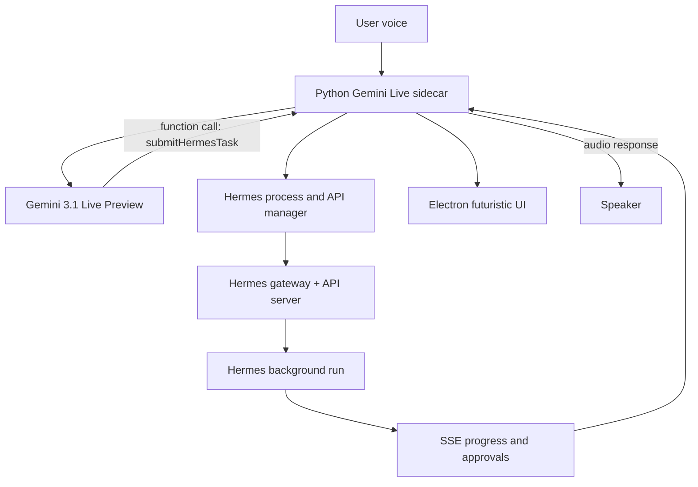

# Gemini Live Manager + Hermes Worker Plan

> **Note (implemented):** This file captures the original pre-build plan, which
> assumed a Python voice sidecar. The shipped app moved the Gemini Live + audio
> path into Electron-native code for better laptop-speaker echo cancellation, and
> added **camera hand-gesture control** via MediaPipe `GestureRecognizer`
> (`src/useHandControl.ts`) plus an `html2canvas`-based card disintegration
> effect. See `README.md` → "Hand & Gesture Control (MediaPipe)" for the full,
> current details and diagrams.

## Core Decision
Use your AI Studio sample as the voice backend foundation, with `MODEL = "models/gemini-3.1-flash-live-preview"`, Zephyr voice, 16 kHz mic input, 24 kHz audio output, and optional camera/screen streaming.

Important caveat: Gemini 3.1 Live supports function calling, but not non-blocking function calling. To preserve natural conversation, every Hermes tool call must return quickly. The app will submit Hermes work as a background run, return `run_id` immediately, and track completion separately.

## Architecture

## Implementation Shape
- `apps/desktop/`: Electron + React UI with a futuristic orb, wake/sleep state, transcript, task cards, Hermes status, and approval prompts.
- `sidecar/voice_server.py`: Python service adapted from the AI Studio sample. It owns PyAudio, Gemini Live connection, camera/screen streaming, tool calls, and audio playback.
- `sidecar/hermes_client.py`: Local Hermes client for `/health`, `/v1/runs`, `/v1/runs/{run_id}/events`, `/stop`, and `/approval`.
- `sidecar/hermes_process.py`: Starts `hermes gateway` if the API is not healthy. It will not create a new Telegram gateway config.
- `sidecar/protocol.py`: WebSocket messages between Electron and Python for UI state, transcript, audio state, task events, and approvals.

## Gemini Tool Design
Declare a small set of tools at session start:

- `checkHermesStatus`: fast health check.
- `startHermes`: starts `hermes gateway` if needed.
- `submitHermesTask`: submits a Hermes background run and returns immediately with `run_id`.
- `getHermesTaskStatus`: checks a run status.
- `stopHermesTask`: stops an active run.
- `approveHermesAction`: resolves a pending Hermes approval.

For `gemini-3.1-flash-live-preview`, `submitHermesTask` must not wait for completion. It returns: "started", `run_id`, and a short acknowledgement for Gemini to speak.

## Runtime Flow
1. Electron starts the Python sidecar.
2. Sidecar connects to Gemini Live using `GEMINI_API_KEY` from environment or local app settings.
3. User clicks wake or later says a local wake phrase.
4. Gemini handles natural voice, VAD, interruption, and spoken responses.
5. If the user requests work, Gemini calls `submitHermesTask`.
6. Sidecar ensures Hermes API is running, starts a Hermes run, and immediately returns to Gemini.
7. Hermes progress streams to the UI as task cards.
8. On completion, the sidecar sends a short completion message into Gemini or speaks through the UI, depending on whether the Live session is active.

## Wake Word Plan
Start with push-to-wake in the UI for the first build. Add local wake word after the Gemini/Hermes loop is stable.

Preferred wake-word options:
- `node-wakeword`/openWakeWord for free local detection.
- Picovoice Porcupine if you want easier custom wake phrase quality and do not mind an access key.

## First Milestone
Build a working developer prototype:
- Python sidecar runs your Gemini Live loop in `--mode none`, `--mode camera`, or `--mode screen`.
- Electron UI can start/stop the sidecar and display state.
- Gemini can call `submitHermesTask`.
- Hermes background run appears in UI with status updates.
- App speaks immediate acknowledgement and completion.

## Risks And Mitigations
- Gemini 3.1 synchronous tools: return immediately; never block on Hermes work.
- Hermes API not enabled: detect health failure and show exact `.env` setup required.
- macOS mic/camera permissions: configure Electron entitlements and request permissions explicitly.
- Audio pipeline complexity in Electron: keep audio in Python sidecar first because your AI Studio sample already works with PyAudio.
- Workspace currently unavailable: begin implementation only after a workspace folder is open again.
