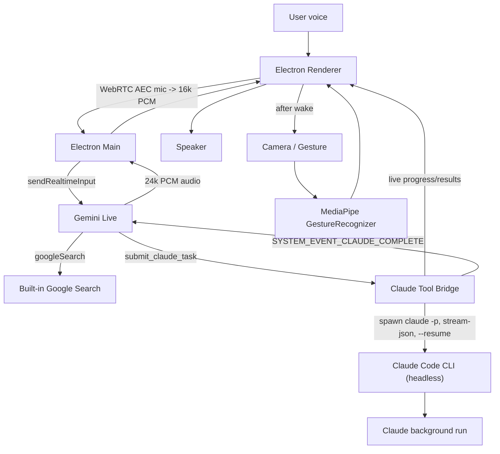

# Iris Current Plan / Architecture

## Core Decision
Use **Electron-native Gemini Live** as the realtime voice manager and **Claude
Code running headless** (`claude -p`) as the worker agent:

- Electron renderer captures mic with Chromium/WebRTC echo cancellation.
- Electron main owns the Gemini Live session through `@google/genai`.
- Gemini can use built-in Google Search for quick facts.
- Gemini delegates long-running work by spawning `claude -p` with NDJSON
  streaming (`--output-format stream-json`).
- The spawn returns a `run_id` immediately; Iris keeps talking while Claude works.
- All tasks share one continuous Claude session (`--resume`), run one at a
  time (queued), and the session persists across app restarts. A fresh session
  starts only when the user explicitly asks.
- Source/dev workflows are cross-platform (`npm run dev` works on macOS,
  Windows, and Linux). Packaged apps read config from `.env` in development or
  `~/.iris/.env` / `%USERPROFILE%\.iris\.env` once packaged.

## Architecture

## Implementation Shape
- `electron/main.mjs`: Gemini Live session, tool declarations, headless Claude
  Code bridge (spawn, NDJSON stream parsing, per-session queue, `--resume`
  continuity), completion announcements, audio IPC.
- `electron/preload.cjs`: Safe `window.iris` IPC bridge.
- `src/App.tsx`: Voice UI state, WebRTC mic capture, PCM playback, task reader, gestures, Orbital Deck layout.
- `src/deck.css`: Dark-only Orbital Deck layout styles.
- `src/useHandControl.ts`: MediaPipe `GestureRecognizer` camera/gesture hook.
- `scripts/run-electron.mjs`: Cross-platform Electron launcher that clears
  `ELECTRON_RUN_AS_NODE` and can start the production build.

## Gemini Tool Design
Declare a small set of tools at session start:

- `check_claude_status`: fast health check (`claude --version`).
- `submit_claude_task`: spawns (or queues) a headless Claude run and returns immediately with `run_id`.
- `get_claude_task_status`: checks a run status.
- `stop_claude_task`: stops an active or queued run.
- `start_new_claude_session`: clean-slate session, only on explicit user request.

For `gemini-3.1-flash-live-preview`, `submitClaudeTask` must not wait for completion. It returns: "started" (or "queued"), `run_id`, and a short acknowledgement for Gemini to speak.

## Runtime Flow
1. App boots dark-only with camera/gesture disabled.
2. User presses `W`.
3. Electron main opens Gemini Live.
4. Renderer starts WebRTC microphone capture and streams 16 kHz PCM to Gemini.
5. After wake succeeds, camera/gesture control starts automatically.
6. Gemini speaks the welcome message and listens continuously.
7. User can interrupt while Gemini speaks; playback is flushed on Live interruption events.
8. If the user requests work, Gemini calls `submit_claude_task`.
9. Claude progress (tool calls, notes) streams into the Work Stream in realtime.
10. On completion, Electron injects `SYSTEM_EVENT_CLAUDE_COMPLETE` into Gemini so Iris proactively summarizes the result.
11. User presses `S` to sleep; Gemini, mic, playback, and camera/gesture control stop.

## Wake Word Plan
Current control is push-to-wake (`W`) and sleep (`S`). Add local wake word only
after the voice/Claude loop remains stable.

Preferred wake-word options:
- `node-wakeword`/openWakeWord for free local detection.
- Picovoice Porcupine if you want easier custom wake phrase quality and do not mind an access key.

## First Milestone
Current stable milestone:
- Voice wake/listening works through Electron-native mic capture.
- Gemini Live can respond and handle interruption.
- Claude background runs appear in Work Stream with markdown reader.
- Camera/gesture starts after wake and supports point/dwell/open-palm/fist controls.
- UI is dark-only Orbital Deck.

## Risks And Mitigations
- Gemini 3.1 synchronous tools: return immediately; never block on Claude work.
- Claude CLI missing or not on PATH: `check_claude_status` surfaces the error; probe common install paths and support `IRIS_CLAUDE_BIN`.
- macOS/Windows/Linux mic/camera permissions: request media permissions explicitly.
- Do **not** start camera/MediaPipe on app boot; it can interfere with the voice path. Start it after wake.
- Keep the Gemini Live JS SDK names and model identifiers pinned in README.
- Keep Claude tasks non-blocking; return `run_id` immediately.
- Keep `.env` ignored and document credentials through `.env.example`.
